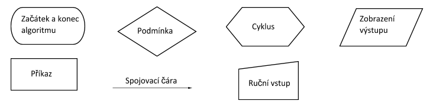

# Základy algoritmizace a programování

sekvence jednoduchých kroků, kdy v každém kroku víme, který krok bude následovat nebo bude končit, navíc je po konečném počtu kroků získán výsledek

algoritmus musí být:
- **hromadný** - neměl by sloužit pouze pro jediný případ, ale k obecnému řešení nějakého problému
- **jednoznačný** (deterministický) - v každém kroku je jasné co bude následovat
- **opakovatelný** - protože je v každém kroku udáno, co bude následovat, je možné opakovat postup a výsledek bude vždy stejný
- **konečný** - po určitém počtu kroků skončí
- **správný** - pro všechna přístupná data by měl být výsledek správný

## Počítačový program

je zápis algoritmu takovým způsobem, kterému počítač rozumí

## Programovací jazyk

je komunikačním nástrojem mezi programátorem, který v programovacím jazyce formuluje postup řešení daného problému, a počítačem, který program interpretuje technickými prostředky; obsahují takové příkazy, které je člověk tvořící program schopen snadno zadat, a zápis v těchto jazycích je pak převeden do jazyka počítače = strojového kódu
- **nižší programovací jazyky** - primitivní instrukce odpovídají příkazům procesoru; kód programu je složitý a nesrozumitelný; velmi malý nebo žádný rozdíl mezi daným programovacím jazykem a strojovými instrukcemi procesoru (instrukční sadou); Assembler nebo strojový kód
- **vyšší programovací jazyky** - srozumitelnější pro programátora; má logickou strukturu; příkazy jsou převáděny do strojového kódu; jednodušší vlastní vývoj programů; zápisy jsou kratší a lépe čitelné; kompilátor – překladač vyššího programovacího jazyka do strojového kódu; PHP, Python, Java, BASIC, C++; první programovací jazyk vytvořil Konrad Zuse jazyk zvaný Plankalkül

## Zápis algoritmu
- **slovně** - slovní popis můžeme rozumět různé návody na použití, recepty, popisy sestavení…
- **matematický** - vhodný v případě, kde je možné danou problematiku popsat pomocí matematických vzorců, vztahů nebo definic
- **rozhodovací tabulka** - používá se v případech, kdy se v úloze vyskytuje několik možností a vlastní řešení je pro každou možnost jednoduše popsatelné
- **strukturogramy** - úspornější znázornění algoritmu – kombinace grafického a textového popisu; tvořen obdélníkovou tabulkou; záhlaví tabulky obsahuje název algoritmu nebo dílčího kroku; zpravidla uprostřed trojúhelníková podmínka
- **vývojové diagramy** (vývojáčky :3) - zachycení řešení pomocí specifických grafických symbolů ve kterých je zapsán slovní text
- **programovací jazyk**

## Vývojové role (??)
- **analytik** - určuje co má program umět; vypracuje určité zadání, kde naznačí řešení problému
- **vývojář** (programátor) - dle popisu vytvoří program, přepíše řešení do programovacího jazyka
- **tester** - zadává různá data a zkoumá chování programu; pokud objeví chybu, pak ji předá zpět programátorovi k dořešení

## Vývojový diagram - značky
