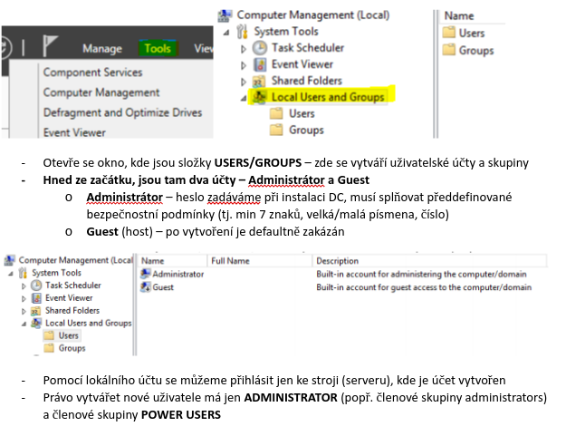
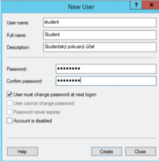
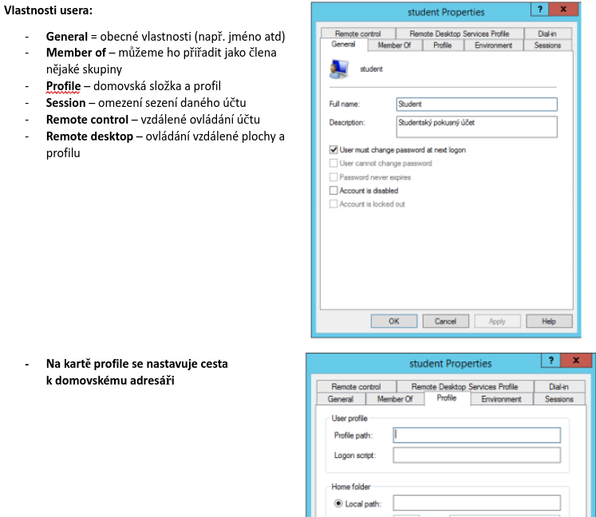
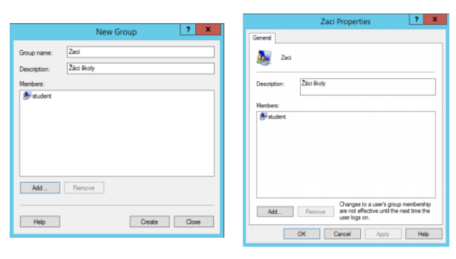
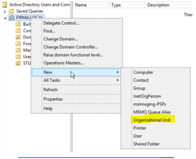
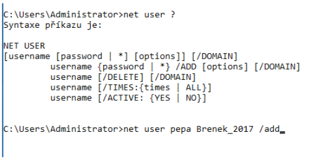
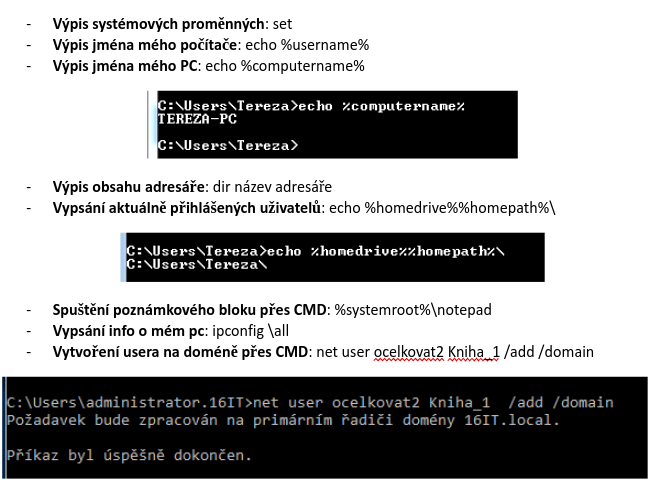

# Active Directory

- Rozšiřitelná adresářová služba umožňující spravovat prostředky na doménovém řadiči (slouží pro něj něco jako základ)
- Poskytuje celkový přehled o objektech v síti (např. účty, počítače, tiskárny)
- Umožňuje využívat stromovou strukturu objektu, nastavovat globální politiky, spravovat software na počítačích
- Jedná se o distribuovanou databázi tzn. části databáze jsou přenášeny do jednotlivých PC v doméně, obsahuje informace o nastavení PC a uživatelů v doméně
- Je nástrojem centrální správy

### Funkce

- Je založena na standardních internetových protokolech
- Jednoznačně definuje strukturu sítě
- Organizuje skupiny počítačů a domén

- Vyžaduje instalaci služby DNS
- Nutno povýšit na DC (doménový řadič)
- Instalace služby Active Directory: Start🡪Spustit🡪otevřít: dcpromo (OK)
  - Ve win12 je automaticky 🡪 stačí proto jen povýšit na DC přes role

### Služba AD obsahuje logické i fyzické struktury sítě

**Logické**

- **Organizační jednotky** - podskupiny domén, které často odpovídají obchodní nebo řídící struktuře organizace
- **Domény** - skupiny počítačů sdílejících společnou adresářovou databázi
- **Stromy domén** - jedna nebo více domén sdílejících souvislý obor názvů
- **"lesy" domén** - jeden nebo více stromů domén sdílejících společné adresářové informace

**Fyzické**

- **Podsítě** - síťová skupina se specifickým rozsahem IP adres a masky podsítě
- **Sítě** - jedna nebo více podsítí, slouží ke konfiguraci přístupu k adresářové službě a replikací

- Logické struktury pomáhají při organizaci objektů adresářové služby a při správě účtů a sdílených prostředků sítě
- Fyzické struktury usnadňují komunikaci v síti a fyzicky ohraničují prostředky sítě

## Doména active directory

Skupina počítačů, které sdílejí společnou adresářovou databázi
Základní jednotka je AD, tvoří ji minimální 1 doménový řadič
Je bezpečnostní hranice ve struktuře Active direktory
Má jednoznačné zařízení
Má vlastní zásady a zabezpečení
Vytváří vztahy důvěry s ostatními doménami

## Povýšení AD na Doménový řadič

1. Otevřít manažera serveru
2. **Manage** – add roles and features
3. Přidat role-based or feature installation
4. Ze server roles vybere,e active direktory domain services (odklikat a nainstalovat)
5. Po instalaci vyskočí upozornění 🡪 kliknout na Promote this server to a DC
6. Přidáme nový forest a definujeme jméno nové domény

### Konfigurace účtů, skupin, uživatelů, organizační jednotky

- Uživatelé a skupiny můžeme vytvářet jak lokálně, tak i doménově
- Organizační jednotky jsou pouze doménové prvky
- Nástroje pro vytvoření uživatele: Tools 🡪 Active directory users and Computers

 

 

## Vytvoření nového uživatele

Right click 🡪 volba new user

 

 

- Když na takto vytvořeného uživatele znovu klikneme right click můžeme jej upravovat 🡪 smazat, změnit heslo, přejmenovat, upravovat jeho vlastnosti

 

 

- **Logon script** – skript, který se spustí při přihlášení uživatele, např. aby bylo zajištěno automatické připojení domovského adresáře
- **Profile Path** – cesta k vytvořenému profilu

## Vytvoření skupiny

- Skupiny sdružují uživatelé např. kvůli přiděleným právům
- Skupiny nemohou být členem nějaké další skupiny
- Pomocí nich primárně nastavujeme nějaké práva více uživatelům
- Při instalaci serveru jsou defaultně vytvořeny tyto skupiny:
  - **Administrators** - Backup operators
  - Guests
  - IIS_IUSRS
  - Power Users
  - Print Operators
  - Remote desktop users
  - Users
- Je také vytvořena skupina EVERYONE, do které patří všichni vytvoření uživatelé
- Skupina USERS nemá po instalaci serveru žádného uživatele
  - až po vytvoření nějakého účtu se automaticky účet přidá do této skupiny
- Nástroje pro vytvoření skupiny: tools 🡪 Active Directory users and computers 🡪 složka groups 🡪 right click 🡪 add new group

 

 

- Přihlášení do domény dvěma způsoby:
  - `username@doména.local`
  - Doména\username

## Organizační jednotky

- Podskupiny v rámci domén, které často odráží řídící nebo obchodní strukturu organizace
- Slouží pro nastavení globální politiky
- Vznikají při povýšení AD na DC
- Můžeme si to představit jako logické kontejnery, do kterých si můžeme umístit:
  - Uživatelské účty
  - Sdílené prostředky
  - Další organizační jednotky
- Jedná se o nejnižší formu seskupování objektů v AD
- Může být až 12 úrovní
- Můžeme na ně uplatňovat skupinovou politiku
- Jsou definovány uvnitř domény
- Vlastnosti se dědí v rámci domény nikoli mezi doménami
- Vytvoření organizační jednotky: Tools 🡪 Active directory users and computers 🡪 right click na doménu 🡪 Organizational unit

 

 

## Přidělování práv

- Group policy
- Nastavení politik v editoru gpedit na doméně: tools 🡪 group policy management 🡪 edit
- **Gpedit.msc** – nastavení lokálních politik
- Uživatelé jsou rozděleni do pracovních skupin
- Skripty jsou na: `C:\Windows\System32\Repl\Iport\scripts`
- Skripty na úrovni GP:
  - Skript při přihlášení: `C:\windows\system32\grouppolicy\user\scripts\logon`
  - Skript při odhlášení: `C:\windows\system32\grouppolicy\user\scripts\logoff`
- Po úpravě scriptů musíme vždy zadat do CMD gpupdate /force (vynucení změny politik)

## Nastavení uživatelům logon script:

- Pro doménový účet se skript nachází `Windows\Sysvo\Sysvol\název domény\Scripts`
- Pro lokální účet je to `%Systemroot%\System32\Repl\import\Scripts`
- Může být i v podadresářích těchto adresářů, ale musíme zadat relativní cestu management\skripts.bat

## Příkazy v logon scriptu

- `net use x:\\server\složka` = mapování složky
- `net.exe use H: \\zaci\%USERNAME%$` = mapování domovské složky
- `net time \\server /set/y` = měnit čas může pouze administrátor a power user

### Uživatelské profily

- Sada nastavení, díky kterým počítač vypadá a pracuje podle našich představ
- Profil obsahuje nastavení:
  - Plochy pozadí
  - Spořičů obrazovky
  - Předvolby ukazatele
  - Nastavení zvuku
  - A další funkce
- Profily uživatelů zaručují, že bude osobní nastavení použito pro každém přihlášení uživatel k systému Windows
- Výchozí nastavení profilů: `C:\users\username`
- Profil je vytvářen z defaultního profilu a vzniká při prvním přihlášení uživatele
- Uživatelský účet je tvořen minimálně jedním uživatelským profilem

## Typy uživatelských účtů

- Máme 3 typy uživatelských účtů
- Místní (local)
  - Je uložen na lokálním PC
  - Pokud se uživatel přihlašuje na více počítačích, na každém má samostatný nezávislý profil
  - Ukládají se do složky `C:\users`
- Cestovní (roaming)
  - Je uložen na serveru a umožňuje přenášet nastavení uživatele mezi různými stanicemi
  - Nejprve se vytvoří místní profil při přihlášení uživatele a až po jeho odhlášení se aktualizuje jeho místní profil na lokálním disku a poté se uloží na síťový disk
  - Při dalším přihlášení se ze serveru stahují jen ty informace, které se změnily
- Povinný (mandatory)
  - Jedná se o cestovní profil umístěný na serveru
  - Uživatel jej nemůže měnit (pouze správce systému)
  - Dva typy:
    - **Uživatelský** – jeden účet používá více uživatelů, např. pro výukové účely
    - **Skupinový** – více uživatelských účtů využívá jeden společný profil, např. všichni skladníci mají své jednotlivé účty, ale společné nastavení plochy

### Nastavení cestovního profilu

- Nejprve musím vytvořit složku, kterou budu sdílet pro určitou skupinu uživatelů (např. při vytvoření na serveru v `c:` složky profily musíme složku sdílet s uživateli domény)
- Po sdílení složky přejdeme do AD, kde vytvoříme uživatelský účet, kterému na kartě _„Profil“_ musíme zapsat cestu **Profile_Path** k jeho cestovnímu profilu 🡪 `\\sdílená_složka\profily\%username%\`
- Cestovní profil se vytvoří až při prvním přihlášení (vytvoří se do složky profily na serveru)

### Nastavení povinného profilu

- Postupujeme stejně jako u vytváření cestovního profilu
  S výjimkou, že při zadávání cesty se musí přidat koncovka MAN

### Podotázky

- Společná _„řeč“_
- Jednoznačná identifikace – např. IP, název PC
- Pojící médium

## Pojmy

- **NIC** – Network Interface Controller = síťová karta, část počítačového hardware, která zprostředkovává komunikaci po síti
- **NIC teaming** – spojení více síťových rozhraní do 1, mají stejnou IP, zvýší se přenosová rychlost, bezpečné
- **iLO** – od firmy HP, je to nástroj na monitoring a vzdálenou správu serveru
- **IP adresa** – 32 bitový identifikátor zařízení v síti

## Práce s CMD

- Vytvoření nového uživatele: `net user %username% passwd /add`

 

 

 

 

## Porty

- Celkové množství portů: 216
- Porty od 0 do 1000 jsou rezervovány pro konkrétní službu – měli bychom volit porty 1000 a výše
- Nejznámější:
	- **http** – port 80
	- **https** – port 443
	- **FTP** – port 21

## APIPA (Automatic Private IP Addressing)

- Zápis: 169.254.xxx.yyy
- Adresa, která je přiřazena počítači, když není nalezen žádný DHCP server a PC adresu požaduje
