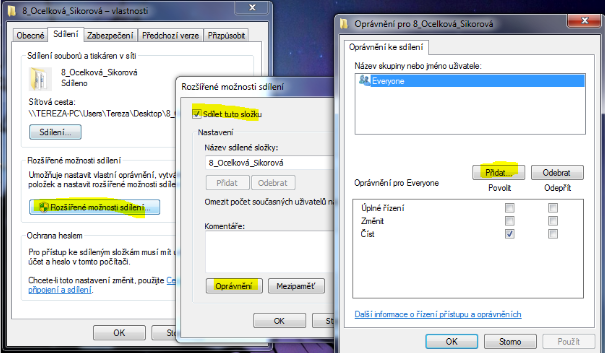
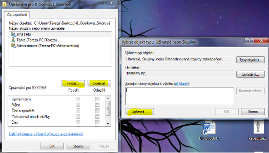
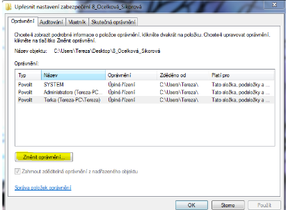
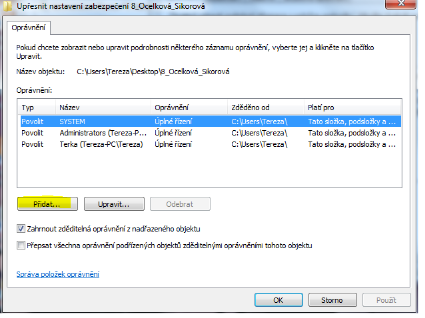
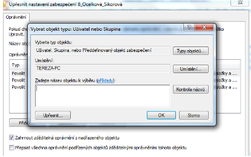
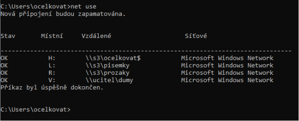
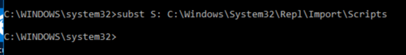
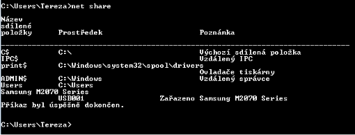

# Domovské adresáře, síťové složky, oprávnění

## Domovské složky

- Místo, kam uživatel ukládá svá data, kde si vytváří podsložky a kde vlastní všechny práva
- Mohou být na:
  - Místním disku (stanici)
  - Sdílené síťové jednotce (server)
- Přidání domovského adresáře k profilu: tools 🡪 active directory users and computers 🡪 properties příslušného uživatelského účtu 🡪 záložka profile 🡪 do pole home folder zadat cestu k domovskému adresáři
- Adresa může být zadána:
  - Lokálně – např. `C:\users\home\student`
  - Síťově - `\\server1\home\%username%` (systémová proměnná `%username%` odkazuje na uživatele, který je zrovna přihlášen)
- Jestli se domovská složka nepřiřadí uživatelskému účtu, použije systém jako domovskou složku adresář místního profilu uživatelů (disk\documents and settings\uživatelské jméno)

## Mapování složek / disků při přihlášení uživatele

- Využívá se tzv. logon script – script, který se provede při přihlášení uživatele
- Cesta k logon scriptu se píše do pole Logon script:
- Do skriptu zapíšeme: net use + adresa adresáře disku
  - Např. `net use H: \\s2\vyuka`
  - Nebo `net use H:\\server\%username%`
    - Příkaz připojí sdílenou složku, která je umístěna na serveru pod jménem účtu právě přihlášeného uživatele
    - Připojí ho pod síťovým identifikátorem H
- Do těchto skriptů lze zapsat plno dalších příkazů + klasické promnné + komenáře apod.
- Skripty se ukládají do složky netlogon ve tvaru `[uživatelské jméno]@[doména].bat`
  - Složka netlogon je na serveru `C:\windows\sysvol\domain\scripts`

## Sdílené složky

- Např. složky použitelné pro domovské adresáře
- Vytváříme je na serveru
- Musíme jim nastavit určitá oprávnění
  - Např. tak, aby v nich nemohl pracovat jen tak někdo, ale jen nějaký uživatel a administrátor
- Tyto složky přiřazujeme do home folder, danému uživateli a mohou být použity v logon skriptech
- Dále je můžeme mapovat na shared folder v Active directory users and computers (a např. je přiřadit do organizační jednotky)

 

 

## Oprávnění

- Tzv. práva k modifikaci adresářů
- Základní oprávnění:
  - Full Control – prohlížení, spuštění, úpravy, mazání a nastavení oprávnění
  - Modify – prohlížení, spuštění, úpravy a mazání
  - Read & Execute – prohlížení a spuštění
  - List Folder Content – zobrazení obsahu adresáře, pouze pro adresáře
  - Read – prohlížení
  - Write – prohlížení, spuštění, úpravy, mazání
- Tyto práva nastavujeme uživatelům ve vlastnostech složky
- Kliknutím na _„upravit“_ můžeme práva editovat
- Klinutím na _„upřesnit“_ se dostáváme do podokna, kde nastavujeme rozšířená práva

### Editační mód práv

- Můžeme přidávat nebo odebírat uživatele nebo skupiny, kteří mají přístup ke složce
- Po kliknutí na přidat a upřesnit se dostaneme do rozšířeného módu, kde je si možného uživatele/skupinu i vyhledat

 

 

- V druhé části povolujeme/nepovolujeme práva zrovna vybranému uživateli (na obrázku zrovna pro uživatele systém)

### Rozšířená nastavení pro práva

 

 

- Po kliknutí na _„změnit oprávnění“_ se dostaneme do módu, kdy můžeme přidávat a upravovat oprávnění uživatelům

 

 

- Je zde možno vypnout i dědičnost – oprávnění nadřazených objektů
- V následujícím módu přidáváme uživatele, definujeme mu jeho umístění typ, název

 

 

### NET USE X SUBST

#### Net use

- Extérní příkaz operačního systému (samostatný spustitelný program)
- Má koncovku `.exe`
- Nachází se v domovském adresáři
- Když ho spustíme jako administrátor nachází se v `C:\windows\system32`
- Používá se k mapování disků
- Příkazy:

  - Net use = zobrazí síťové zdroje, které jsou připojené na PC, odkud jsou a pod jakým označením ten zdroj je

 

 

- Značka dolaru $ znamená, že síťový zdroj se skrytý
  - Nemá nic společného s právy přístupu
- Připojení disku: `net use Z: \\s2\vysledky`
- Odpojení disku: `net use /delete Y:`
- Když pracujeme na disku s nějakým souborem, ale chceme disk odpojit, systém se nás dotáže, zda to opravdu chceme udělat 🡪 po potvrzení _„ano“_ soubor stejně vyžaduje uložení

#### Subst

- Slouží k připojení reálného disku k virtuálnímu
- Podobné jako net use, akorát písmeno, které tam uvádíme připojí zdroj u našeho PC
- Používá se pro rychlejší a přehlednější práci

 

 

- Písmeno S: je alias, přes který se odkazujeme na cestu ke složce scripts

### Absolutní, síťová a relativní cesta

- Absolutní cesta
  - celá zadaná cesta, definuje cestu k místnímu zdroji
  - např. `C:\win\syst32\repl\import\scripts`
- Síťová cesta
  - známá jako UNC
  - specifikuje umístění síťového prostředku, sdíleného adresáře, souboru nebo tiskárny,
  - zapisujeme `\\[název PC]\[Sdílený adresář]\[sdílený soubor]`
  - např. `\\s2\vantuchj`
- Relativní cesta
  - je určení polohy vzhledem k souboru nebo zadanému adresáři, na kterém se aktuálně nacházíme
  - můžeme jít _„o patro níž/výš“_ nebo skok _„níž/výš“_
  - např. nacházíme se ve složce dokumenty, kde je složka dopisy, relativní cesta tedy bude _„dopisy“_, kdežto absolutní cesta by musela být `c:\dokumenty\dopisy`

### Net share

- vypíše všechny sdílené složky se sdílenými jmény

 

 

### Ten zbytek

- paměťová proměnná pro umístění domovského adresáře: `echo %homedrive%%homepath%`
- umístění přihlašovacích skriptů z hlediska použitého účtu: `C:\Windows\System32\repl\import\scripts`
- umístění přihlašovacích scriptů v bezpečnostní politikách: `C:\windows\SYSWOL\syswol\nazevdomeny\scripts`
