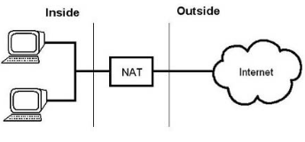
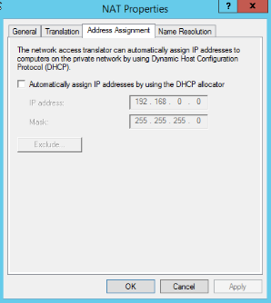
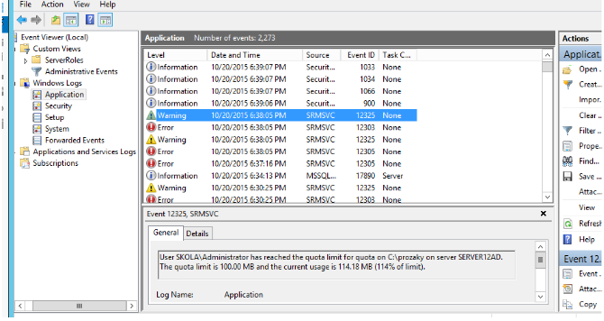

# Práce s disky, základní nastavení sítě

## Disky

- Hlavní rozdělení:
  - Primární diskové oddíly
  - Rozšířené diskové oddíly
- Další rozdělení
  - Základní disky
  - Dynamické disky
    - Oproti základním podporují rozdělení na několik diskových oddílů
    - Ukládají metadata do 1MB na konci disku, který nepatří k žádnému oddílu
- Master boot record (MBR)
  - sběrnice metadat pro starší disky
  - dokáže adresovat maximálně 2TB disky
  - jeho nástupcem je GTP
  - jeho velikost je 512 bajtů
  - je v něm uložen:
    - zavaděč (bootloader) OS
    - tabulka rozdělení disku na logické oddíly
    - číselný identifikátor disku
- GUID Partition table (GPT)
  - standart pro popis členění pevného disku na oddíly
  - nahrazuje starší tabulku MBR
  - je součástí UEFI od Intelu

### Inicializace disku, práce s oddíly

1. Do PC přidáme nový HDD (pokud pracujeme s virtuálním PC, přidáme nový virtuální disk)
2. Zapneme počítač, ten automaticky detekuje nový hardware
3. Přes start spustíme Správu počítače 🡪 úložiště 🡪 správa disků
4. right click na disk 🡪 nový jednoduchý svazek 🡪 odklikat až k formátování (nastavujeme různé parametry jako je jméno, písmeno jednotky atd.)

- Po tomto procesu je disk připravený, naformátovaný k použití
- Velikost disku lze změnit pouze fyzickou výměnou
- Lze měnit jen velikost oddílů na disku nebo sloučit disky do oddílů
  - Lze tedy svazek rozšířit nebo jej zmenšit
  - Lze svazky i odstranit 🡪 dojde ke ztrátě dat 🡪 disk zůstane jako nepoužitelný
- **Zmenšení svazku** => Right click na disk 🡪 volba zmenšit disk
- **Rozšíření svazku** =>Right click na disk 🡪 výběr rozšířit disk
- **Změna typu disku** => Disk lze změnit na dynamický 🡪 right click na disk 🡪 volba převést na dynamický
- **Zpátky převézt disk je složitější** – nutné zálohovat všechny data, složitě přerozdělit disk na oddíly a následně překopírovat zálohu

### Defragmentace

- Defragmentace = rozházená data, která jsou nesouvisle uložena po částech jsou přeuskládaná na disk
- Disky můžeme defragmentovat ve vlastnostech disku
- Uspořádá soubory, zrychlí systém

## RAID 0

- Stačí když máme 2 disky
- Dva druhy:
  - Zřetězení
    - Není to skutečný RAID 0
    - Z více fyzických disků se vytvoří jeden velký
    - Data se ukládají nejprve na první disk, po jeho zaplnění se ukládají na druhý disk
    - Není moc bezpečný
    - Nepřicházíme o kapacitu
    - Rychlejší čtení a zápis
  - prokládání
    - Skutečný RAID 0
    - Data se ukládají na disky na střídačku (střídavě na první a druhý)
    - Nízká bezpečnost – když ztratíme 1 disk přijdeme o všechna data
    - Rychlejší čtení a zápis
    - Vysoká kapacita

## RAID 1

- Neboli zrcadlení
- Musíme mít minimálně dva disky, které se budou zrcadlit 🡪 soubory, které jsou na jednom disku jsou automaticky na druhém disku
- Přichází se o polovinu kapacity
- Vysoká bezpečnost – když přijdeme o jeden disk, máme data na druhém

## RAID 5

- Zapotřebí minimálně 3 disky
- 2 disky se využijí pro data 1 disk je pro samoopravné kódy
- Kódy jsou rozloženy střídavě na všechny disky
- Pří poruše jednoho disku, samoopravné kódy zajistí, aby data nebyla porušena do přidání nového disku

## Složené RAIDY 1 + 0

- Kombinací RAIDU 1 a 0
- RAID 0 složen z RAIDů 1

## Složené RAIDY 0 + 1

- Kombinace 0 a 1
- RAID 1 složený z RAIDů 0
- Odolný proti výpadku všech disků jednoho pole

## NAT – Network Address Translation

- Slouží k překladu síťových IP adres
- NAT se používá pro přístup více počítačů z lokální sítě na internet pod jedinou veřejnou adresou
  - Např. máme školní sít, kde každému počítači je přidělena privátní IP adresa, ale do internetu všechny počítače pomocí NAT serveru přistupují pouze pod jedinou IP adresou
- Znemožňuje však přímou komunikaci mezi klienty a může snížit rychlost přenosu
- NAT vznikl jako důsledek omezeného a nízkého počtu veřejný IP adres
- Privátní adresy:
  - Rozsah 10.0.0.0 – 10.255.255.255
  - Rozsah 172.16.0.0–172.31.255.255
  - Rozsah 192.168.0.0 – 192.168.255.255
- NAT je technologie rozpažených rukou (dvě síťové karty)

 

 

### Princip NATu

- Klient vyšle požadavek na vnitřní bránu sítě
- router, který plní funkci NATu, zachytí pakety a změní jejich IP adresu na svou vnější
- Router označí pakety tak, že je odešle z náhodného TCP portu
- Router si do tabulky zapíše port, který zvolil a který klient k němu patří
- Při přijetí odpovědi router provede reverzní akci a pakety vrátí klientovi

### Výhody

- Umožňuje připojit více PC na jednu veřejnou IP adresu 🡪 šetří se tak IPv4 adresy
- **Bezpečnost vnitřní sítě** – jednoduchý způsob ochrany jak předejít neoprávněnému vniknutí z vnější sítě ( i přes to nelze NAT považovat jako bezpečnostní opatření)

### Nevýhody

- Zařízení z vnitřní sítě nemají skutečné připojení k internetu a není možné se snadno připojit k jinému zařízení z vnější sítě
- Nemožnost blokování IP adres, za kterou jsou kromě zlomyslného uživatele nebo napadeného zařízení rovněž i legitimní uživatelé

### Konfigurace

- V serveru manageru Tools🡪Routing and Remote access
- Right click na SERVER🡪 configure and enabling remoute access (povolujeme danou službu)
- Rozbalit položku IPv4, kde se nachází položka NAT
- Right click na NAT 🡪 položka properties 🡪Adress Assigment zaškrtnout automaticky přidělovat IP pomocí DHCP
  - Pokud chceme přidělovat IP adresy z nějakého rozsahu, musíme v části IP adresa a maska podsítě nastavit, ze kterého rozsahu mají být přiřazovány

 

 

- Pokud chceme některé adresy z nakonfigurovaného rozsahu vyloučit 🡪 tlačítko vyloučit 🡪 přidat adresy 🡪 zde nakonfigurujeme adresy, které mají být vyloučeny

### Konfigurace veřejného rozhraní

- Pravým na položku NAT 🡪 nové rozhraní 🡪 rozhraní připojené k veřejné síti 🡪 OK
- Na kartě NAT 🡪 veřejné rozhraní připojené k síti Internet 🡪 Povolit NAT 🡪 OK
- Na záložce Service and Ports můžeme nastavit, která služba bude přesměrována, na které PC
- Po kliknutí na ADD 🡪 nastavujeme vlastní pravidla směrování do naší sítě

### Konfigurace privátního rozhraní

- Pravým na NAT 🡪 nové rozhraní 🡪 rozhraní připojené k privátní síti 🡪 OK
- Na kartě NAT 🡪 privátní rozhraní připojené k privátní síti 🡪 povolit NAT 🡪 OK

### Rozhraní NAT

- Pokud chceme zjistit, jak procházejí data přes rozhraní NAT 🡪 right click na NAT 🡪 show mapping
- Zde zjistíme, kdo je připojen na NAT serveru

- Náš virtuální NAT: 10.0.12.248
- Moje přihlášení do virtuálky přes NAT: 10.0.12.248:20239

## Diskové kvóty, adresářové kvóty

- Jsou dva druhy kvót:
  - Diskové kvóty
  - Adresářové kvóty
- Slouží k omezení zápisu na disk/adresář pro jednoho uživatele, aby nedošlo k přeplnění disku/adresáře
- Dělíme limit kvót na:
  - Soft limit – překročitelný limit, uživatel může překročit zadaný limit, systém ho pouze upozorní
  - Hard limit – nepřekročitelný limit, uživatel už nemůže nic přidat na disk

### Adresářové kvóty

- Lze je nastavit na daný adresář, podadresář bez možnosti výběru uživatele
- Nastavují se na serveru tools 🡪 file service resourse manager 🡪 Ouota Managment 🡪 v kontejneru Ouota manage 🡪 right click na Quoty
- V Quota path najdeme náš adresář, na který chceme nastavit kvótu
- Nastavíme také limit a zda kvóta platí pro adresáře nebo pro podadresáře
- K vytvoření kvót můžeme použít také šablony
- Po vytvoření kvóty můžeme pomocí right click na danou kvótu, upravovat její vlastnosti
- Pokud změníme u kvóty ze SOFT limitu na HARD limit, data se nevymažou, jenom v logu bude warning (log si můžeme prohlídnout v tools🡪event viewer 🡪 windows log 🡪 application

 

 

- Toto nastavení platí na podadresáře složky

### Nastavení kvóty na celý adresář

- Vytvoříme novou kvótu 🡪 vybereme adresář, který na který chceme kvótu nastavit
- V editaci Quoty změníme šablonu kvóty
- Vybíráme z následujícího nastavení:

1. volba – přepíše pouze původní podadresáře se zadanou limitou, ostatní nepřepíše
2. volba – nastaví všechny kvóty na nové
3. volba – aktuální adresář necháváme s původní kvótou

- Po nastavení kvóty si můžeme načasovat report nebo si ho popř. vygenerovat ihned (musíme být na kartě storage reports managment 🡪 right click 🡪 vyvolá se nabídka)
- Report nastavujeme na záložce setting (vybereme quota usage a File by owner)
- Na záložce scope definujeme kvótu a které složky budeme sledovat
- Nakonec vygenerujeme report kvóty a uložíme ho do `C:\StorageReports\interactive`

### Diskové kvóty

- Nastavení limitu ukládání dat na disk
- Svazek musí být naformátovaný jako NTFS
- Nastavují se přímo na disku 🡪 right click 🡪 properties 🡪 quota
- **Limit disk space to:** nastaví limit na disku pro uživatele, kteří budou založeni po nastavení kvóty
- **Quota entries:** nastavujeme pravidla pro jednotlivé uživatele
- **Přidělené kvóty (Quota entries):** nastavujeme pravidla pro jednotlivé uživatele
