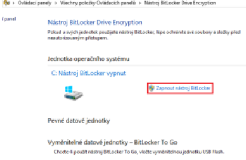
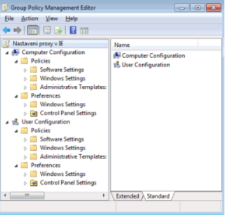
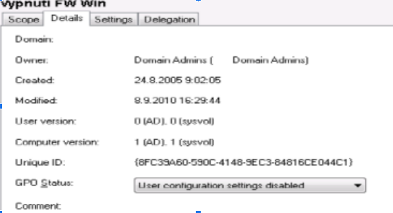

# Bezpečnost dat a uživatelkých účtů

## 1. Šifrování dat na disku, záloha a obnova certifikátů

- Šifrování je proces, kterým se nezabezpečená data převádí pomocí kryptografie na data
  šifrovaná, čitelná pouze za použití klíče
  o Klíč = informace, obsahující kryptografický algoritmus, který autentizuje přístup
  k zašifrovaným objektům

- Je to forma ochrany dat a uplatňuje se při jejich ukládání i přenosu
- Šifrování dělíme:

  - Šifrování souborů (File encryption)
    - Šifrování souborů, médií, ale i části pevných disků
    - Používají se klíče nebo hesla
  - Šifrování disků (Disk encryption)
    - Šifrování tzv. full disk encryption, kdy se zašifruje celý disk i s partition table
    - Nelze se tedy nejen dostat na disk, ale i vidět jeho rozložení a konfiguraci

- Software defaultně ve Windows pro šifrování: BitLocker

### BitLocker

- Umí zašifrovat celé oddíly a disky a to včetně USB uložišť
- Přístup k zašifrovaným datům přes klíč
- Data se šifrují při zápisu a dešifrují při čtení
- Práce s dešifrováním a šifrováním se zpomalí – vyšší režie
- Je používán 128-bit, nebo 256-bit AES šifrování
- Při šifrování si musíme zvolit způsob ověřování:
  - TPM čip - stará se o bezpečné generování a skladování dešifrovacích klíčů.
    Nejbezpečnější metoda. Je na základní desce.
  - Flash disk - nahrazuje TPM čip. Je zapotřebí jej vkládat při každém startu PC.
  - Heslo - není potřeba TPM ani flash disk. Při startu pouze zadáte heslo. Málo
    bezpečné.

### Šifrování

- Pokud počítač neobsahuje
  kompatibilní čip TPM, vyskočí tuten.
- To se dá vyřešit přes WIN + R -> gpedit.msc
  - Konfigurace počítače > Šablony pro správu > Součásti systému Windows > Šifrování
    jednotky nástrojem BitLocker > Jednotky operačního systému
  - V označeném poli klikněte na Povoleno a pak zaškrtněte Povolit nástroj BitLocker
- Po ošetření TPM čipu už bude vše fungovat a v ovládacích panelech -> Nástroj BitLocker Drive Encryption můžeme zapnout bitlocker

 

 

- Dále vás systém vyzve k zadání hesla nebo výběru USB Flash disku
- V po zadání hesla nebo flash disku, bude systém chtít zálohovat obnovovací klíč, který použijete v případě ztráty flash disku nebo hesla
- Po zadání uložiště pro obnovovací klíč, se vás systém zeptá, co všechno chcete zašifrovat - Dále pak jestli chcete zkontrolovat funkčnost systému BitLocker – bude po vás chtít heslo, nebo flashku, nebo certifikát
- Dále se disk zašifruje
- Pokud budeme chtít vypnout bitlocker tak budeme muset zase přes ovládací panely a u disku jej vypnout

### ZÁLOHA A OBNOVA CERTIFIKÁTŮ

- Buď v online uložišti
- Nebo ve WIN + R -> certmgr.msc
  - Požadavek na zápis certifikátu -> (pravým kamkoliv) Všechny úkoly - > importovat -> procházet -> změnit typ souboru na „Výměna osobních informací .pfx“ -> vyhledejte uloženou zálohu z instalace -> označte klíč jako exportovatelný -> projít průvodce

## 2. Záloha systému

- Windows má vlastní program na zálohování, která vytvoří kompletní bitovou kopii systému
- Můžeme vytvořit novou plnou zálohu např. na externí disk

## 3. Shadow copy

- Stínové kopie svazku
- Manuální nebo automatická záloha disku přímo za běhu
- Snímek disku v reálném čase, pokud jej budeme chtít načíst, vidíme, na který čas se přesně vracíme

 

 

## 4. Group policy

- Nástroj pro hromadnou správu oprávnění a nastavení aplikovaných jak na celý počítač, tak na přihlášeného uživatele
- Objekt Group Policy se nazývá GPO (Group policy object) = kolekce nastavení - Dané GPO se linkuje na jednotlivou organizační jednotku, pro zajištění aplikace nastavení jen na vybrané uživatele
- Možnosti nastavení zásad skupiny jsou zpracovávány v následujícím pořadí:
  1. Místní objekt zásad skupiny – místní zásady uloženy právě na každém počítači
  2. Síť – zásady propojené se sítí, do níž daný počítač patří
  3. Doména – zásady zadané na doméně, do které je počítač přiřazen
  4. Organizační jednotka – nejvyšší priorita, zásady pro jednu specifickou organizační jednotku   
- Mají dvě hlavní části Computer Configuration a User Configuration

 

 

- GPO fungují na principu úprav registrů, kdy část Computer Configuration se týká nastavení na počítačové objekty v Active Directory(aplikují se při startu počítače) a User Configuration se týká nastavení uživatelských účtů v Active Directory( při přihlášení uživatele) - Aplikace politik
  - Spojením (link to) nebo vytvořením GPO(create) pro síť, doménu nebo organizační jednotku
  - při aplikaci se uplatňuje dědění (inheriting) = uplatnění politik se projeví na všech počítačích a uživatelích, kteří se nachází v této a ve vnořených OU. Provádí se v Group Policy Inheritance, kde se privádí např. i zrušení Block Inheritance
  - Politiky se zpracovávají postupně viz, ,,Možnosti nastavení zásad skupiny jsou zpracovávány v následujícím pořadí“ s tím, že později zpracovaná politika může přepsat nastavení předchozí

### Vypnutí (části) politky

- Na politice zobrazíme záložku details a zde je položka GPO status
  - Enabled – vše zapnuto
  - All settings disabled – vše vypnuto
  - Computer configuration settings disabled – aplikuje se uživatelská část
  - User configuration settings disabled – aplikuje se počítačová část

 

