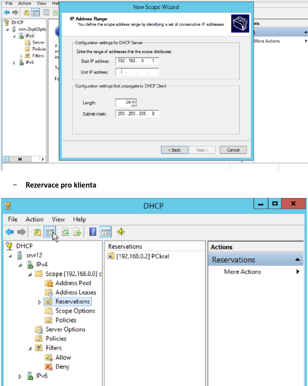
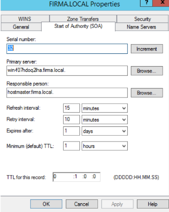
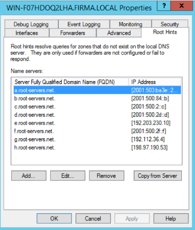
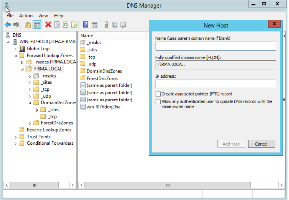

# Síťové služby: dhcp a dns

## DHCP – Dynamic Host Control Protocol

- Protokol aplikační vrstvy TCP/IP
- Technologie typu klient – server
- Technologie DHCP serverům umožňuje zapůjčit adresy IP počítačům a jiným zařízením, které jsou klienty DHCP
- Zapůjčuje: IP, MASKU PODSÍTĚ, PRIMÁRNÍ A SEKUNDÁRNÍ DNS, DEFAULT GATEWAY
- Má statickou IP adresu
- Pomocí DHCP serveru lze provádět:
  - Zapůjčovat adresy IP klientům DHCP na určitou dobu a jejich automatické obnovení na žádost klienta
  - Automatická konfigurace počítačů propojených do počítačové sítě
  - Automatická aktualizace parametrů klientů DHCP změnou možnosti serveru
  - Možnost rezervace IP adres – některé IP adresy můžeme zarezervovat pro konkrétního klienta (jeho identifikátor bude MAC adresa)
  - Vyloučení adres IP nebo rozsahů adres z distribuce serverem DHCP za účelem jejich možného použití pro staticky konfigurované servery, směrovače a jiná zařízení vyžadující statické adresy IP
  - Poskytování služeb DHCP mnoha dalším podsítím, za předpokladu, že jsou směrovače konfigurovány pro předávání zpráv DHCP
  - Konfigurace serveru DHCP pro poskytování služby registrace názvů DNS klientům DHCP
  - Přiřazení adres více směrového vysílání klientům DHCP založeným na protokolu IP
- Platnost přidělených údajů je omezená, proto je na PC spuštěn DHCP klient, který jejich platnost prodlužuje
- V případě, že DHCP je součástí domény, je potřeba doplnit doménového administrátora jako uživatele, který může administrovat
- Musíme definovat obor zapůjčovaných IP adres (scope, pool)
  - Scope = rozsah IP adres, které server DHCP může pronajmout klientům
- Definujeme časový interval, na který je IPA vypůjčena
- Komunikace probíhá na portech:
  - **68** – klient (zařízení, které žádá o přidělení konfigurace)
  - **67** – port, na kterém naslouchá DHCP server
- Nastavení na úrovni serveru
  - Ovlivní všechny scope
  - Nastavení pro všechny podsítě
- Nastavení na úrovni scope
  - Pouze pro konkrétní podsíť
  - Má prioritu
- Pevná IP adresa pro vybraného klienta se přiděluje pomocí identifikátoru – MAC adresy a pouze v rámci scope
- Vytvoření tzv. Scope
  - Nastavujeme rozsah IP adres, výjimky rozsahu, dobu zapůjčení, popř. další nastavení

 

 

- Dále můžeme povolit (Allow) nebo zakázat (deny) vybraného klienta, aby nedostal IP adresu
- Dostane automaticky APIPU
- Pokud chceme ručně požádat neo uvolnit IP adresu tak v cmd zadáváme:
  - IPCONFIG /RELEASE
    - Uvolní DHCP konfiguraci z klienta (alias odhodí starou IP)
  - IPCONFIG /RENEW
    - Opětovně žádá o DHCP konfiguraci (alias přidělení nových parametrů)

## DNS – DOMAIN NAME SERVER

- Protokol aplikační vrstvy TCP/IP
- Slouží k překladu jmen objektů (doménová jména) na IP adresy nebo jiné zdrojové záznamy – dopředný záznam
- Doménové jména: `www.seznam.cz` – IP adresa: `192.168.0.1`
- Může překládat i naopak IP adresy na doménové jména – reverzní záznamy
  - **A** – záznam pro hostname IPv4
  - **AAAA** – záznam pro IPv6
  - **NS** – nameserver
- Komunikace spočívá v rekurzivních a iterativních záznamech
  - **Rekurzivní** – klient – server (může použít i server, pokud se potřebuje doptat dále)
    - Klient očekává finální odpověď
    - Dotaz na sebe sama
  - **Iterativní** – server – server (dotazy na kořenové DNS servery) - Pro internet
- Jmenný prostor DNS se skládá z tzv. zón
  - Zónu tvoří minimálně jedna doména
  - Mohou být:
    - Obyčejné – data v textovém souboru
      - Např. `C:\Windows\System32\DNS\novaZona.dns`
    - AD integrované – využití active direktory
      - data jsou uložena přímo v databázi active direktory
- Užitečné nástroje:
- **NSLOOKUP** – příkaz na dotaz na DNS a diagnostiku
- **DNSCMD** – správa DNS serveru v příkazovém řádku
- **TTL** – označuje maximální dobu, pro kterou je možné uchovat data v cache cacheovacího serveru – obvykle je to 24 hodin

 

 

- **ROOT HINT** – kořenový DNS server
  - Představují základní část infrastruktury internetu
  - Je jich 13 a jsou pojmenovány podle abecedy od A až po M
  - Poskytují kořenový zónový soubor ostatním DNS serverům
    - Popisuje, kde se nacházejí autoritativní servery pro domény

 

 

- **AUTOMATIC UPDATE ZÓNY** – dynamická aktualizace zóny, kdykoliv dojde ke změně na DNS serveru

- **DNS MANAGER** – vytvoření hosta

 

 
