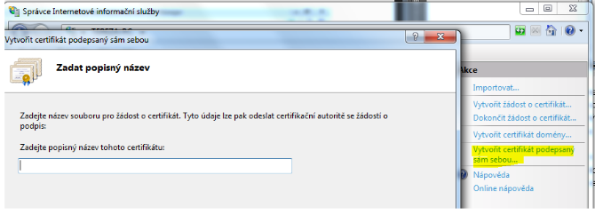
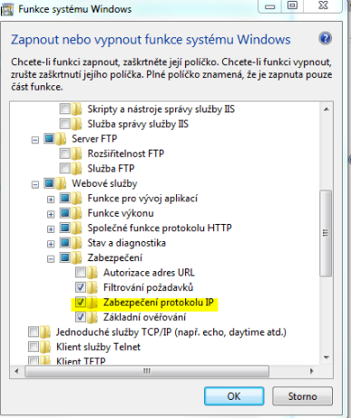

# Síťové služby: IIS – Internet Information Services

- Softwarový webový server vytvořený společností Microsoft
- Druhý nejpoužívanější webový server (první je APACHE)
- IIS nabízí svůj obsah svému okolí
- Naslouchá na portu 80 (http), 443 (https) nebo na jiných.
- Verze 7.5 podporuje protokoly aplikační vrstvy – http, HTTPS, FTF, FTPS, SMTP a NNTP
- Není defaultně zapnut 🡪 je nutné si ho doinstalovat přes PROGRAM 🡪ZAPNOUT/VYPNOUT FUNKCE SYSTÉMU 🡪 INTERNETOVÁ INFORMAČNÍ SLUŽBA
  - IIS poskytuje:
    - Celkové zabezpečení webového serveru
    - Vlastní generování certifikátů – SSL
    - Celkovou správu webového serveru
  - Windows Authentication (neboli Ověřování) se musí doinstalovat – slouží k zabezpečení stránky
- Doinstalování balíčku IIS:

 

 

- Po doinstalování, když zadám do vyhledávače _„localhost“_ zobrazí se defaultní stránka IIS
- Funkčnost:
  - Výchozí složka webu: `C:\inetpub\wwwroot (%systemdrive%\inetpub\wwwroot)`
  - v záložce WEBY (sites) přidáváme vlastní web
    - nastavujeme jméno webu, cestu k html souboru, typ a port
- vytvořený dokument je nutné přidat do Výchozí dokument (Default document) – zde je uložený seznam souboru, které se mohou stát výchozím souborem webu
- první zobrazovaný dokument se načte po zadání localhost (možno na boku dokument posunout nahoru)

## Virtuální adresáře

- Jiný než domovský adresář serveru (čili jiný adresář než `wwwroot`), kde můžeme mít soubory, které chceme sdílet na webovém serveru
- Přidání nového virtuálního adresáře: Default web sites 🡪 right click na Default Document 🡪 Zobrazit virtuální adresáře 🡪 right click 🡪 Add virtual Directory
- Konfigurace IIS: `C:\Windows\System32\inetsrv\config\aplicationhost.config` (zde můžeme změnit jméno virtuálního adresáře)

## Šifrování SSL

- Secure sockets layer
- Protokol mezi transportní a aplikační (např. mezi TCP/IP a http)
- Zaručuje:
  - **Identifikaci** – díky SSL mají klient i server jistotu, že komunikují opravdu spolu navzájem, a ne s někým jiným, kdo se za druhou stranu vydává
  - **Šifrování komunikace** – zařídí bezpečnou výměnu klíčů
- Poskytuje zabezpečení pomocí šifrování a autentizace komunikujících stran
- Autentizace = proces ověření identity subjektu
- Pokud chceme poskytovat HTTPS musíme mít SSL certifikát
- Využívá jej jak http i https
- Využívá tzv. certifikátů (autorizace strany) – podepsaný veřejný šifrovací klíč, který vydává certifikační autorita, certifikát obsahuje informace o majiteli a vydavateli klíče
- Certifikační autorita:
  - Velké společnosti, kterým důvěřuje velké množství webů
  - Jejich funkcí je prověřovat servery a vydávat jejich majitelům certifikáty
- Certifikát u webu si můžeme jednoduše ověřit:
  - Kliknutím na zámek u adresy
  - 🡪 musí být platný certifikát 🡪 kliknout na něj
  - Je tam napsáno, která autorita ho vydala
- Následovníkem SSL je TSL (Transport Layer Security)
- Certifikát lze:
  - požádat o nějaký SSL certifikát
  - vytvořit doménový certifikát jen pro doménu
  - vytvořit certifikát podepsaný sám sebou

 

 

- po vygenerování vlastního certifikátu, musím konkrétnímu webu ho přiřadit
  - web 🡪 upravit vazby (bindings) 🡪 přidat 🡪 zvolíme https a vybereme certifikát
- poté najet do SSL nastavení 🡪 nastavit požadovat certifikát (vzhledem k tomu, že jsem sama si certifikát podepsala, je těžké ho vyhodnotit jako důvěryhodný)

## IP a domain restriction

- Když potřebujeme zabezpečit, aby se k naší stránce na serveru dostaly jen specifické IP adresy
- Omezení IP adres je nutné naistalovat v podsložce security

 

 

- Můžeme povolovat nebo zakázat nějaké IP adresy nebo pool adres

## Authentication and autorization rules

- Pravidla, kdy povolujeme autentizaci uživatelům pro FTP nebo celkově uživatelům
- Nastavujeme, kdo může adresář navštívit a kdo ne
- Standartně je nastaveno, že všichni uživatelé mohou zobrazovat obsah
  - Přenastavit to můžeme na určené uživatele nebo na skupiny
  - Lze nastavit i jejich oprávnění
- K autorizaci přístupu používáme Windows Authorization
- Musíme doinstalovat 🡪 FTP server 🡪 rozšiřitelnost FTP

### IIS Express

- Omezená verze IIS
- Převážně pro klientské systémy
- Slouží pro testovací účely – něco jako xampp

## FTP – file transfer protocol

- Slouží pro přenos soubor mezi počítači přes sít
- Může být i šifrovaný – FTPS
- **FTP server** – server na který soubory posíláme z FTP klienta

## Podotázky

- Způsoby odlišení jednotlivých webů na webovém serveru
  - Adresářovou strukturou webového adresáře
  - Virtuálními adresáři
  - Umístěními mimo root webu
  - Portem ale zejména hlavičkou
- Způsoby získání SSL certifikátu
  - Zakoupením od tzv. certifikační autority např. `ica.cz`, Postsignum, česká posta
  - Naistalovat si na své síti komponentu serverového OS vydávající certifikáty a vystavit certifikáty ve své síti
  - Vystavit si sám sebou podepsaný certifikát (nouzové čí výukové řešení)
- Kolik bitů má IPAv4? – 32 bitů
- Typy IPA z hlediska použité sítě
  - Veřejné
  - Privátní – `10.0.x.x`, `172.16.x.x`, `192.168.x.x`
- Speciální IPA
  - **APIPA** – `169.254.x.y`
  - **Localhost** - `127.0.0.1`
- **Co je to iLO?** – software pro dálkovou správu serveru
