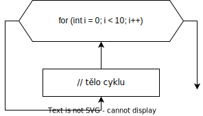
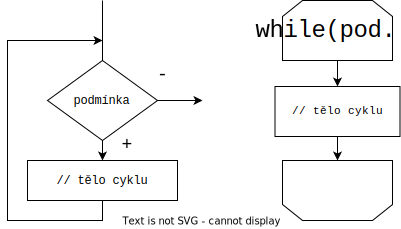
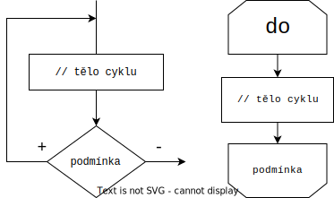

# Strukturované programování - cykly

- používáme tehdy, když chceme, aby se něco opakovalo
- tři základní druhy: cyklus s řídicí proměnou, cyklus s podmínkou na začátku a cyklus s podmínkou na konci
- používá se zde operátor pro inkrementaci/dekrementaci

## Cyklus s řídící proměnou - FOR

- tento cyklus má stanovený **pevný počet opakování** a hlavně obsahuje tzv. řídící proměnnou (celočíselnou), ve které se postupně během běhu cyklu mění hodnoty

```csharp
// for (inicializace, podmínka, aktualizace)
for (int i = 0; i < 10; i++) {
	// tělo cyklu
}
```

- v inicializaci nastavujeme nejčastěji hodnotu 0 (int i =0)
- podmínka musí být splněna pro vykonání dalšího kroku cyklu, když přestane platit, cyklus se ukončí
- aktualizace znamená co s danou proměnou má stát například zvýší se vždy o 1 (i++)
- nejčastěji se využívá u polí

<p align="center">
  
</p>

## Cyklus s podmínkou na začátku - WHILE

- Cyklus opakuje příkazy dokud platí podmínka
- Nejčastěji je podmínka `boolean`, používá se například při dotazu zda chce uživatel pokračovat

```csharp
while (podmínka) {
	// tělo cyklu
}
```

<p align="center">
  
</p>

## Cyklus s podmínkou na konci - DO

- Používá se v případech, kdy víme, že cyklus musí být proveden alespoň jednou, přičemž nemusíme znát kolik opakování přesně bude.
- Dokud je podmínka splněna, program se vrací na začátek těla cyklu a ten se opakuje

```csharp
do {
	// tělo cyklu
}
while(podmínka)
```

<p align="center">
  
</p>
