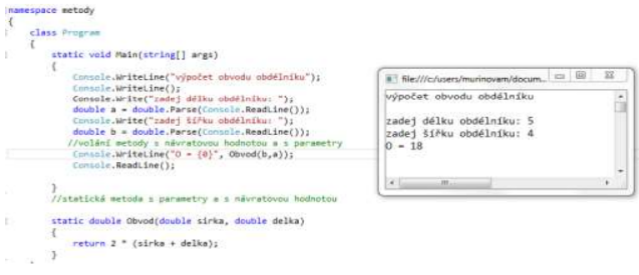
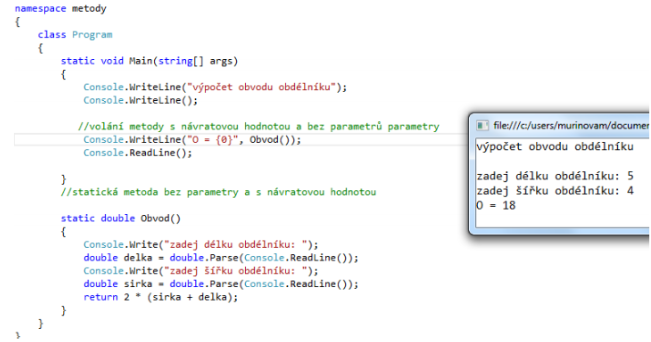
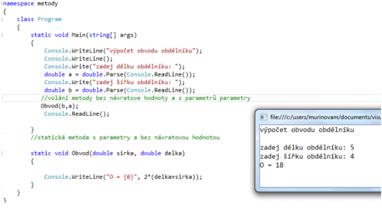
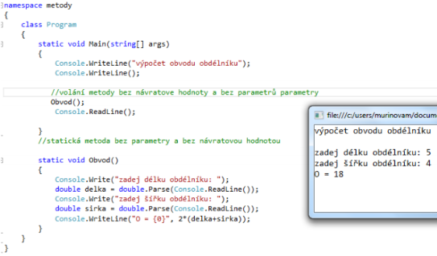

# Metody

- Samostatná část programu, kterou můžeme volat v jiné metodě nejčastěji v main(). Metoda je vždy deklarována uvnitř třídy.

## Rozdělení metod:

- Statické – vztahují se k nějaké třídě např. `Math.Round()`
- Metody instance – vztahují se k objektu

### Vlastní statické metody

- Vytváří je uživatel, nejprve je musíme napsat a pak je můžeme využít

### Deklarace metody:

#### Hlavička

- Obsahuje klíčové slovo static, datový typ, název a parametry
- Může být s parametry(`string j`) nebo bez parametru()

#### Tělo

- Zbylý kód programu
- Pokud se jedná o metodu s návratovou hodnotou píšeme zde příkaz return

### Volání metody:

- Voláme v Main nebo v jiné metodě
- Název(skutečný parametr)
- Skutečný parametr je hodnota, kterou mu předáváme při volání metody
- Pokud metody vrací hodnotu musíme ji zapsat buď do nějaké proměnné, nebo vytisknout.

#### Název(skutečný parametr)

- Skutečný parametr je hodnota, kterou mu předáváme při volání metody
- Pokud metody vrací hodnotu musíme ji zapsat buď do nějaké proměnné, nebo vytisknout.

### Oblast platnosti proměnné:

- Lokální proměnná – je deklarovaná uvnitř metody a je platná pouze pro tuto metodu. Je nutné ji inicializovat.
- Proměnná třídy – jsou deklarované vně metody. Při deklaraci je nutné uvést slovo static. Jsou přístupné všem metodám v dané třídě. Mohou být deklarované až za metodou, ve které je používáme.

- V rámci jednoho bloku (část programu uzavřená v složených závorkách) nelze deklarovat proměnné se stejným jménem. Pokud pojmenujeme stejně lokální a nelokální proměnnou, lokální ji zastíní.

- Pokud bychom v metodě chtěli využit nelokální proměnnou musíme k ni přistupovat přes třídu (třída.proměnná).

## Metoda s parametry s návratovou hodnotou

- Do kulatých závorek zadáváme parametry
- V těle programu píšeme příkaz return

 

 

## Metoda bez parametrů s návratovou hodnotou

- Kulaté závorky v hlavičce jsou prázdné
- Formální parametry se používají pro předávání hodnot, pokud tam nejsou, nechce předávat hodnoty.
- Při volání metody nesmíme zapomenout na závorky.

 

 

## Metoda bez návratové hodnoty s formálními parametry

- Metoda nevrací žádnou činnost. Její datový typ je void (prázdny datový typ)

 

 

## Metoda bez návratové hodnoty a bez formálních parametrů

 

 

## Každá metoda může být:

- `Public` – veřejná použitelná kdekoliv
- `Private` – soukromá – použitelná pouze ve třídě, ve které je vytvořená
- `Protected` – chráněná – použitelná zděděných třídách
- `Override` – přepsaná – když má stejnou hlavičku, ale dělá něco jiného (v rámci dědění)
- `Overload` - přetížená v jedné třídě je několik stejně pojmenovaných metod s jiným počtem parametrů
