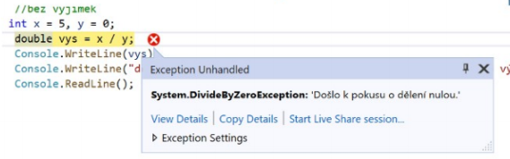

# Výjimky

- Je to pasivní ošetření chyb
- Používá se pro ošetření chyb v kódu, aby se zamezilo pádu programu
- Pokud v `try` program narazí na chybu, stačí tu chybu ošetřit v `catch` a program pokračuje dál

```csharp
Try
{
  //Kód programu
}
Catch
{
  //Chybové hlášení
}

```

## Druhy výjimek:

### ArithmeticException

- `DividedbyZeroException` – dělení 0
- `OverFlowException` – ve výsledku je číslo, které přesáhne hranici rozsahu datového typu, nemůžu ani navyšovat inkrementací maximální hodnotu

### ArgumentException

- `ArgumentNullException` – hodnota Null v argumentu
- `ArgumentOutOfRangeException` – mimo rozsah argumentů

### FormatException

- Pokud do proměnné zadám nevhodnou hodnotu tzn do číselného dat typu zadám text

### IndexOutOfRangeException

- Přetečení pole, chci napsat více prvků než je rozsah pole

```csharp
static void Main(string[] args)
{
  //výjimky dělení nulou
  //bez výjimek
  int x = 5, y = 0;
  double vys = x / y;
  Console.Writeline(vys);
  Console.WriteLine("dělíme celé čisla nulou, ale bez výjimek se tady k tomuto výpisu nedostanu" );
  Console.ReadLine();
}
```

- Po spuštění programu, program spadne

<br>



<br>

- Po použití výjimek program se provede

```csharp
static void Main(string[] args)
{
  //výjimky dělení nulou
  //bez výjimek
  int x = 5, y = 0;
  try
  {
    double vys = x / y;
    Console.WriteLine(vys);
  }
  catch(Exception e)
  {
    // Zobrazí chybové hlášení
    Console.WriteLine(e.Message);
  }
  Console.WriteLine("dělíme celé čisla nulou, ale bez výjimek se tady k tomuto výpisu nedostanu" );
  Console.ReadLine();
}
```

## Using

- Zjednodušená konstrukce pro výjimky
- `Using` => nahrazuje bloky `try`, `finally`
- Parametrem je vytvoření instance pro zápis nebo čtení ze souboru

## Odchytávání výjimek

- Používáme příkaz `throw`
- Definujeme výjimku přímo v programu, například v cyklu nebo ve větvení

```csharp
static void Main(string[] args)
{
  int cislo1, cislo2 = 0;
  Console.Write("Zadej čislo 1: ");
  cislo1 = int.Parse(Console.ReadLine())
  if (cislo2 == 0)
    throw new DivideByZeroException(); //volám výjimku
  else
    Console.WriteLine(cislo1 / cislo2);
  Console.ReadLine();
}
```

## Vlastní výjimky

- Pro definovaní vlastních výjimek si vytvoříme třídu
- Třída by měla mít v názvu slovo exception
- Samotná třída dědí z třídy `Exception`
- Může být prázdná nebo obsahovat konstruktor s parametry
