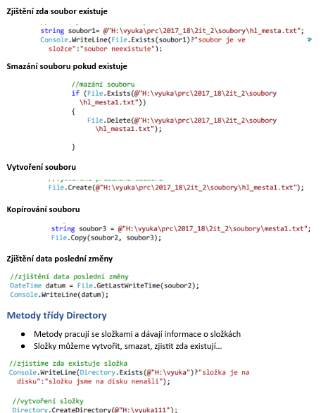

# Práce se soubory

- Abychom mohli pracovat se soubory musíme mít připojenou knihovnu `using Systém.IO`

## Zápis do souboru

- Zápis do souboru provedeme pomocí třídy `StreamWriter`
- Při práci se soubory je dobré využít výjimky `TRY` příkazy pro zápis nebo výpis `CATCH` výjimka text soubor nenalezen, `FINALLY` zavření souboru
- Do souboru můžeme zapisovat text i čísla

```csharp
StreamWriter zapis_z_klaves = new StreamWriter(@"D:\ŠKOLA\ukol.txt", true)
```

- Za `@` Cesta k souboru
- Vlastnost `true` přidání hodnot k původním

### Přímý zápis

```csharp
zapis.WriteLine("Ostrava");
zapis.WriteLine("Brno");
zapis.WriteLine("Praha");
```

### Zápis zadáním klávesnice

```csharp
Console.WriteLine("Zapiš jména: ");
string nazvy_k = Console.ReadLine();

zapis_z_klaves.WriteLine(nazvy_k);
```

### Zápis je třeba ukončit a zavřít soubor

```csharp
zapis_z_klaves.Close();
```

## Čtení ze souboru

- Čtení souboru tzn. Zobrazení v konzolové aplikaci provedeme pomocí třídy `StreamReader`
- Soubor je čten po řádcích, dokud nenarazí na znak konce dokumentu => prázdný řádek

```csharp
Console.WriteLine("Čti jména ze souboru: ");
StreamWriter cti_jmena = new StreamWriter(@"D:\ŠKOLA\jmena.txt", true)

```

### Čtení souboru, soubor se čte, dokud nenarazí na prázdný řádek

```csharp
try
{
  while (!cti_jmena.EndOfStream)
  {
    // To co přečteme zapíšeme do konsole
    Console.WriteLine(cti_jmena.ReadLine());
  }
}
```

### Ukončení čtení / zavřít soubor

```csharp
finally
{
  cti_jmena.Close();
}
```

## CSV soubory

- Je to soubor do, kterého se záznamy ukládají jako do tabulky
- Pokud jej otevřeme v poznámkovém bloku položky jsou oddělené ;

### Zadání cesty k souboru

```csharp
Console.WriteLine("Zadej cestu k souboru včetně názvu: ");
string soubor = Console.ReadLine();

using (StreamWriter zapis = new StreamWriter(soubor, true, Encoding.Default))
{
  // Zápis do souboru
  string zavodnik = string.Join(";", jmeno, prijmeni, auto, misto);
  zapis.WriteLine(zavodnik);
}
```

### Čtení souboru pomocí pole

```csharp
using (StreamReader cteni = new StreamReader(soubor, Encoding.Default))
{
  // Hodnoty musíme oddělit split (";")
  string text = "";
  while (( text = cteni.ReadLine() ) != null )
  {
    string[] hodnoty = text.Split(":");
    foreach (var h in hodnoty)
    {
      Console.Write("{0} , h");
    }
  }
}
```

## Metody třídy FILE

- Jsou to metody, které dávají informace o souboru a pracují se soubory
- Soubor můžeme: vytvořit, smazat, kopírovat, zjistit zda existuje…

<br>



<br>
