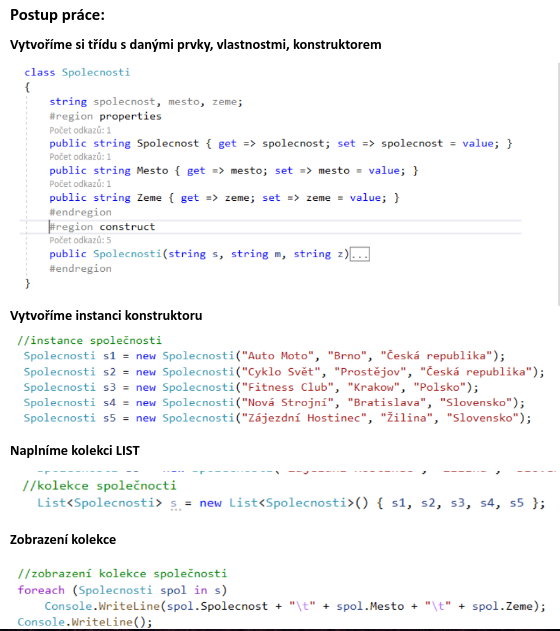
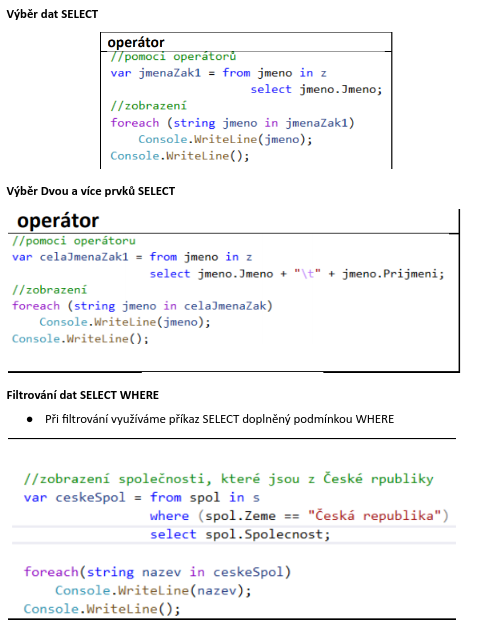
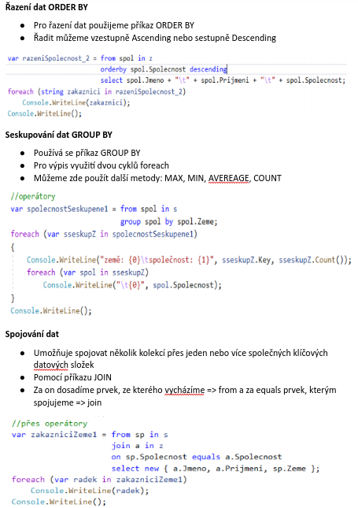

# LINQ

- **LINQ** (Language Integrated Query)
- Integrovaný dotazovací jazyk, podobný jazyku SQL
- Slouží pro práci s daty v kolekcích
- Dotazy umožňují měnit strukturu dat, aniž by se změnil kód programu
- Umí zpracovávat data v XML souborech

### Operátory / metody

- Využívají se dotazové operátory = malá písmena, nevyužívá se lambda operátoru

```csharp
// Pomocí operátorů
var jmenaZak1 = from jmeno in z select jmeno.Jmeno;

// Zobrazení
foreach(string jmeno in jmenaZak1)
  Console.WriteLine(jmeno);
Console.WriteLine();
```

- Nebo metody = velká písmena, pro definici se využívá lambda operátor

```csharp
// PDotaz pro vybrání pouze jmén ze zákazníků
var jmenaZak = z.Select(zak => zak.Jmeno);

// Zobrazení
foreach(string jmeno in jmenaZak)
  Console.WriteLine(jmeno);
Console.WriteLine();
```

### Datový typ

- Datový typ dotazu je `var`, který si určí datový typ u překladu

### Jazyk LINQ

- LINQ pracuje s daty libovolné kolekce nebo polem
- Všechny kolekce se, kterými pracuje dědí z rozhraní `IEnumerable`
- Rozhraní umožňuje příkazy pro procházení kolekcí

### Enumerátor

- Je objekt, který vrací metodu `GetEnumerator` z kolekce
- Obsahuje referenci na daný prvek a pomocí metody `MoveNext` se přesune na další prvek kolekce
- Používá se kombinace `foreach` a cyklu `while`

```csharp
IEnumerator<int> enumerator2 = collection2.GetEnumerator();
while (enumerator2.MoveNext())
  Console.Write(enumerator2.Current);
```

<br>



<br>

## LINQ operace

<br>



<br>

<br>



<br>

### Agregační funkce

- U `SELECTU` můžeme využít mnoho dalších metod a funkcí
- `MIN()` - vypíše nejmenší hodnotu
- `MAX()` – vypíše největší hodnotu
- `AVERAGE()` – spočítá průměr ze zadaných hodnot
- `COUNT()` – Spočítá počet prvků v kolekci
- `SUM()` – spočítá Součet daných prvků, použití u čísel
- `DISTINCT()` – odstranění duplicity v kolekci
- `FIRST()` – vrací první prvek
- `LAST()` – vrací poslední prvek
