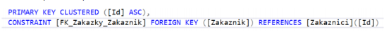

# MS SQL

- Data můžeme v `C#` ukládat trvale do databází
- V `C#` mluvíme o RDBMS (Relational DataBase Management System) – systém řízení báze dat, jde o jakýsi databázový stroj, který používá jazyk MS SQL.
- Krom ukládání dat databáze umožňuje:
  - zabezpečení
  - optimalizaci výkonu
  - konzistentnost (uzamčení dat při zápisu, po ukončení zápisu se znovu odemknou)
- Umožňuje vytvářet tzv. transakce spojení několik dotazů, tak že se buď vykonají všechny anebo žádný.
- Transakce mají 4 základní vlastnosti `ACID`
- **Neoddělitelnost (Atomicity)** - transakce se provede tehdy, když se provedou všechny dotazy, které obsahuje, pokud se alespoň jeden neprovede, pak se transakce ukončí a databáze je v původním stavu.
- **Konzistentnost (Consistency)** – po každé transakci je databáze v konzistentním stavu
- **Izolace (Isolation)** – jednotlivé operace se provádějí izolovaně a neovlivňují se navzájem
- **Trvanlivost (Durability)** – data se zapisují do trvanlivého úložiště (pevný dis, cloud, …), tzn. Při přerušení energie je databáze uložena takže po obnově el. Energie je v stejném stavu jako před jejím výpadkem

## Relační datový model

- Nejpoužívanější model databází
- Základem relačních databází jsou relace (tabulky), podobné relaci např. v MS Excel.
- Relace (tabulky) jsou propojené předem nastavenými vztahy.
- Relace obsahuje jednotlivé atributy = sloupce a řádky = záznamy.

<table>
	<tr>
		<th>Číslo</th>
		<th>Jméno</th>
		<th>Dat_nar</th>
		<th>Plat</th>
		<th>ZPS</th>
		<th>Smlouva_od</th>
	</tr>
	<tr>
		<td>1</td>
		<td>Petr Novák</td>
		<td>1.1. 1985</td>
		<td>20 000</td>
		<td>A</td>
		<td>1.5. 2000</td>
	</tr>
	<tr>
		<td>2</td>
		<td>Jan Velký</td>
		<td>1.2. 2005</td>
		<td>26 000</td>
		<td>A</td>
		<td>1.5. 2020</td>
	</tr>
	<tr>
		<td>3</td>
		<td>Martin Novák</td>
		<td>1.1. 1990</td>
		<td>30 000</td>
		<td>N</td>
		<td>1.6. 2018</td>
	</tr>
</table>

## Vlastnosti relací

Relace má jméno, které musí být jedinečné
Každá relace musí obsahovat minimálně jeden sloupec
Každý sloupec má v relaci jedinečné jméno
Všechny hodnoty v jednom sloupci mají stejnou doménu (stejný dat. Typ)
Nezáleží na pořadí sloupců ani řádků
Každý záznam musí být jedinečný
Každá buňka relace obsahuje přesně jednu hodnotu => je atomická

Datové typy

- `int`, celé čislo, `4B`
- `bigint`, celé číslo, `8B`, `long`
- `tinyint`, celé číslo, `1B`, `byte`
- `real`, des. číslo, `4B`, `float` (ukládá se v dvojkové soustavě)
- `float`, des. čislo, `8B`, `double` (ukládá se v dvojkové soustavě)
- `decimal numeric`, des. čislo, pro vysokou přesnost, ukládá se v desitkové soustavě, udává se počet des. Mist a míst celkem
- `bit`, logická hodnota, `bool`
- `nvarchar`, text. řetězec, `string` - proměnlivá délka
- `nchar`, text. řetězec, `string` - pevná délka a pokud tam tolik znaků neni doplni mezery
- `datetime`, datum a čas, `DateTime`

## Jazyk SQL

- Veškeré požadavky na data se zpracovávají pomoci dotazovacího jazyka SQL. Jazyk je univerzální pro různé databázové produkty i když určité rozdíly existují. MS SQL Server používá jazyk `T SQL` (transact SQL)

## Dotazy

- Jestli už máme v tabulce nějaké data, můžeme na ně vytvářet dotazy
- Mezi základní dotazy patří SELECT, INSERT, UPDATE, DELETE
- Provedení dotazu kliknutím na zelenou šipku

### SELECT

- Vypíše z tabulky záznamy
- Můžeme vypsat všechny, pouze určité sloupce, pouze určité záznamy vyhovující podmínce příkaz `WHERE`
- Záznamy můžeme dále třídit podle nějakého pole příkazem `ORDER BY`

```sql
select * from Zakaznici where mesto is not null order by Prijmeni

```

### INSERT

- Vloží nám do tabulky další záznam
- Textové prvky a datum vkládáme do apostrofů

```sql
insert into Zakaznici(Id, Prijmeni, Jmeno, Mesto, Mail, Telefom) values(6, 'Světlá', 'Jarmila', 'Ostrava', 'jarmila@svetla.com', '666666666')
```

### UPDATE

- Aktualizace položek v tabulce

```sql
update Zakaznici set Jmeno='Jakub', mail="jakub@google.com" where Id=7
```

### DELETE

- Vymaže zvolený záznam

```sql
delete from Zakaznici where Prijmeni='Světlá' and Jmeno='Jarmila'
```

## Spojení více tabulek

- Někdy je nutné mít v databázi více tabulek, aby byla dodržená konzistence
- Tabulky mezi sebou propojíme pomocí cizího klíče

<br>



<br>
