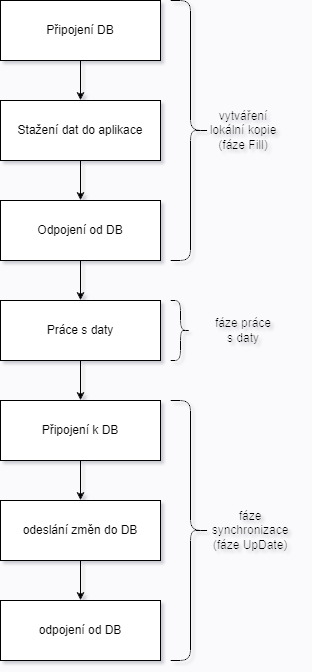
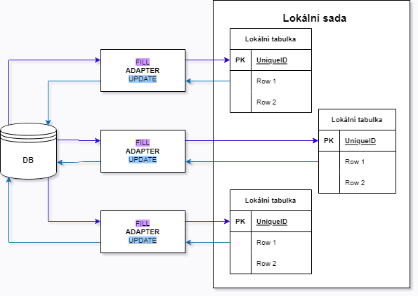
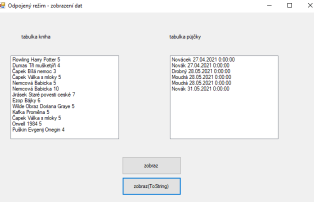
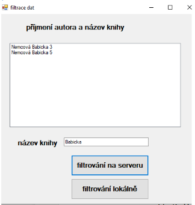

# ADO.NET - odpojený režim

- nepracuji s DB na serveru, kopie DB v paměti aplikace, po skončení odešleme změny do DB
- komfortnější práce s daty
- vhodné jsou tabulky, které často používám

## ORM (objektově relační mapování)

<p align="center">
  
</p>

- **Připojený režim** - přímý - SQL přístup
- **Odpojený režim** - paměťový - objektový přístup

<p align="center">
  
</p>

- `Adapter` - zprostředkuje komunikaci mezi DB a lokální sadou. Pracuje buďto v metodě `FILL` (naplní lokální sadu), nebo v metodě `UPDATE` (synchronizace)
- Pro práci v odpojeném režimu používáme:
  - třídu `DataSet` - lokální sada
  - třídu `DataTable` - lokální tabulky
  - Musíme mít připojený namespace `System.Data`

## Vytvoření lokální sady

- V aplikaci přidám nový `Item DataSet` pomocí `Add > New Item` a pojmenuju ho `LokalniSada`
- Přetáhneme tabulky z DB `Server Exploreru` do tabulky pomocí `Project > NewItem`
- Vytvoříme si pomocnou třídu, ve které budou vnořené třídy pro konverzi pomocí `ToString()` pro každou tabulku zvlášť

```csharp
partial class LokalniSada
{
  // Vnořená třida pro Kniha
  partial class KnihaRow
  {
    // Upravení metody ToString
    O references
    public override string ToString()
    {
      return Autor_prijmeni + " " + Nazev + " " + PocetKs;
    }
  }

  partial class PujckyRow
  {
    // Upravení metody Tostring
    public override string ToString()
    {
      return Zakaznik_prijmeni + " " + Datum_vypujceni;
    }
  }
}
```

### Metoda pro zobrazení bez toString

```csharp
private void BtnZobtaz_Click(object sender, EventArgs e)
{
  // Zobrazení knih
  // Nejdřív LBX vymažeme
  LbxKniha.Items.Clear();
  // Postupnë procházim jednotlivé položky (řádky) lokálni tabulky
  foreach (LokalniSada.KnihaRow k in sada.Kniha)
  {
    string zaznam = k.Autor_prijmeni + "\t " + k.Nazev + "\t " + k.PocetKs;
    LbxKniha.Items.Add(zaznam);
  }

  // Zobrazení z Půjček
  LbxPujcky.Items.Clear();
  foreach (LokalniSada.PujckyRow p in sada.Pujcky)
  {
    string zaznam = p.Zakaznik_prijmeni + "\t" + p.Datum_vypujceni;
    LbxPujcky.Items.Add(zaznam);
  }
}
```

<br>


<br>

### Metoda pro zobrazení s toString

```csharp
private void BtnZobrazTs_Click(object sender, EventArgs e)
{
  // Knihy
  LbxKniha.Items.Clear();
  LbxKniha.Items.AddRange(sada.Kniha.ToArray());

  // Půjčky
  LbxPujcky.Items.Clear();
  LbxPujcky.Items.AddRange(sada.Pujcky.ToArray());
}
```

<br>



<br>

## Update dat v tabulce

```csharp
// Instance Ls a adapter
LokalniSada sada = new LokalniSada():
LokalniSadaTableAdapters.KnihaTableAdapter adapterkniha = new LokalniSadaTableAdapters.KnihaTableAdapter();
Lokalnisada.KnihaDataTable tabulkaKnihy; // Lokalní tabulka

private void Form1_Load (object sender, EventArgs e)
{
  // Naplnění lokalní sady
  tabulkaKnihy = sada.Kniha; // Do lokalni tabulky přiřadím hodnoty z LS Kniha

  // Naplnění přes adapter použijí metodu Fill
  adapterKniha.Fill(tabulkaKnihy);

  // Zobrazime hodnoty v ListBoxu
  LbxKnihovna.Items.AddRange(tabulkaKnihy.ToArray());
}
```

### Přídání nového záznamu do lokální tabulky

```csharp
private void BtnNovy_Click(object sender, EventArgs e)
{
  // Přidání nového záznamu
  LokalniSada.KnihaRow novyZaznam = tabulkaKnihy.AddKnihaRow( "Božena", "Němcová", "Babička", 2, 1999);
  LbxKnihovna.Items.Add(novyZaznam);
}
```

### Update již existujícího záznamu

```csharp
private void BtnZmena_click(object sender, EventArgs e)
{
  // Změníme nějakou hodnotu u vybrané položky
  // Kontrola zda je v listboxu vybraná položka, pokud ne zobrazí se info v messagebox
  if (LbxKnihovna.SelectedItem == null)
    MessageBox.Show("nutno vybrat položku ze seznamu");

  // Vybranou položku přiřadíme do proměnné
  LokalniSada.KnihaRow vybranaKniha (LokalniSada.KnihaRow) LbxKnihovna.SelectedItem;

  // Měníme název Knihy na POKUS
  vybranaKniha.Nazev = "POKUS";

  // Aby se projevila změna v listboxu tak ho musime znovu přepsat
  // Zjistíme index
  int index = LbxKnihovna.SelectedIndex;
  LbxKnihovna.Items[index] = Lbxknihovna.Items[index];
}
```

### Smazání záznamu

- Mažeme vybranou položku

```csharp
private void Btnvymaz_click(object sender, EventArgs e)
{
  // Vymažeme položku, kterou v LBX vybereme
  // Pokud nemáme nic vybráno zobrazí se info v messagebox
  if (LbxKnihovna.SelectedItem == nul11)
    MessageBox.Show("vyberte položku v seznamu");
  else
  {
    // Mám něco vybrané
    // Zapíši vybranou hodnotu do proměnné
    LokalniSada.KnihaRow vybranyZaznam = (LokalniSada.KnihaRow) LbxKnihovna.SelectedItem;

    // Smazání z lokální tabulky
    vybranyzaznam.Delete();

    // Odstranění z lbx
    LbxKnihovna.Items.Remove(vybranyZaznam);
  }
}
```

- Zkontrolujeme jestli se vybraná položka opravdu smazala

```csharp
private void BtnPosmazani_Click(object sender, EventArgs e)
{
  // Kontrola počtu řádků v tabulce lokální
  MessageBox.Show("počet záznamů v tabulce: " + tabulkaKnihy.Rows.Count);

  // Zobrazení do messageboxu záznamy
  string zaznam = "";
  foreach (LokalniSada.KnihaRow z in tabulkaKnihy)
    // Při zobrazování hodnot v MessageBox se zobrazí chybové hlášení, protože v LT se smazaná hodnota označí, ale nesmaže => nejde zobrazit
    // Ošetříme podmínkou
    if(z.RowState !=DataRowState.Deleted)
      zaznam += z + Environment.NewLine;
  MessageBox.Show(zaznam);
}
```

## Filtrování dat v tabulce

```csharp
public partial class Form1 : Form
{
  LokalniSada sada = new LokalniSada(); // Instance lokalni sady

  // Instance adapteru
  LokalniSadaTableAdapters.KnihaTableAdapter adapterKniha = new LokalniSadaTableAdapters.KnihaTableAdapter();

  // Proměnná pro lokální tabulku
  LokalniSada.KnihaDataTable tabulkaKniha = new Lokalnisada. KnihaDataTable();

  public Form1()
  {
    InitializeComponent();
  }

  // Stáhnu celou tabulku do LS a filtruji až tam
  private void BtnLs_Click(object sender, EventArgs e)
  {
    // Naplnění tabulky
    adapterkniha.Fill(tabulkaKniha);

    // Chci zobrazit V lbx pouze knihy se zadanym nazvem ve formu
    string nazev = TxtNazev.Text;

    // Knížek může byt více tak to přidám postuně do pole
    DataRow[] vybrane = tabulkaKniha.Select( "Nazev ='" + nazev + "'", "PocetKs");
    LbxKniha.Items.Clear();
    LbxKniha.Items.AddRange(vybrane);
  }
}
```

### Filtr na serveru

- Pro úpravu lokální sady kliknu na tabulku poté `Add > Query...`, až se proklikám až k oknu dotazem přepíšu `select` a pojmenuji metodu jako `FillByNazev`

```csharp
private vold BTNServer_click(object sender, EventArgs e)
{
  string nazev = TxtNazev.Text;

  // Naplnění tabulky
  adapterkniha.FillByNazev(tabulkaKniha, nazev);
  LbxKniha.Items.Clear();

  // Zobrazení tabulky
  LbxKniha.Items.AddRange(tabulkaKniha.ToArray()); // V listboxu zobrazim LT
}
```

<br>



<br>