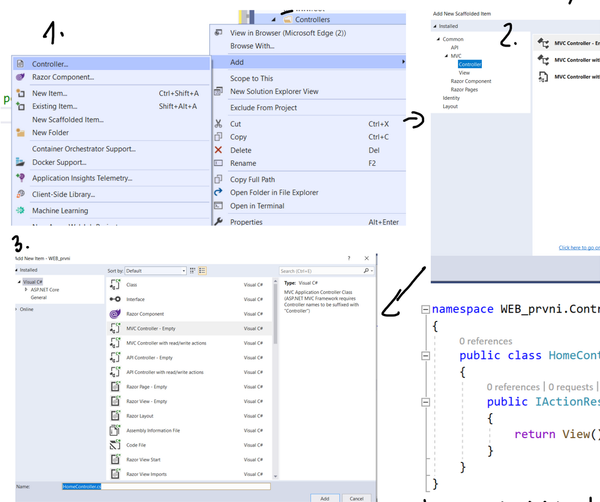

# ASP.NET - Webové aplikace, MVC architektura

## ASP.NET - dynamický web

- technologie založená na architektuře klient-server
- v Asp.Net je program, jehož výstupem je HTML stránka
- primárně běží na IIS, ale také může běžet na Apache

### Webové aplikace v Visual Studio

#### WebForm

- starší technologie
- snaha převést WinForm na webové rozhraní
- složití architektura
- neumí spolupracovat s jinými technologiemi

#### .NET Core

- nejnovější technologie, která využívá architekturu MVC
- dokáže využít i další technologie (Bootstrap, JavaScript)

## MVC architektura

- odděluje logiku od výstupu

#### Model

- logika (výpočty, databázové dotazy)
- využívá třídy
- neví nic o výstupu, pouze připojuje DB zvenku a posílá zpracovaná data
- neví odkud má data ? xD

#### View

- zobrazuje výstup, to co vidí uživatel
- html šablona
- může obsahovat Razor kód
- pohledů může být několik
- obsahuje minimum logiky

#### Controller

- prostředník / rozhraní pro Model a View

## Základní pojmy

- HTML - statický web
- PHP - dynamický web (Apache), dynamické typování, využívá většinou Apache web server
- ASP.NET dynamický web, statické typování (C#), využívá většinou IIS (Internet Information Services), Apache jen za určitých podmínek

### Desktopové aplikace

- aplikace nainstalovaná na konkretním počítači, bere data ze serveru
- **výhody:** výkon, cena
- **nevýhody:** aktualizace aplikace musí být provedeny zvlášť na každém zařízení, složitější správa (instalace SW na více zařízeních), horší bezpečnost

### Webová stránka x Webová aplikace

### Webové aplikace

- přístupné z mnoha zařízeních, multiplatformní (nezáleží na OS a HW)
- jednoduchá správa (nemusí se instalovat), nízká cena vývoje
- uživatelé používají vždy nejnovější verzi aplikace
- běží v prohlížeči ► omezený výkon
- menší dostupnost ► aplikace nejsou obsaženy v instalátorech jako App Store nebo Play Store
- závislá na připojení k internetu

## Vytvoření jednoduché aplikace

### Struktura řešení:

```bash
app/
├── wwwroot/                # statické soubory webapp
│   ├── favicon.ico
│   ├── banner.png
│   ├── script.js
│   └── style.css
├── Controllers/
│   └── HomeController.cs   # mělo by končit slovem Controller
├── Models/
│   └── Generator.cs
├── Views/
│   └── Index.cshtml
├── Program.cs              # odkazuje na Startup.cs
└── Startup.cs              # obsahuje konfigurace aplikace a co se má spustit
```

### Vytvoření Modelu

```csharp
namespace app.Models // skládá se z názvu projektu a složky
{
	public class Generator
	{
		Random r = new Random(); // instance class Random, generuje náhodné číslo
		public int getNum()
		{
			return r.Next(10, 61); // interval <0; 1)
		}
	}
}
```

### Vytvoření Controlleru

<p align="center">
  
</p>

#### Možnosti předávání dat:

- **`ViewData`** - pracuje s daty podobně jako kolekce, dictionary přistupuje k hodnotám pomocí klíče

```csharp
ViewData["Greeting"] = "Ahoj cukrouši";
```

- **`ViewBag`** - interně využívá `ViewData`, k hodnotám přistupuje dynamicky přes vlastnost objektu

```csharp
ViewBag.Greeting = "Ahoj cukrouši";
```

- **`TempData`** - předává data mezi Controller ◄► View, používá se například při přesměrování, po dokončení operace se požadavek smaže

```csharp
TempData["Greeting"] = "Ahoj cukrouši";
```

```csharp
using app.Models.Generator;

namespace app.Controllers
{
	public class HomeController : Controller
	{
		public IActionResult Index()
		{
			Generator g = new Generator();
			ViewBag.Cislo = g.getNum();
			return View();
		}
	}
}
```

### Vytvoření Pohledu

#### Razor engine

- slouží pro vkládání C# kódu do HTML

```
<body>
	@*
		komentář
	*@
	@{
		ViewBag.Title = "Generování čísla";
	}
	<h2>Generování čísla</h2>
	<p>@ViewBag.Cislo</p>
</body>
```

### Middleware

- SW který zpracovává HTTP requests a responses
