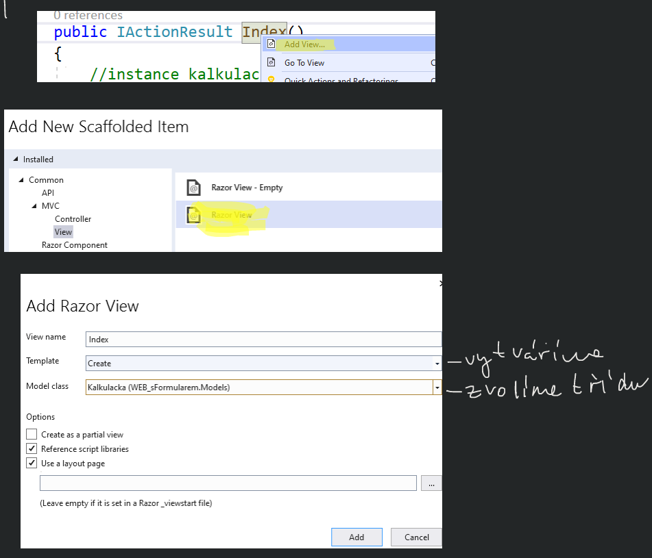
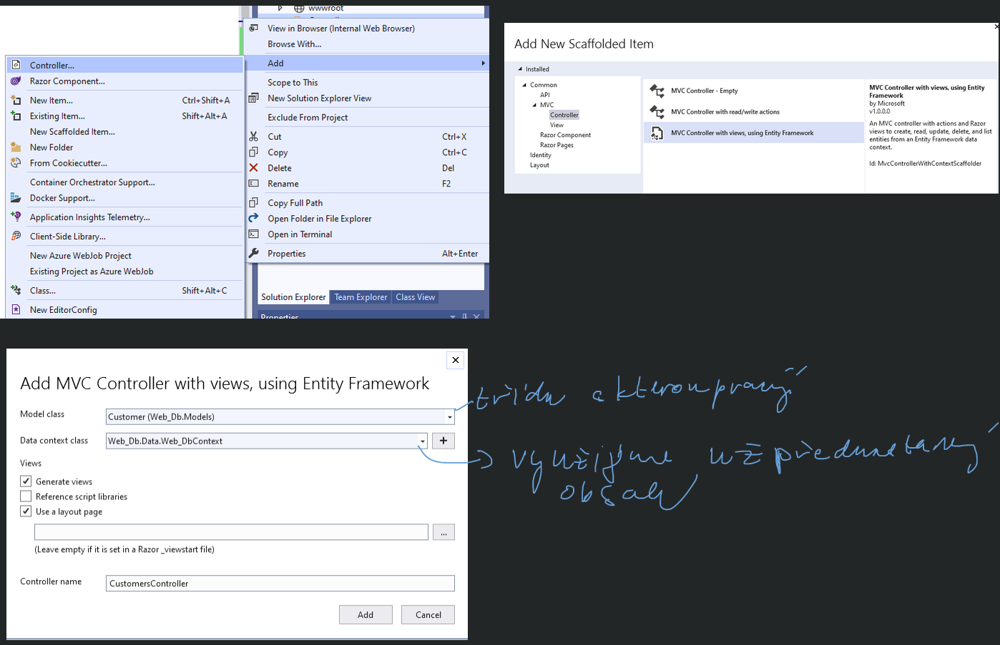
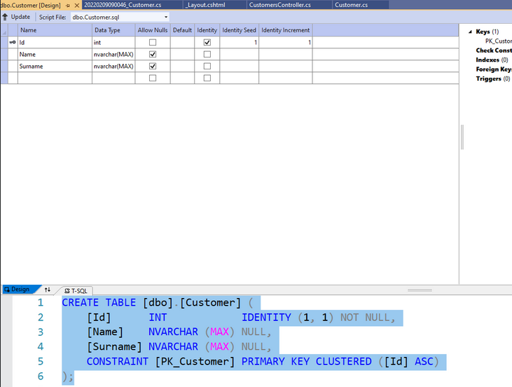

# ASP.NET formuláře a jejich propojení s DB

## Aplikace s formulářem - kalkulačka

### `Models/Kalkucka.cs`

```csharp
public class Kalkulacka
{
	private double a, b, vys;
	private string operator;
	// prvky rozbalovaciho seznamu - kolekce List z datového typu SelectedListItem
	List<SelectListItem> operatory = new List<SelectListItem>();

	// vlastnosti třídy
	public double A { get => a; set => a = value; }
	public double B { get => b; set => b = value; }
	public double Vys { get => vys; set => vys = value; }
	public double Operator { get => operator; set => operator = value; }
	public List<SelectListItem> Operatory = { get => operatory; set => operatory = value; }

	// konstruktor - naplníme kolekci
	public Kalkulacka()
	{
		Operatory.Add(new SelectListItem(text: "součet", value: "+", selected: true));
		Operatory.Add(new SelectListItem(text: "rozdíl", value: "-"));
		Operatory.Add(new SelectListItem(text: "součin", value: "*"));
		Operatory.Add(new SelectListItem(text: "podíl", value: "/"));
	}

	// metoda pro výpočet
	public void Vypocti()
	{
		switch(operator)
		{
			case "+":
				Vys = A + B;
				break;
			case "-":
				Vys = A - B;
				break;
			case "*":
				Vys = A * B;
				break;
			case "/":
				Vys = A / B;
				break;
		}
	}
}
```

### `Controllers/KalkulackaController.cs`

```csharp
public IActionResult Index()
{
	// instance kalkulacky
	Kalkulacka k = new Kalkulacka();
	if (ModelState.IsValid)
	{
		k.Vypocti(); // pokud je model ok, pak voláme metodu
	}
	return View(k); // instanci kalkulačky předávám jako parametr pohledu
}
```

### `View/Index.cshtml`

- buď přepíši existující index nebo vytvořím nový

<p align="center">
  
</p>

**`_ViewImports.cshtml`**

```
@using WEB_sFormularem
@using WEB_sFormularem.Models
@addTagHelper *, Microsoft.AspNetCore.Mvc.TagHelpers
```

```html
<form asp-action="Index">
  <div asp-validation-summary="ModelOnly" class="text-danger"></div>
  <div class="form-group">
    <label asp-for="A" class="control-label">první číslo</label>
    <input asp-for="A" class="form-control" />
    <span asp-validation-for="A" class="text-danger"></span>
  </div>
  <div class="form-group">
    <label asp-for="Operator" class="control-label">první číslo</label>
    @Html.DropDownListFor(model => model.Operatory, new SelectList(Model.Operatory, "Value", "Text"))
    @Html.ValidationMessageFor(model => model.Operatory)
    <span asp-validation-for="Operator" class="text-danger"></span>
  </div>
  <div class="form-group">
    <label asp-for="B" class="control-label">první číslo</label>
    <input asp-for="B" class="form-control" />
    <span asp-validation-for="B" class="text-danger"></span>
  </div>
	<div class="form-group">
    <p>@Model.Vys</p>
    <span asp-validation-for="B" class="text-danger"></span>
  </div>
</form>
```

## Databáze

2 možnosti vytvoření DB:
- **CodeFirst** - nejdříve vytvoříme třídu a pak DB
- **DatabaseFirst** - nejdřív vytvoříme DB a pak generujeme třídu

### CodeFirst

**`Models/Customer.cs`**

```csharp
public class Customer
{
	private int id;
	private string name, surname;

	public int Id { get => id; set => id = value; }
	public string Name { get => name; set => name = value; }
	public string Surname { get => surname; set => surname = value; }
}
```

- Pojmenovávat třídu je doporučeno anglicky pro pozdější použití v controllers (kvůli množného čísla v AJ)
- Třídu rebuildneme proto aby Entity Framework uměl vygenerovat DB
- pravý klik na projekt ► Rebuild

#### Controllers

- vytvoříme nový controller, který využívá EntityFramework

<p align="center">
  
</p>

- do Views se přidá nová složka

```
Views/
  └── Customers/
      ├── Create.cshtml
      ├── Delete.cshtml
      ├── Details.cshtml
      ├── Edit.cshtml
      └── Index.cshtml
```

- Úprava souboru `Layout.cshtml`
- vhodné provést migraci:
- Menu VS: Tools ► Package Manager Console

```
PM> Add-Migration Customer
Build started...
Build succeeded.
To undo this action, use Remove-Migration.
PM> UpDate-Database
```

- DB se ukládá do `C:\Users\%username%\name.mdf`
- V složce projektu vytvořena složka `Migrations`
- po připojení do server exploreru:

<p align="center">
  
</p>

- provádíme-li změnu v třídě, nutno provést migraci

<p align="center">
  
</p>