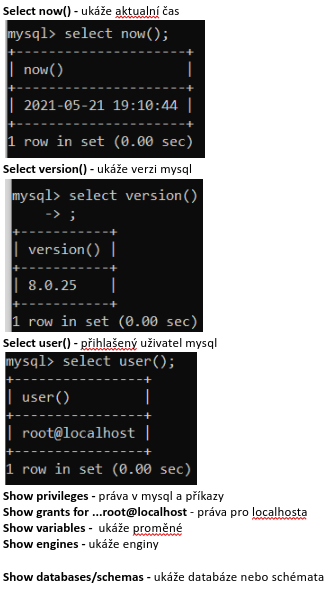
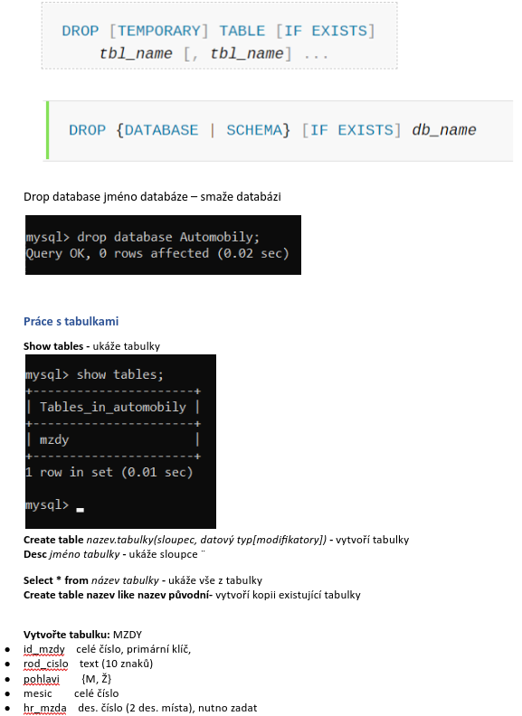
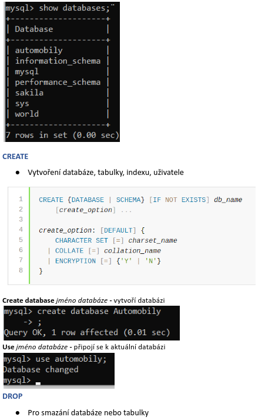
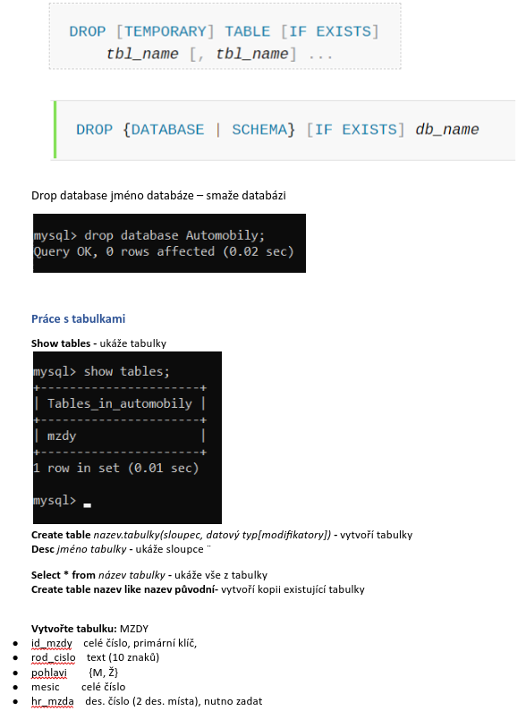
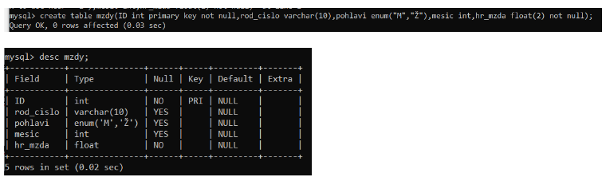

# SQL DDL syntaxe jazyka SQL create, drop

## Jazyk SQL (Structured Query Language)

- je standardizovaný strukturovaný dotazovací jazyk od Společnosti Oracle
- Používá se pro práci s daty v relačních databázích
- Umožňuje vytvářet databáze, vytvářet tabulky, vypisovat, měnit, aktualizovat, mazat, přidávat data

## Rozdělení jazyka

### DDL (Data Definiton Language)

- Příkazy pro definici dat
- Vytváří se struktury: Databáze, tabulky, indexy,
- Vytvořené struktury lze upravovat, přidávat a mazat
- Patří zde příkazy `CREATE, ALTER, DROP`

### DML (Data Modification/Manipulation Language)

- Příkazy pro manipulaci s daty
- Můžeme zde vkládat, měnit, mazat, vybírat data
- Práce s uživateli
- Patří zde příkazy: `INSERT, SELECT, DELETE, UPDATE`

### DCL (Data Control Language)

- Pro ovládání dat, kontrolu nad daty
- Příkazy pro nastavení oprávnění, řízení transakcí
- Patří zde příkazy: `GRAND, REVOKE, CREATE USER`

## Datové typy v My SQL

### Číselné

- Celočíselné: `INT (4B), TINY INT (1B), SMALL INT (2B), BIG INT (8B)`
- Reálné: `FLOAT 4B, DOUBLE(M,D) 8B, DECIMAL(M,D)`

### Znakové

- Pro vkládání textu
- `CHAR(8 – Petr – zbytek vyplní mezerami), VARCHAR(8 – Petr – naplní 4 pouze daný počet znaků), TEXT, BLOB`

### Datum a čas

- Pro vkládání data a času
- `DATE, TIME, DATATIME, TIMESTAMP`

### Výučtové typy

- `ENUM` – například pohlaví `{„m“ nebo „ž“}`, radiobutton
- `SET` – například `{,,hokej,, ,,fotbal,, ,,MMA,,}`, checkbox

## Modifikátory v My SQL

- Klíčová slova, které upravují chovaní databázové tabulky
- `Autoincrement` – u primárního klíče, nejčastěji `INT`, navyšuje každý nový záznam o `1`
- `Primary key` – nesmí být NULL, jedinečný, pro jednoznačnou identifikaci
- `NOT NULL` – nesmí být prázdný
- `DEFAULT` – přednastavená hodnota
- `Foreign key` – cizí klíč propojuje s primárním klíčem více relací
- `Zerofill` – vyplní 0 všechny místa v datovém typu `1 => 0001`
- `Unsigned` – nezáporné hodnoty
- `Unique` – nesmí obsahovat duplicitní hodnoty

## Syntaxe jazyk SQL

- Musí začínat písmenem, nesmí začínat číslem
- Nesmí obsahovat mezery a speciální znaky
- Nesmí se porušovat klíčová slova ( LEVEL, TYPE)
- Klíčová slova musí být vždy velkými písmeny
- Tabulka a databáze musí mít vystihující název

### Syntaxe:

- `[příkaz]` – nepovinný argument
- `(příkaz)` – musím napsat, povinný argument
- `{příkaz}` – výběr z hodnot musí být oděleny `|`
  `…` - sloupec 1, sloupec 2
  `|` - svislítko, `OR`
  `‘‘Ahoj‘‘` – text musí být vždy v uvozovkách nebo apostrofech
- Case sensitive – rozlišují se velké a malé písmena
- Komentáře - `#` pro jeden řádek, `/* pro více řádku */`

## Základní příkazy

 

 

 

 

 

 

 

 

 

 

 

 