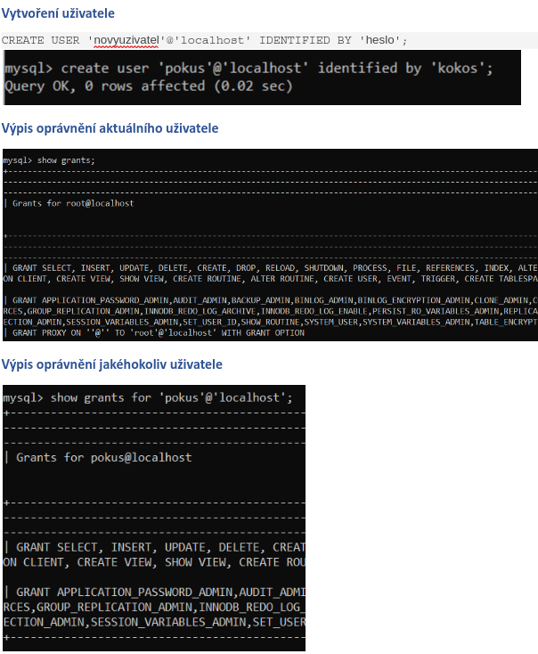
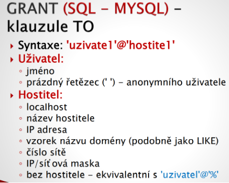
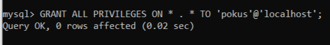
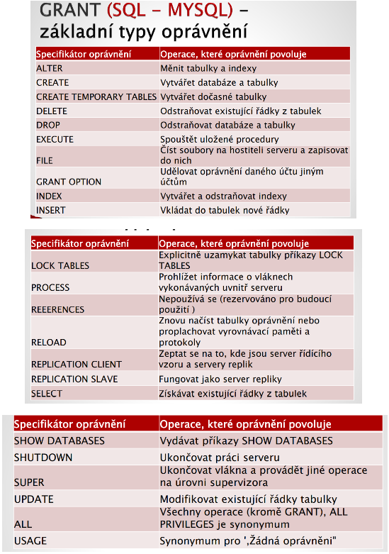
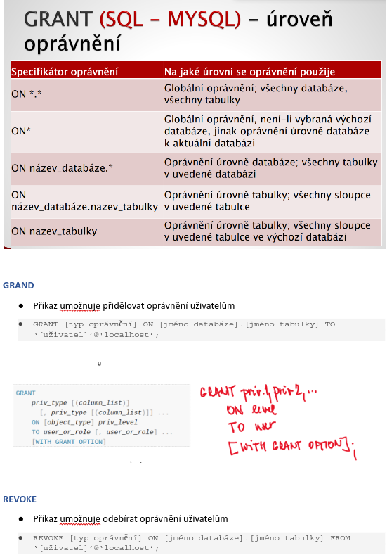
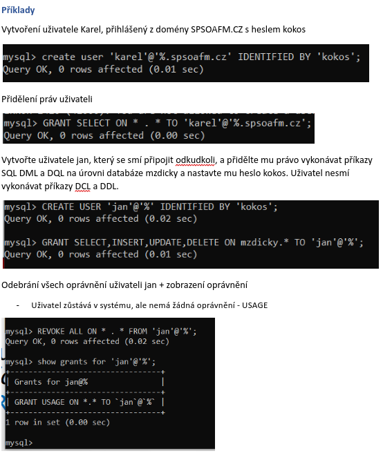
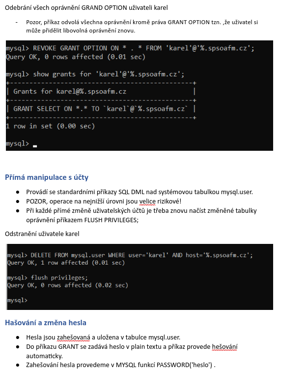
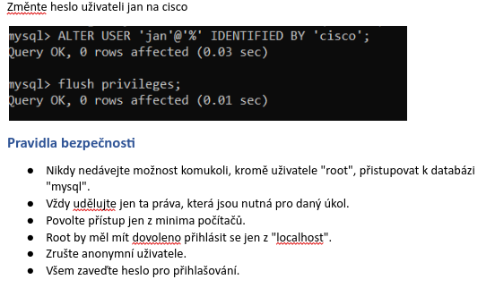

# SQL DCL grat, revoke

 

 

## Typy uživatelů

 

 

## Přidělení práv

- Uživatelské účty jsou uloženy obvykle v systémových tabulkách.
- Každý SŘBD používá vlastní systém uložení uživatelských dat.
- Dva základní příkazy ke správě účtů:
  - `GRANT` - vytváří účty a specifikuje jejich práva.
  - `REVOKE` - odvolává práva k existujícím účtům.
- Příkaz na kontrolu oprávnění:
  - `SHOW GRANTS FOR 'uzivate1'@'host';`
  - `SHOW PRIVILEGES` - zobrazí oprávnění, která lze udělovat včetně kontextu.

### Přidělení všech práv vytvořenému uživateli

 

 

## Základní typy oprávnění

 

 

 

 

 

 

 

 

 

 