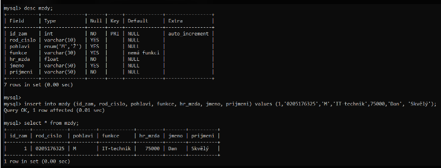
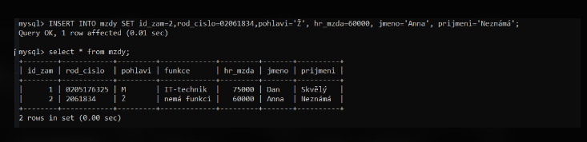
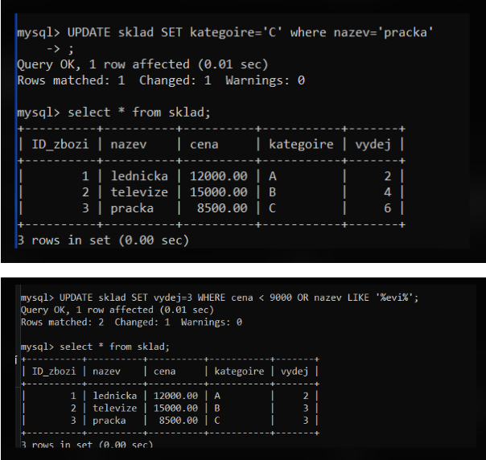
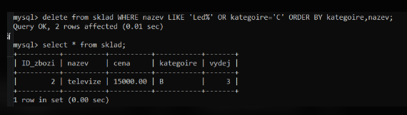

# SQL DML insert, update, delete, truncate

- Jazyk pro manipulaci s daty

## INSERT

- Umožňuje vkládání nových záznamů do relační tabulky

### INSERT pomocí VALUES

- `INSERT [LOW_PRIORITY | DELAYED] [IGNORE] [INTO] nazev_tabulky [(seznam_sloupcu)] VALUES (seznam_vyrazu)`
- Seznam sloupců - Názvy sloupců jsou oddělené čárkou. Umožňuje zadat sloupce, do kterých se vkládají hodnoty uvedené v seznamu výrazů. - Sloupce, které nejsou uvedeny v seznamu sloupců, se nastaví automaticky na výchozí hodnotu zadanou při definici struktury tabulky.
- Seznam výrazů - Výrazy jsou odděleny čárkou. Pořadí a datové typy výrazů musí odpovídat seznamu sloupců. Počet výrazů musí odpovídat počtu sloupců uvedených v seznamu sloupců. Pokud se neuvede seznam sloupců, vyžadují se v seznamu výrazů hodnoty pro všechny sloupce tabulky v pořadí, v jakém jsou definované ve struktuře tabulky. Výchozí hodnotu lze zadat v seznamu výrazů klíčovým slovem `DEFAULT`.

 

 

### DELAYED

- Způsobí, že se řádky budou umísťovat do fronty a vkládat později, klient může pokračovat ihned a nemusí čekat, až se příkaz INSERT vykoná.

### LOW_PRIORITY

- Příkaz je odložen do doby, kdy z tabulky nebude číst žádný klient.

### IGNORE

- Odstraní se ty řádky, které obsahují duplicitní hodnoty kandidátních klíčů (včetně primárního) v existujících řádcích.
- Pokud není tato klauzule uvedena a vyskytne-li se duplicita, je příkaz ukončen chybou.

### INSERT pomocí SET

- `INSERT [LOW_PRIORITY | DELAYED] [IGNORE] [INTO] nazev_tabulky SET název_sloupce = vyraz [, název_sloupce = vyraz ]`
- Nastavuje sloupce vyjmenované v klauzuli SET na hodnoty dané odpovídajícími výrazy. Nevyjmenované sloupce se nastaví na výchozí hodnoty.

 

 

### INSERT pomocí SELECT

- `INSERT [LOW_PRIORITY | DELAYED] [IGNORE] [INTO] nazev_tabulky [(seznam_sloupcu)] SELECT ...`
- Získává záznamy na základě specifikovaného příkazu SELECT ( obvykle z jiné tabulky ) a vloží je do nazev_tabulky.
- Příkaz `SELECT` musí vybrat tolik sloupců, kolik je uvedeno v seznam_sloupcu.

## UPDATE

- Pro modifikaci hodnot v existujících záznamech relační tabulky
  `UPDATE [LOW_PRIORITY] [IGNORE] nazev_tabulky SET nazev_sloupce=výraz [, nazev_sloupce=výraz, ...] [WHERE vyraz_where] [ORDER BY nazev_sloupce , nazev_sloupce … ] [LIMIT n]`

### LOW_PRIORITY a IGNORE

- Viz příkaz `INSERT`

### ORDER BY

- Určuje pořadí aktualizace řádků.

### LIMIT N

- Určuje maximální počet řádků, které se budou aktualizovat.

### WHERE

- Řádky, které se mají modifikovat, jsou ty, které odpovídají výrazu specifikovaném v vyraz_where.
- Není-li uvedena klauzule WHERE, aktualizují se všechny řádky tabulky.

 

 

### Update nad více tabulkami

- `UPDATE [LOW_PRIORITY] [IGNORE] nazev_tabulky , nazev_tabulky ... SET nazev_sloupce=výraz [, nazev_sloupce=výraz, ...] [WHERE vyraz_where]`
- Syntaxe příkazu s více tabulkami, v klauzili WHERE se specifikují podmínky spojení tabulek
- Příklad: `UPDATE tab1,tab2 SET tab1.pocet=tab2.pocet WHERE tab1.id=tab2.id`

## DELETE

- Pro odstranění existujících záznamů relační tabulky
- `DELETE [LOW_PRIORITY] FROM nazev_tabulky [WHERE vyraz_where] [ORDER BY nazev_sloupce , nazev_sloupce … ] [LIMIT n]`

### LOW_PRIORITY

- Viz příkaz `INSERT >>`

### ORDER BY

- Určuje pořadí odstraňování řádků.

### LIMIT N

- Určuje maximální počet řádků, které se budou odstraňovat.

### WHERE

- Odstraní se řádky, které odpovídají výrazu specifikovaném v vyraz_where.
- POZOR, není-li uvedena klauzule `WHERE`, odstraní z tabulky všechny řádky!

 

 

### DELETE nad více tabulkami

- `DELETE [LOW_PRIORITY] FROM nazev_tabulky [, nazev_tabulky] ... USING nazev_tabulky [, nazev_tabulky] ... [WHERE vyraz_where]`
- Syntaxe příkazu s více tabulkami
- `DELETE FROM t1 USING t1, t2 WHERE t1.id=t2.id;`
- Odstraní z tabulky t1 řádku, jejichž id odpovídá nějakému id v tabulce t2

## TRUNCATE

- Upravený `DELETE`
- `TRUNCATE` smaže celou tabulku, ale hned vytvoří novou se stejným schématem jen bez hodnot
- Lepší je používat `DELETE`, protože víme, kolik záznamů jsme smazali, u `TRUNCATE` to nevíme
- `TRUNCATE [TABLE] tbl_name`
