# SQL jednotabulkové dotazy DQL

## DQL (Data Query Language)

- Tzv. dotazy k získání informací z databází
- Nejvíce používané
- Slouží k výběru jakýchkoliv informací z databáze
- Databáze se dotazuji, nechávám si vypsat něco, co potřebuji
- Musím vybírat minimálně jeden sloupec, ostatní sloupce jsou už nepovinné

 

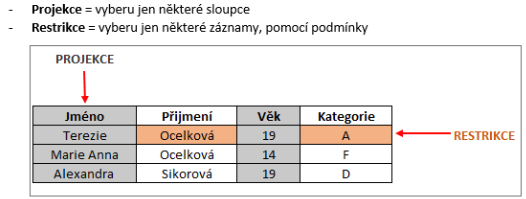

 

## SELECT

- Příkaz SQL SELECT je nejsložitějším příkazem jazyka SQL obsahující mnoho klauzulí.
- Hvězdička označuje vyber všechny sloupce, můžeme ale vybrat pouze sloupce, které chceme
  `SELECT (*|nazev slopců) FROM nazev tabulky [WHERE podmínka] [GROUP BY] [HAVING podmínka] [ORDER BY nazev sloupce asc|dsc]`

### SELECT použití

- Získat záznamy ze všech nebo z některých sloupců (projekce)
- Filtrovat data pomocí podmínky (restrikce)
- Řadit data
- Odebírat duplicitní záznamy
- Zobrazit sloupce pod jiným dočasným pojmenováním
- Seskupovat data
- Provádět výpočty s vybranými záznamy (použití agregačních funkcí)
- Omezit počet vrácených dat (nastavení limity)
- Vybrat data z více tabulek

## WHERE

- Podmíněný výraz na jehož základě se mění výsledný výpis záznamů

## DISTINCT

- Pouze neduplicitní záznamy

## GROUP By

- Seskupení záznamů
- Váže se s agregačními funkcemi nutno zadat podmínku HAVING

## HAVING

- Podmínka při použití seskupování záznamů nebo při agregačních funkcích

## ORDER BY

- Seřazení záznamů, sestupně, vzestupně, podle daného sloupce

## LIMIT M N

- `LIMIT M, N` – omezení počtu výběru záznamů, `M` = kolik přeskočí, `N` = kolik zobrazí

## Selekce a projekce

 

 

## Aliasy

- Alias použiju, pokud chci zobrazit nějaké sloupce pod jiným názvem
- Pojmenování je pouze dočasné
- Pokud mám jednoslovný název, nemusím ho dávat do uvozovek
- Víceslovný název je nutné dát do uvozovek nebo použít podtržítko místo mezery
- Příkaz `AS`

 

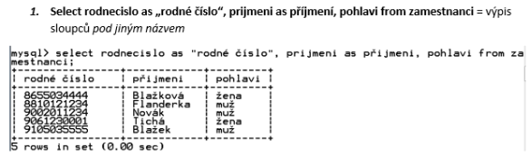

 

## Omezení výstupu

- Neboli restrikce
- Pomocí podmínky vybírám pouze některé záznamy
- Příkaz `WHERE`

 

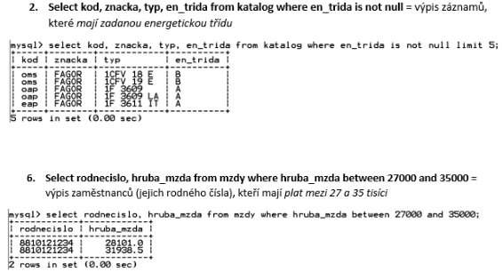

 

## Zástupné znaky

- Znak procento `%` = zastupuje libovolný počet libovolných znaků
- Znak podtržítko `_` = zastupuje jeden libovolný znak

 

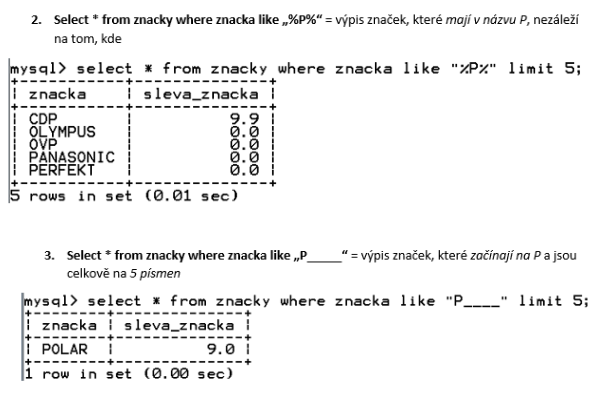

 

## Řazení dat

- Pomocí příkazu `ORDER BY`
- Můžeme řadit vzestupně (`ASC`) nebo sestupně (`DESC`)
- Řadíme minimálně podle jednoho sloupce, je možné ale řadit i podle více sloupců

 

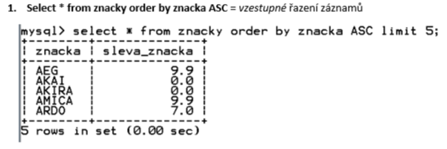

 

## Výpočty

Pomocí select si můžu v MySQL vypočítat jednoduché příklady – slouží jako jednoduchá kalkulačka
Můžu nějakému sloupci zvýšit hodnotu 🡪vytvoří se mi nový sloupec

 

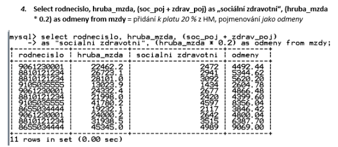

 

## Agregační funkce

- Provádíme operace se sloupci

### Agregační funkce:

- `COUNT` – počet, spočítá záznamy
  - `Count(*)` – spočítá všechny hodnoty včetně `NULL`
  - `Count (sloupec)` – spočítá všechny hodnoty bez `NULL`
- `SUM` – spočítá sumu vybraných záznamů/sloupce
- `MIN` – najde záznam s nejmenší hodnotou
- `MAX` – najde a vypíše záznam s největší hodnotou
- `AVERAGE` – spočítá průměr z vybraných záznamů/sloupce

### Zaokrouhlování

- `ROUND` (výraz, počet desetinných míst) – klasické matematické zaokrouhlování
- `CEIL (výraz)` – zaokrouhlování nahoru na celá čísla
- `FLOOR (výraz)` – zaokrouhlování dolů na celá čísla

### COUNT

 

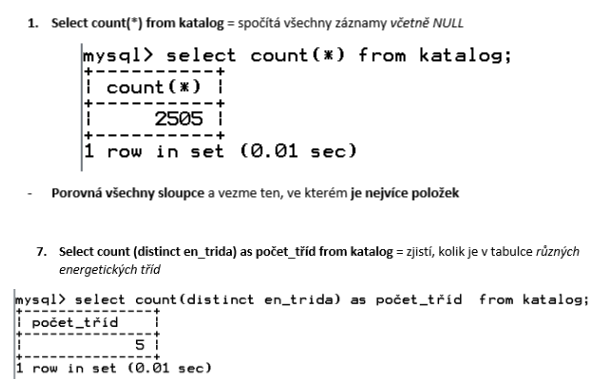

 

 

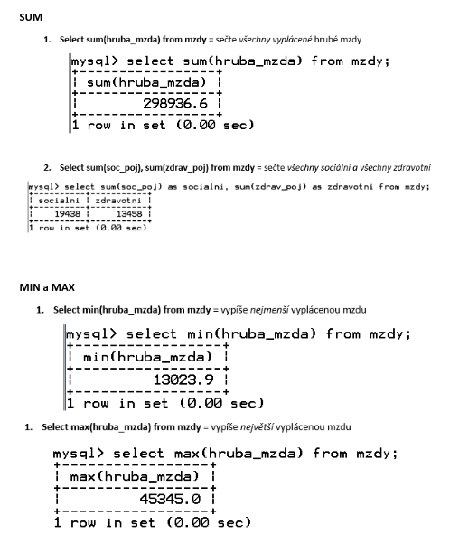

 

 

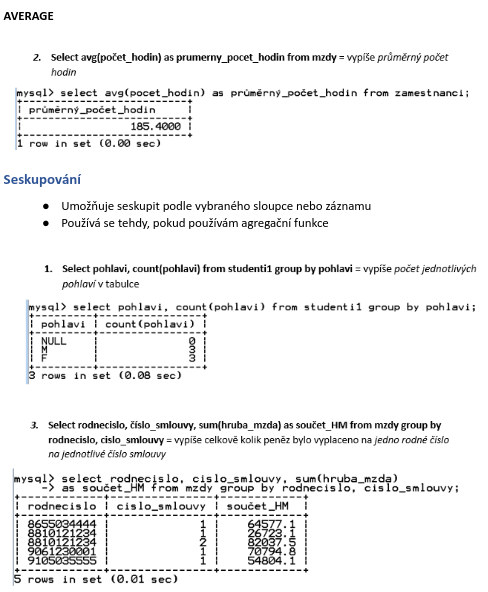

 

 

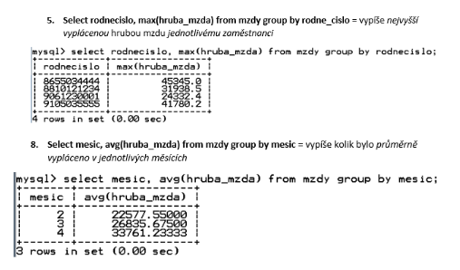

 

 

 

 

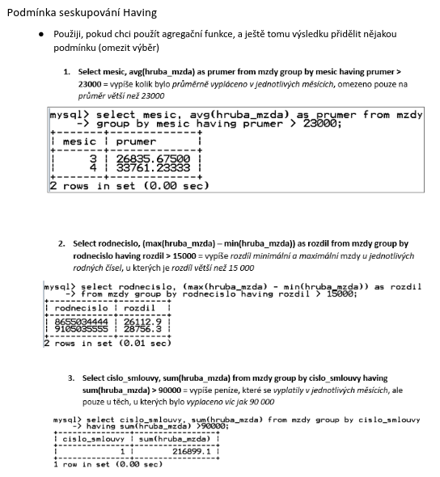

 