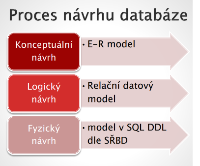
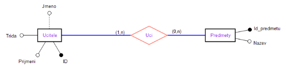
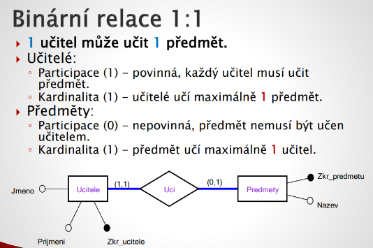
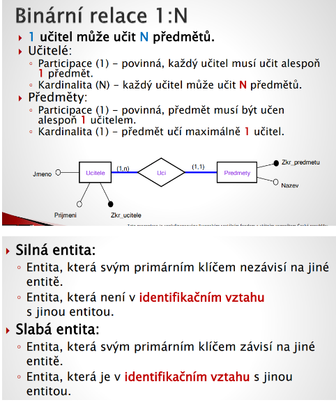
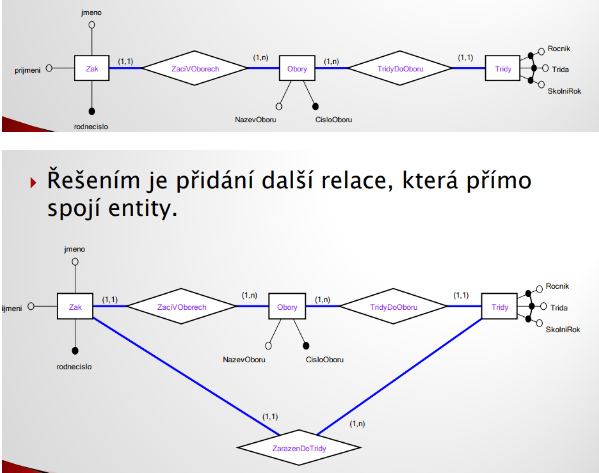
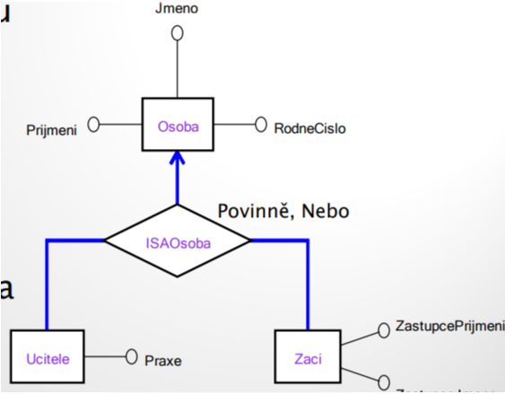

# Entitně relační modelování

 

 

 

 

## Entita

- Množina na sobě nezávislých objektů se stejnými vlastnostmi
- Rozlišitelný a identifikovatelný objekt reality
- Entitou mohou být lidé, hmotné a nehmotné věci, zvířata…
- Výskyt entity = instance objektu

## Relace

- Množina vztahů mezi entitami
- Každá relace má své jméno (nejčastěji sloveso), které popisuje její funkci

## Atributy

- Množina vlastností entit nebo relací
- Nabývá hodnot z dané domény(fyz . Úroveň = dat. Typ)

### Druhy atributů

- Jednoduchý
  - Skládá se z jedné komponenty
  - Nelze dělit => je atomický
- Složený
  - Skládá se z více komponent
  - Lze dělit na menší složky
  - Příklad: Adresa rozdělíme na: ČP, město, PSČ, ulici

### Poddruhy atributů

- Atribut s jedinou hodnotou:
  - Atribut, který obsahuje jednu hodnotu na výskyt entity.
  - Nejčastější případ.
- Atribut s více hodnotami:
  - Atribut, který na jeden výskyt entity obsahuje více hodnot.
  - Může být stanoven minimální a maximální počet hodnot.
- Atributy odvozené
  - Atribut, jenž představuje hodnotu, kterou lze odvodit ze souvisejících atributů jež nemusí patřit téže entitě

## Stupně relace

- Podle počtu zúčastněných entit v relaci
- Relace stupně:
  - Jedna = unární relace, neboli rekurzivní
  - Dva = binární relace, v praxi nejčastější
  - Tři = ternární relace
  - Čtyři = kvartérní relace
  - Vyšší stupně = n-ární relace

## Super klíč

- Atribut nebo množina atributů jednoznačně identifikující výskyt entity.
- Může obsahovat nadbytečné atributy které pro jednoznačné určení výskytu entity nejsou potřebné.

## Kandidátní klíč

- Super klíč, který obsahuje minimální počet atributů k jedinečné identifikaci záznamů.

### Vlastnosti kandidátního klíče:

- Jedinečnost - jednoznačně identifikující datovou n-tici v relaci
- Neredukovatelnost – žádná vlastní podmnožina atributů kandidátního klíče nezajišťuje jedinečné určení záznamů

## Primární klíč | identifikátor

- Kandidátní klíč, který je vybrán, aby jednoznačně určoval výskyt entity.
- E-R modelu - identifikátor <=> Relační model - primární klíč.

### Druhy PK | Identifikátorů

- Jednoduchý PK
  - PK je založen na jediném atributu.
- Složený PK
  - PK je založen na dvou nebo více atributech.

## Grafické zobrazení

- UML diagram, Chenova notace, Bachmanova notace

 

 

## Multiplicita

- Počet výskytů jedné entity, které se mohou vztahuje k počtu výskytů související entity
- Skládá se z kardinality, omezení participace

## Kardinalita

- Popisuje počet možných relací pro každou zúčastněnou entitu.
- V ER modelu popisuje maximální hodnotu multiplicity.

## Participace

- Popisuje účast hodnot, vyjadřuje povinnost se učástnit hodnotám relaci

 

 

 

 

- Dekompozicí - relace M:N vznikne nová slabá entita s dvěma identifikačními relacemi 1:N, 1:M .

## Rozšířenné relační modelování

- Problém na zdvojené přiřazení musíme vytvořit další relaci
- Nelze určit do jaké třídy žák patří

 

 

- Založeno na specializaci a generalizaci.
### Nadtřída:
- Entita obsahující jednu nebo více podskupin svých výskytů samostatně reprezentovatelných v datovém modelu.
- Multiplicita `0:1` nadtřída nemusí mít podtřídu
- Multiplicita `1:1` nadtřída má právě jednu podtřídu
- Participace `0` a `1`

### Podtřída:
- Podskupina výskytů entity, která je rozšiřitelná a je samostatně reprezentovatelná v datovém modelu.
- Podtřída vždy `1:1`
- Participace vždy `1`
### Disjunkce
- Vztah mezi podtřídami a nadtřídami, logické operátory `AND` a `OR`

 

 
