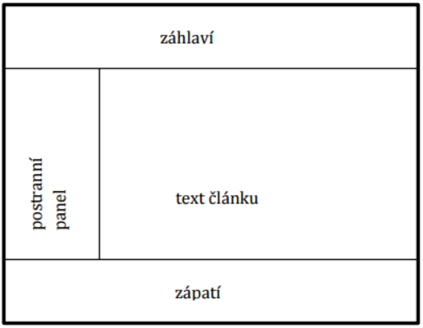
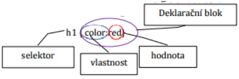
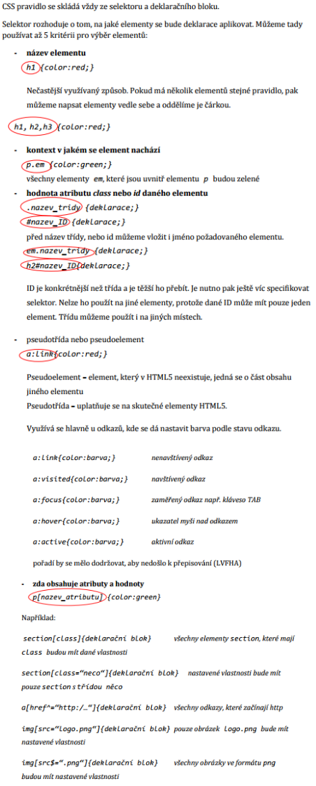

# Tvorba webových stránek s využitím HTML/CSS

## Značkovací jazyky - historie

- Jazyk pro vytváření internetových stránek se vyvinul z jazyka, který byl původně určen pro zpracování rozsáhlých dokumentů

#### 1969 - 1971

- 3 pracovníci dostali za úkol vytvořit informační systém, který se měl skládat ze 3 částí
  - Aplikace pro editaci textu
  - Vyhledávacího systému
  - Program pro generaci dokumentu na tiskárnu, nebo jinou prezentaci
- Jazyk byl pojmenován podle jejich jmen (Goldfabr, Mosher, Lorie) GML – Generalized Markup Language

#### 1965

- Ted Nelson použil poprvé termín **Hypertext** = rozvětvená struktura, provázaná různými spojeními

#### 1986

- Standardizace jazyka **GML** a vznik **SGML**.
  - Přísné pravidla – při jejich porušení nešlo daný dokument zpracovat
- Počátek **Internetu** – zjištění, že pro tvorbu internetových stránek je značkovací jazyk ideální
  - Původně se počítalo jen s přenosem textu (nadpisy, odstav

#### 1991

- **HTML**
  - (HyperText Markup Language), který obsahoval omezenou množinu značek. Postupně vzniklo několik verzí jazyka HTML.
  - Vývojáři Prohlížečů si vytvářeli vlastní značky, proto docházelo ke kompatibilitě – vznik konsorcia W3C, které vydává návrhy a schvaluje doporučení pro vývoj značkovacích jazyků. Členové např. Adobe, Cisco, Google, Facebook apod.
  - Dále vznikaly další verze HTML, které netrvaly na dodržování pravidel, proto se stránky nezobrazovaly tak jak měly

#### 1993 - 1997

- Každý rok jedna verze HTML – HTML 2.0, 3.0, 3.2, 4.0

#### 1998

- **XML 1.0** (Extensive markup language) - Přísný stejně jako SGML – nebyl přijat, nebyl moc user friendly

#### 1999

- HTML 4.01

#### 2000

- **XHTML 1.0** (eXtensible HyperTet Markup Language) - Více user friendly než **XML** – když se stránka nevytvořila úplně bez chyb, tak se zobrazila ale s určitou nekompatibilitou

#### 2001 - 2003

- XHTML 1.1, 2.0

- My používáme **HTML5**, který je zaměřen na pozicování jednotlivých prvků webové stránky, na celkové struktuře stránky a na vkládání jednoduchých grafických prvků (video, zvuk)
- Pro kontrolu stránky používáme různé **validátory**

## Struktura webové stránky

```html
<!-- Počátek HTML dokumentu -->
<!DOCTYPE html>
<!-- <html></html> - ohraničení dokumentu -->
<html lang="en">
  <!-- <head></head> - hlavička dokumentu -->
  <head>
    <!-- <meta/> - specifikace stránky, klíčová slova apod. -->
    <meta charset="UTF-8" />
    <meta http-equiv="X-UA-Compatible" content="IE=edge" />
    <meta name="viewport" content="width=device-width, initial-scale=1.0" />
    <!-- <title></title> - titulek karty v prohlížeči (max. 60 znaků) -->
    <title>Document</title>
  </head>
  <!-- <body></body> - tělo dokumentu -->
  <body></body>
</html>
```

- Struktura samotné stránky se dělí do několika částí – uspořádání v CSS stlyech

<p align="center">
  
</p>

- **Záhlaví `<header></header>`** obsahuje většinou logo, vyhledávací formulář, hlavní nabídku, odkazy, může obsahovat i nadpisy. Pokud se tam nachází i navigace pak je ohraničená elementem `<nav></nav>`. Navigace odkazuje na vnitřní obsah, nebo na jinou stránku. Odkazy jsou v nesetříděném seznamu (odrážky).
- **text článku `<article></article>`** může obsahovat text, obrázky, video, zvuk, tabulky, odkazy, seznamy, ... Pokud je na stránce více souvisejících části mohou být v samostatných elementech article. Někdy může stránky obsahovat i jiné části např. komentáře a pak se vkládají do elementu `<section></section>`
- **postranní panel `<aside></aside>`** - jeho umístnění se nastavuje pomoci css stylů. Používá se např. pro citační blok, blok s odkazy na jiné stránky, reklamu, navigaci, ...
- **zápatí `<footer></footer>`** - obsahuje copyright, autora, datum.

## Základní HTML tagy

### Práce s textem

```html
<h1>Nadpis první urovně<h1>
<h2>Nadpis druhé urovně<h2>
<h3>Nadpis třetí urovně<h3>
<p>Toto je odstavec. <br> Tento text bude na novém řádku</p>
```

### Zvýraznění textu

```html
<strong>tučné slovo na které klademe důraz</strong>
<b>tučné slovo na které neklademe takový důraz</b>
<em>kurzíva na kterou klademe důraz</em>
<i>kurzíva na kterou neklademe tak velký důraz</i>
<mark>zvýraznění textu</mark>
```

### Horní a dolní index

```html
<sup>horní index</sup>
<sub>dolní index</sub>
```

### Citace

- `<cite></cite>` citace a reference neodkazuje na jména osob, ale na název písně, knihy, filmu apod.
- `<blockquote></blockquote>` citování textu
- `<q></q>` citace krátkých frází

### Seznamy

```html
<!-- uspořádané seznamy (ol - ordered list, li - list) --->
<ol>
	<li>polozka</li>
	<li>polozka</li>
	<li>
		<ol>
			<li>vnorena polozka</li>
			<li>vnorena polozka</li>
		</ol>
	</li>
</ol>
<!-- neuspořádané seznamy (ul - unordered list, li - list) --->
<ul>
	<li>polozka</li>
	<li>polozka</li>
	<li>
		<ol>
			<li>vnorena polozka</li>
			<li>vnorena polozka</li>
		</ol>
	</li>
</ul>
```

```css
ul {
	list-style-type: circle; /* square, disc */
}

ol {
	list-style-type: upper-roman; /* lower-roman, lower-alpha, upper-alpha */
}
```

## CSS

- (Cascading Style Sheets) definují vzhled HTML stránky

### umožňuje nastavovat:
  - **formát textu** (barva, velikost)
  - **vlastnosti pro definování rozvržení**
  - **vlastnosti pro řízení tisku**
  - **dynamické vlastnosti** (např. zobrazení a skrytí objektů – využití při tvorbě rozevíracích seznamů)

### struktura stylu

- **selektor** - udává, na jaký element se dané pravidlo aplikuje
- **deklarační blok** - specifikuje, co se s elementem má dít. Skládá se z 1 nebo více dvojic vlastnost: hodnota, jsou umístněné v {}

<p align="center">
  
</p>

- CSS používají koncepci kaskád a berou v úvahu faktory jako dědičnost, specifičnost a umístěni
- **dědičnost** - CSS mohou dědit některé vlastnosti ze svých předků a některé vlastnosti můžeme přidat nové
- **specifičnost** - říká, že čím přesnější je selector tím důležitější je pravidlo stylu. Např. pokud nastavíme pro h1 nějakou vlastnost např color:red a pak pro elementy s třídou pokus nastavíme barvu modrou `h1.pokus { color: blue; }`,tak h1 s třídou pokus budou modré, protože je to přesnější specifikace. Přesnější specifikace může být i s identifikátorem

<p align="center">
  
</p>

## Selektory

<p align="center">
  
</p>