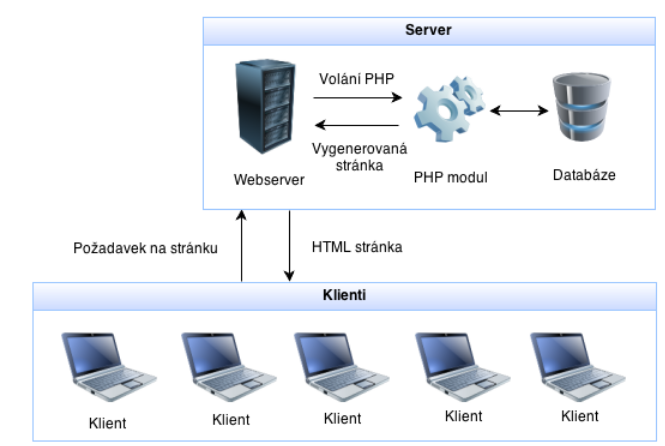

# Tvorba dynamických WWW stránek s využitím PHP

- Základní principy fungování PHP skriptů – popište, co se děje na straně serveru a na straně klienta.
- Základní datové typy jazyka PHP.
- Základní příkazy – přiřazovací příkaz, výstupní příkaz, matematické operace.
- Podmíněný příkaz, vyjadřování podmínek.
- Příkaz cyklu.
- Pole – deklarace, zadání hodnot do pole, operace s prvky pole.

<hr>

- PHP je dynamický scriptovací programovací jazyk, který se využívá pro programování webových aplikací
- Webové aplikace využívají dále databázi MySQL, web server Apache

## Princip webové aplikace

- Klient napíše URL dané stránky a tím vyšle požadavek na server
- Na serveru běží PHP modul se CGI scriptem
- PHP modul se připojí k databázi a načte data, která klient potřebuje
- Na základě dat vygeneruje statickou HTML stránku

<p align="center">
  
</p>

### Výhody dynamického webu

- **Snadná správa** – Aktuální verze
- **Vysoká bezpečnost** - Web i databáze jsou na serveru
- **Efektivita a jednoduchost pro uživatele**
- **Vysoká kompatibilita** – Přistupujeme přes webové prohlížeče.

### Výhody jazyka PHP

- Syntaxe podobná jazyku C
- Podporuje širokou škálu technologií, formátů a standardů
- Jedná se o free a OpenSource projekt
- Na internetu naleznete kvanta již hotového kódu použitelného na vašich stránkách
- PHP funguje na různých serverech pod různými operačními systémy (Windows, APACHE,…)
- Podpora komunikace s databázemi MySQL, MS SQL, PostgreeSQL atd.
- Jedná se o standardní funkci i free hostingů

### Nevýhody PHP

- PHP je interpretovaný, nikoliv kompilovaný jazyk (rychlost)
- Uživatel, který má přímý přístup k webovému serveru si může prohlížet i vaše PHP skripty

### PHP script

- Má příponu souboru .php
- Značí se `<?php ?>`
- příkazy ukončujeme `;`

## Proměnná v PHP

- Proměnná je místo v paměti, kde si ukládáme data, se kterými pracujeme
- Proměnná nesmí začínat číslem, nesmí obsahovat diakritiku ani mezery
- Pro více slovné názvy proměnných používáme velbloudí zápis (`TypTrojuhelnik`)
- Proměnná v php musí začínat `$`

## Datové typy v PHP

- Jelikož je PHP dynamický typovaný jazyk nemusíme u proměnných zadávat datové typy, PHP si je odvodí samo podle hodnoty, ne vždy to ale funguje

| Typ             | Název v PHP         | Popis                                                                                           |
| --------------- | ------------------- | ----------------------------------------------------------------------------------------------- |
| Logický typ     | `Boolean`           | uchovává hodnotu true nebo false                                                                |
| Celočíselný typ | `Integer`           | uchovává celá kládná i záporná čísla (-2 biliony až 2 bilióny)                                  |
| Desetinné číslo | `Float` nebo `Real` | uchovává desetinná čísla s přesností na 14 desetinných míst                                     |
| Řetězec         | `String`            | uchovává texty neboli řetězce, řetězec je znak nebo sada znaků, v PHP prakticky neomezené délky |
| Pole            | `Array`             | množina objektů nebo proměnných                                                                 |
| Objekt          | `Objekt             | abstraktní datový typ definován pomocí třídy                                                    |
| Null            | `Null`              | nezadaná hodnota                                                                                |

```php
// boolean
$mamMaloPenez = true;
// int
$plat = 5000;
// float
$foo = 3.5;
// řetězec
$bar = "foo";
echo $mamMaloPenez . " <br>";
```

## Operátory

- V PHP můžeme využívat logické, aritmetické, relační operátory
- Následně pomocí tečky můžeme spojovat řetězce

### Základní matematické operátory

| Operátor | Význam                                 |
| -------- | -------------------------------------- |
| `+`      | sčítání                                |
| `-`      | odčítání                               |
| `*`      | násobení                               |
| `/`      | dělení                                 |
| `%`      | modulo (zbytek po celočíselném dělení) |

### Logické operátory

| Syntax | Operátor            |
| ------ | ------------------- |
| `==`   | Rovnost             |
| `>`    | Je větší            |
| `<`    | Je menší            |
| `>=`   | Je větší nebo rovno |
| `<=`   | Je menší nebo rovno |
| `!=`   | Nerovnost           |
| `!`    | Obecná negace       |

### Matematické funkce

| Funkce         | Význam                                                          |
| -------------- | --------------------------------------------------------------- |
| `abs()`        | Absolutní hodnota                                               |
| `cos(rad)`     | Cosinus                                                         |
| `deg2rad()`    | Převod stupňů na radiány                                        |
| `max(array)`   | Vyhledání největšího čísla                                      |
| `min(array)`   | Vyhledání nejmenšího čísla                                      |
| `rand(od, do)` | Generování náhodného čísla                                      |
| `round(x, y)`  | Zaokrouhlení čísla `x` na požadovaný počet desetinných míst `y` |
| `sin(rad)`     | Sinus                                                           |
| `sqrt(rad)`    | Druhá odmocnina                                                 |
| `tan(rad)`     | Tangens                                                         |
| `rad2deg()`    | Převod z radiánů na stupně                                      |

## Výpis a spojení řetězců

- Spojování řetězců děláme pomocí `.`
- Výpis proměnné pomocí echo
- Text vkládáme do apostrofů nebo uvozovek

**Apostrof** – vypíše přesně co je tam napsané, když chceme výpis s proměnou je třeba používat `.`

```php
$jmeno = 'Karel';
$text = 'Jmenuji se ' . $jmeno . '\n super jméno.';
echo($text);
```

**Uvozovky** – chytřejší, než apostrofy proměnou si umí v textu najít

```php
$jmeno = 'Karel';
$text = "Jmenuji se $jmeno \n super jméno.";
echo($text);
```

## Podmínky

- Podmíněný příkaz využíváme, když chceme rozlišit dva stavy true / false

```php
if (isset($_POST['jmeno'])) {
	echo($_POST['jmeno']);
}
else {
	echo('Zadejte jméno.');
}
```

## Vícenásobné větvení

- Stejné jako v C#, tvoří jej klíčové slovo switch
- Ptáme se, jestli proměná nabývá dané hodnoty a podle toho se provede
- Můžeme zde využít default, pokud nenabývá žádné hodnoty ze zadaných vypíše se defaultní hodnota

```php
switch($foo) {
	case 'bar':
		echo('bar');
		break;
	case 'foobar':
		echo('foobar');
		break;
	case 'barfoo':
		echo('barfoo');
		break;
	default:
		echo('no foo');
		break;
}
```

## Cykly

- Používáme, když chceme, aby se něco opakovalo
- Cyklus `for`, cyklus s podmínkou na začátku (`while`)

### Cyklus `for`

- Inicializace, podmínka, aktualizace
- Používáme, když známe počet opakování

```php
for($i = 1; $i < 5; $i++) {
	echo($i);
}
```

### Cyklus `while`

- Cyklus s podmínkou na začátku
- Cyklus se provádí, dokud platí podmínka

```php
$i = 0;
while($i < 5) {
	echo("foo $i");
	$i++
}
```

## Pole

- Proměnná se se stejným datovým typem, do které můžeme uložit hodnoty
- Přistupuje se zde přes indexy, první prvek má index 0, poslední index -1
- Pole se zakládá pomocí klíčového slova array nebo u verze PHP 5.4 stačí []
- Vypisujeme přes příkaz echo

```php
// deklarace pole
$pole = array();
// vkládání prvků pomocí indexu
$pole[0] = 'fizz';
$pole[1] = 'buzz';
$pole[2] = 'fizz';
// vkládání do pole přímo (při deklaraci)
$pole = array('fizz', 'buzz', 'fizz', 'buzz');
// lze vkládat postupně pomocí for, stejně tak vypisovat
// od php 5.4 lze nahradit array() hranatými závorkami []
$arr = ['a', 'b', 'c'];
```

## Asociativní pole (Dictionary)

- Čísla indexu jsou zde nahrazené textovými řetězci (klíče)
- Kromě hodnota zadáváme klíče

```php
$numbers = array(
	'jedna' => '一',
	'dva' => '二',
	'tři' => '三',
	'čtyři' => '四',
	'pět' => '五',
);
// od php 5.4 lze nahradit array() hranatými závorkami []
echo($numbers['pět']);
// output: 五
```
