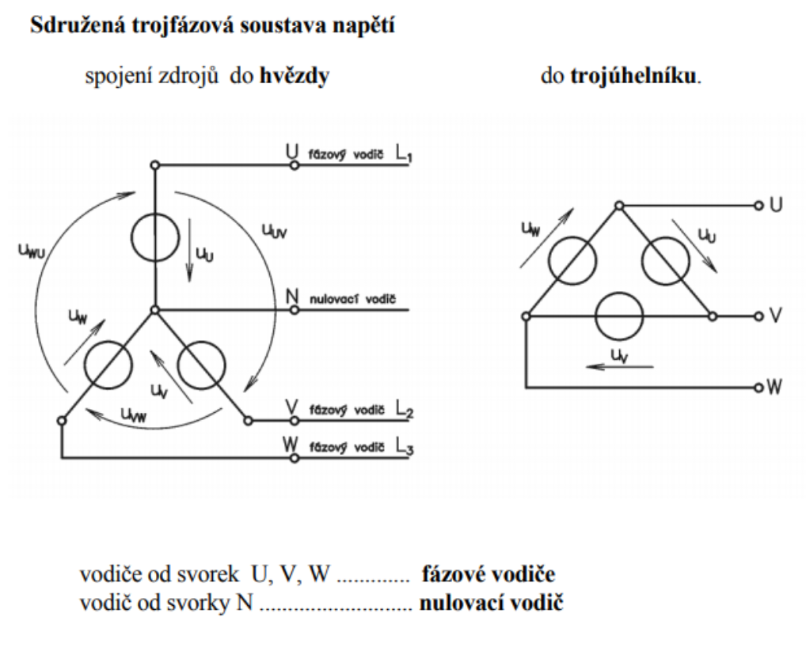
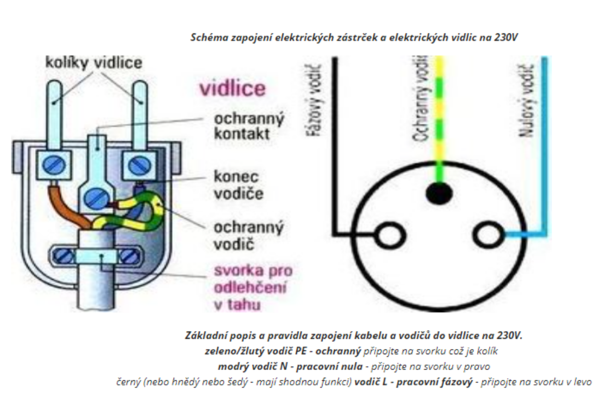
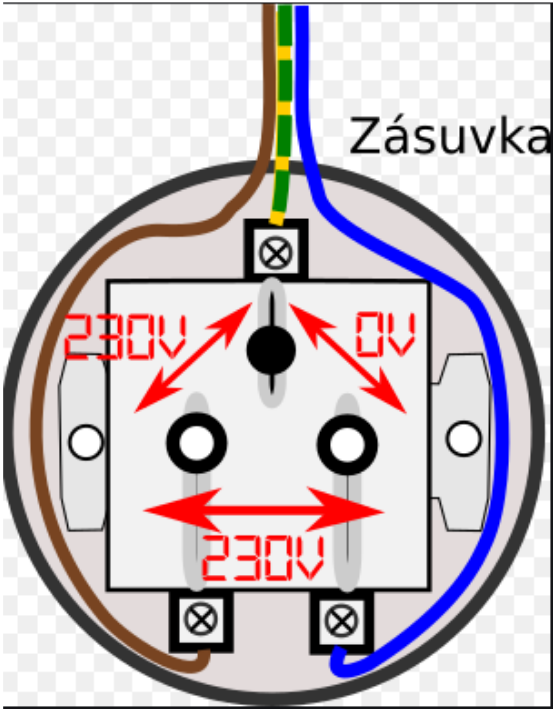
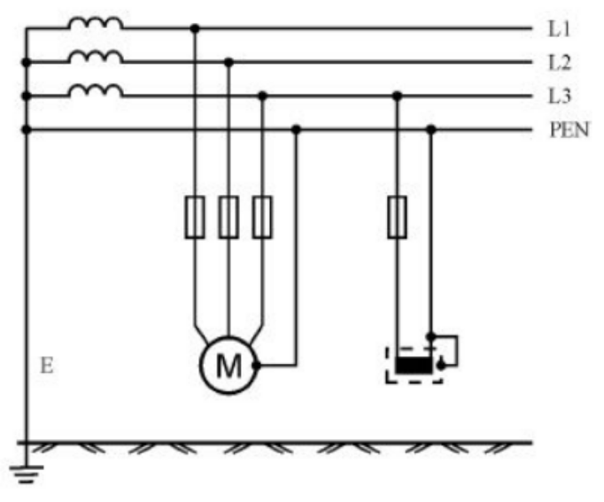
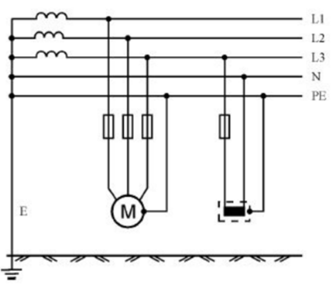
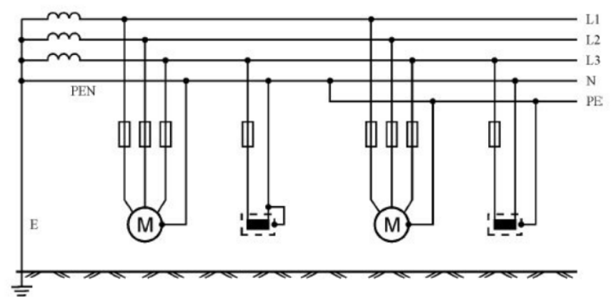
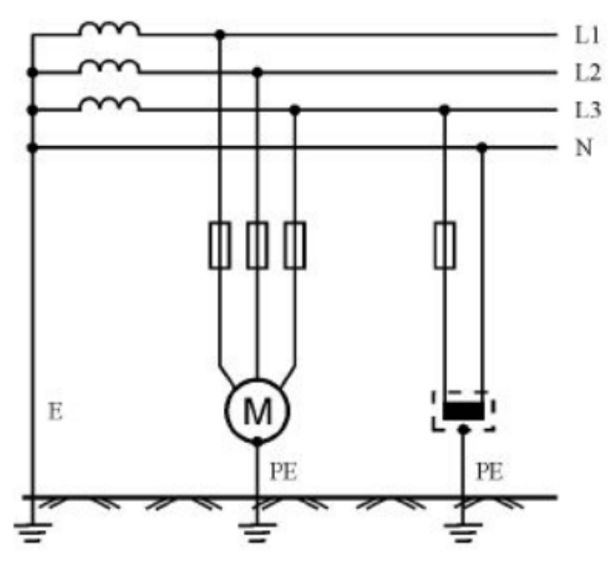
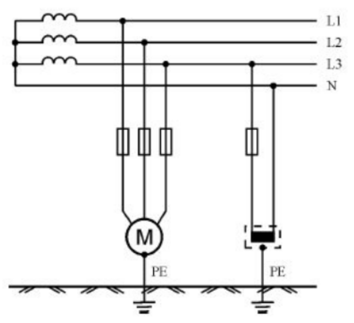

# Bezpečnost elektrických zařízení, vyhl. 50/1978 Sb

## a) Zákony, normy a vyhlášky – zákon č. 22/97 Sb., 50/78 Sb., NV 17/2003

### Zákon č. 22/97 Sb.

- Zákon o technických požadavcích na výrobky
- Při splnění těchto požadavků se výrobek považuje za bezpečný
- Označení CE pro stanovené výrobky dokládá, že byly vyrobeny ve shodě se všemi platnými zákony, nařízeními a normami – platí při země EU

### Zákon č. 50/78 Sb.

- Dle této vyhlášky je ověřována odborná způsobilost pracovníků pro činnost na vyhrazeném elektrotechnickém zařízení

### NV 17/2003

- Nařízení vlády, kterým se stanoví technické požadavky na elektrická zařízení nízkého napětí
- Podmínky uvedení zařízení na trh

## b) Odborná způsobilost v elektrotechnice

### §3 – Pracovník seznámený

- obsluha dle návodů výrobce nebo pokynů nadřízeného
- mezi obsluhu patří i výměna pojistek, zapínání a vypínání jističů (výměna žárovek, zářivek, startérů)
- nesmí však být přístupné dotyku žádné živé oblasti

### §4 – Pracovník poučený

- prokazatelně (písemně) poučen o tom co má dělat (jak pracovat, jaké pomůcky používat, jaké vzdálenosti dodržovat)
- poučení musí být provedeno pracovníkem s vyšší el. kvalifikací

### §5 – Pracovník znalý

- kvalifikovaný s elektrotechnickým vzděláním
- zapracovaný na pracovišti
- přezkoušený ze základních el. Předpisů
- smí pracovat sám, ale musí být řízen pracovníkem znalým s vyšší kvalifikací

### §6 – Pracovník znalý s vyšší kvalifikací

- má praxi min. 1 rok
- je přezkoušen dle požadavků vyhlášky
- pracuje samostatně
- při práci smí řídit sebe a jednoho dalšího pracovníka
- smí provádět všechny práce kromě prací zakázaných

### §7 – Pracovník znalý s vyšší kvalifikací

- má delší praxi
- je přezkoušen dle požadavků vyhlášky
- smí řídit práci více pracovníků

### §8 – Pracovník znalý s vyšší kvalifikací

- má delší praxi
- je přezkoušen dle požadavků vyhlášky
- smí řídit provoz nebo dodavatelskou činnost firmy

### §9 – Revizní technik

- má zkoušku u státní organizace
- provádí výchozí a periodické revize elektrických zařízení

### §10 – Samostatný nebo vedoucí projektant

### §11 – Odborný učitel

- řídí výuku ve školních laboratoří a dílnách
- pouze v rozsahu učebních osnov

## c) Základní pojmy - názvosloví

### NORMY, ZÁKONY A PŘEDPISY

**Bezpečný výrobek** (zákon č. 102/2001 Sb., č. 22/1997 Sb., nařízení vlády č. 173/2003 Sb., č. 163/2002 Sb. vše v platném znění)

**Bezpečná instalace** (ČSN 33 2000-6)

**Bezpečná činnost**

- obsluha na elektrickém zařízení (ČSN EN 50110-1 ed.2, Vyhláška č. 50/1978 Sb.)
- práce na elektrickém zařízení (ČSN EN 50110-1 ed.2, Vyhláška č. 50/1978 Sb.)

**Ochrana elektrického zařízení**

- před úrazem elektrickým proudem (ČSN 33 2000-4-41 ed. 2, ČSN 33 2000-47, ČSN EN 61140 ed. 2)
- před účinky tepla (ČSN 33 2000-4-42)
- proti nadproudům (ČSN 33 2000-4-43, ČSN 33 2000-4-473)
- proti přepětí (ČSN 33 2000-4-443, ČSN 33 2000-5-54 ed. 2, ČSN EN 60071, ČSN EN 62305)
- před bleskem (ČSN EN 62305, ČSN 33 2000-5-54 ed. 2)
- proti požáru (ČSN 73 0802, ČSN 73 0804, ČSN 33 2000-4-482)

**Bezpečné provozování elektrického zařízení**

- bezpečnost práce a pracovního prostředí (zákon č. 262/2006 Sb., č. 309/2006 Sb., č. 174/1968 v platném znění, vyhláška č. 50/1978 Sb.)
- bezpečný provoz (zákon č. 262/2006 Sb., zákon č. 309/2006 Sb., zákon č. 174/1968 v platném znění, nařízení vlády č. 378/2001 Sb.)
- prevence rizik (zákon č. 262/2006 Sb.)

### NÁZVOSLOVÍ

**Elektrické zařízení** - je technické zařízení, které ke své činnosti nebo působení využívá účinků elektrických nebo elektromagnetických jevů.

**Živá část** - Vodič nebo vodivá část určená k tomu, aby při normálním provozu byla pod napětím

**Neživá část** - Vodivá část přístupná dotyku, která za normálních okolností není živá, na které se však může objevit nebezpečné dotykové napětí při poruše.

**Elektrický obvod** - je vodivé spojení elektrických prvků, tyto prvky vytváří vodivou cestu a splňují funkce, které jsou od obvodu požadovány

**Elektrická instalace** - je sestava vzájemně spojených elektrických předmětů a částí zařízení v daném prostoru nebo místě.

**Elektrický spotřebič** - v užším významu je elektrotechnická součástka, která mění elektrickou energii na jiný druh energie.

**Obsluha EZ** §3 – Pracovník seznámený

**Práce na EZ** §5 – Pracovník znalý, smí pracovat pod dohledem

**Práce podle pokynů** §3 – Pracovník seznámený

**Práce pod dohledem** - je práce podle pokynů. Osoba provádějící dohled podle potřeby kontroluje dodržování bezpečnostních předpisů. Za dodržování bezpečnostních předpisů odpovídají pracující osoby samy.

**Práce pod dozorem** - Práce, která se provádí za trvalé přítomnosti osoby, jež byla pověřena dozorem a je odpovědna za dodržování příslušných předpisů k zajištění bezpečnosti a ochrany zdraví při práci.

**Práce na EZ v blízkosti částí pod napětím** §6 – Pracovník znalý s vyšší kvalifikací

**Zakázané práce** - Práce ve ztížených podmínkách (děšť, mlha, bouře)

**Pracoviště** - musí být po dobu provozu udržována potřebnými technickými a organizačními opatřeními, splňujícími požadavky tohoto nařízení, ve stavu, který neohrožuje bezpečnost a zdraví osob.

**Zajištění pracoviště** - Za vlastní zajištění požadavků BOZP na konkrétním pracovišti je vždy odpovědný příslušný vedoucí zaměstnanec

**Vedoucí práce** §10 – Samostatný nebo vedoucí projektant

**Prokazatelně** §4 – Pracovník poučený

**Nebezpečná živá část** - Živá část, která za jistých podmínek může způsobit úraz proudem.

**základní ochrana** - je zajištěna základní izolací živých částí nebo přepážkami nebo kryty

**ochrana při poruše** - je zajištěna ochranným pospojováním a automatickým odpojením v případě poruchy v souladu s příslušnými podmínkami pro toto odpojení.

**části současně přístupné dotyku** s různým potenciálem nesmí být v dosahu rukou (tj. 2,5 m)

**Přímý dotyk** - Dotyk osob nebo zvířat s živými částmi.

**Nepřímý dotyk** - Dotyk osob nebo hospodářských zvířat s neživými (vodivými) částmi, které se mohou stát v případě poruchy živými.

**Dotykové napětí** - je elektrické napětí, které vzniká na lidském těle jako důsledek současného dotyku dvou předmětů nebo částí elektrického obvodu s rozdílným potenciálem.

**Krokové napětí** - Dělat krátké kroky při bouři, čím vetší kroky, tim vetsi krokové napetí

**Prohlídka EZ zahrnuje**

- provedení ochrany před úrazem elektrickým proudem
- bezpečnostní vzdálenosti
- výběr vodičů

**Montáž EZ** - zřizování nových a rekonstrukce již provozovaných zařízení

**Revize EZ** - souhrn úkonů, při kterých seprohlídkou doplněnou potřebným měřením a zkoušením zjišťuje, zdazařízení vyhovuje platným normám a předpisům s ohledem nabezpečnost osob před úrazem a věcí poškozením nebo zničením

**Údržba EZ** - všechny druhy oprav, čištění a odstraňování závad a poruch k zajištění dobrého technického stavu

**Ochranné pomůcky** - předměty chránící pracovníka před nebezpečnými účinky elektřiny, škodlivostí pracovního prostředí nebo před jiným ohrožením

**Pracovní pomůcky** - předměty potřebné k práci na elektrickém zařízení nebo v jeho blízkosti

## d) Popis třífázové soustavy a stejnosměrné soustavy – značení vodičů, fázové a sdružené napětí, dělení napětí podle velikosti

### Trojfázová soustava

- Trojfázová soustava umožňuje vytvoření točivého magnetického pole, které využívají nejjednodušší a nejrozšířenější motory
- Souměrná trojfázová soustava napětí se indukuje v trojfázovém generátoru

  

  

  

### Značení vodičů

**Kladný (fáze L1…)**

- Barva holého vodiče - červená 
- Barva izolovaného vodiče - černá / hnědá  

**Záporný**

- Barva holého vodiče - tmavě modrá 
- Barva izolovaného vodiče - černá / hnědá  

**DC - střední vodič (N)**

- Barva holého vodiče - světle modrá 
- Barva izolovaného vodiče - modrá 

**Ochranný (PE)**

- Barva holého vodiče - zeleno-žlutá  
- Barva izolovaného vodiče - zeleno-žlutá  

### Fázové a sdružené napětí

**Fázové napětí** - Napětí mezi libovolným fázovým vodičem a nulovacím vodičem

**Sdružené napětí** - Napětí mezi dvěma fázovými vodiči

### Dělení napětí podle velikosti

- **MN** – Malé napětí - do 50V
- **NN** – Nízké napětí - do 1000V (1kV)
- **VN** – Vysoké napětí - do 52kV
- **VVN** – Velmi vysoké napětí - do 300kV
- **ZVN** – Zvlášť vysoké napětí - do 800kV
- **UVN** – Ultra vysoké napětí - nad 801kV

## e) Rozvodné sítě TN, TT, IT – význam jednotlivých písmen, schémata, popis

### Rozlišení druhů sítě

**První písmeno** - uzel zdroje

- **T (země)** - uzel zdroje je bezprostředně spojen se zemí
- **I (izolace)** - uzel zdroje je od země izolován

**Druhé písmeno** - neživé části

- **T** - neživé části jsou spojeny se zemí pomocí ochranného vodiče (jsou uzemněny)
- **N (nulový)** - neživé části jsou pomocí ochranného vodiče spojeny s uzlem zdroje

**Třetí/čtvrté písmeno**

- **S (oddělený)** - ochranný vodič PE je veden odděleně od vodiče středního N
- **C (spojený)** - funkce ochranného vodiče PE a středního vodiče N je sloučena v jediném vodiči PEN

### Jednotlivé sítě

**TN-C**

- Funkce středního a ochranného vodiče je v celé síti sloučena do jediného vodiče

  

**TN-S**

- Střední i ochranný vodič v celé síti jsou vedeny odděleně

  

**TN-C-S**

- V první části jsou ochranný a střední vodič sloučeny do jediného vodiče TN-C
- V další části sítě jsou oba vodiče vedeny odděleně TN-S

  

**TT**

- síť má uzemněný uzel chráněné neživé časti jsou uzemněny

  

**IT**

- síť má izolovaný uzel a chráněné neživé části jsou změněny

  

  

