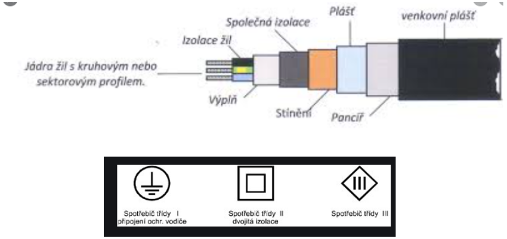
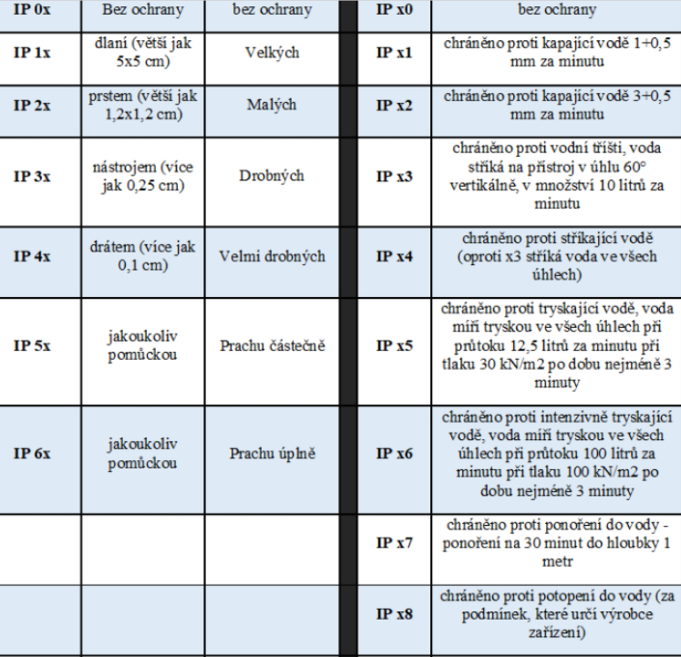
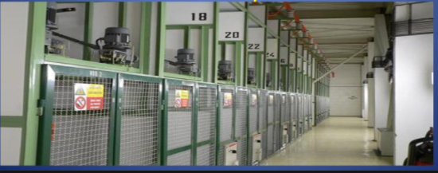
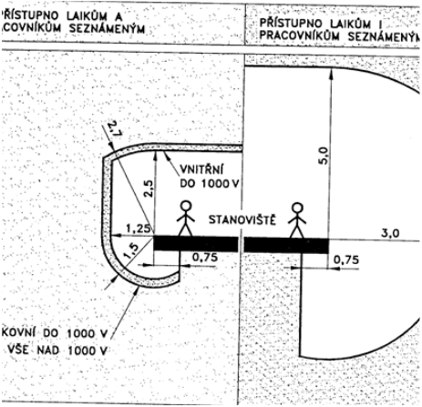
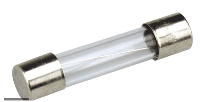
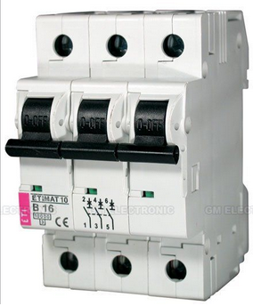
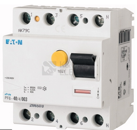
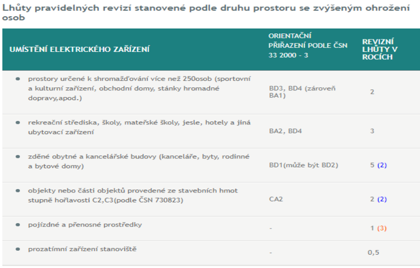
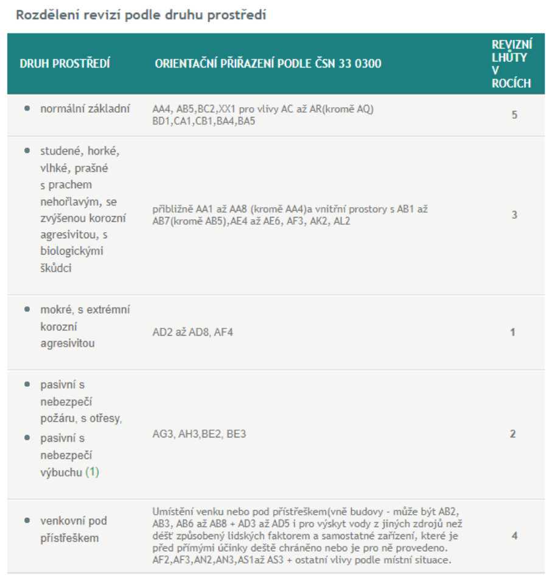

# Ochrana před úrazem elektrickým proudem

## a) úraz elektrickým proudem – příčiny, první pomoc

### Příčiny úrazu

- Každá část elektrického zařízení může potenciálně vyvolat poruchu. Uživatel se musí být chránit před účinky elektrického poruchového proudu.

**Některé příčiny úrazu**

- technické závady strojů a elektrických zařízení/mechanismů, elektrických spotřebičů, distribučních zařízení/rozvoden apod.
- vady elektroinstalačního materiálu (el. vodičů/ napájecích kabelů a přívodních šňůr)
- špatná (nedostatečná, nesprávná nebo nekvalifikovaná) údržba pracovního zařízení, stroje, spotřebiče nebo distribučního zařízení
- neodpovídající stav (opotřebení, stáří) elektrického zařízení, stroje, spotřebiče, elektroinstalací apod.
- tření a přehřátí

**Typy poranění**

- poranění elektrické (elektrický šok),
- poranění tepelné - popáleniny,
- a poranění mechanické, které bývá druhotné (pád, exploze, křečovitý stah svalů).

### První pomoc

Postup při první pomoci:

1. vypneme/odstraníme zdroj elektrického proudu
2. Určíme stav postiženého: zjistíme, zda je osoba při vědomí, oslovíme, případně jemně zatřepeme ramenem.
3. V případě že nebude odpovídat přivoláme pomoc z okolí a řekneme nejbližší osobě aby zavolala záchranou službu 155
4. Volíme způsob první pomoci: zastavíme masivní vnější tepenné krvácení pokud je, zaškrtíme nad ranou směrem k srdci
5. Zjistíme, zdali postižený dýchá přiložením ucha k ústům, zkontrolujeme tep
6. V případě, že nedýchá vyčistíme ústní dutinu a postiženému hlavu šetrně zakloníme
7. Pokud nezačne dýchat zahájíme kardiopulmonální resuscitaci a pokračujeme v jejím provádění až do příjezdu Zdravotnické záchranné služby či úplného vyčerpání zachránců.
8. Vyšetření příčin úrazu

## b) rozdělení prostorů s elektrickým zařízením

### Rozdělení prostor

**Normální** - používání el. zařízení je považováno za bezpečné, protože působením vnějších vlivů nezvyšují nebezpečí úrazu el. proudem (obytné prostory)

**nebezpečné** - působením vnějších vlivů je stálé nebo přechodné nebezpečí úrazu el. proudem (venkovní prostory, prostory v průmyslu…)

**zvlášť nebezpečné** - působením vnějších vlivů či zvláštních okolností nastává zvýšené nebezpečí úrazu el. proudem (prostory s kondenzující či stříkající vodou, prostory s nebezpečím požáru...).

### Bezpečná jmenovitá napětí

<table>
	<tr>
		<td rowspan=2><b>Prostory</b></td>
		<td rowspan=2><b>Při dotyku částí</b></td>
		<td colspan=2><b>Nejvyšší bezpečná malá napětí živých částí (V)</b></td>
	</tr>
	<tr>
		<td><b>střídavá</b></td>
		<td><b>stejnosměrná</b></td>
	</tr>
	<tr>
		<td rowspan=2><b>normální a bezpečné</b></td>
		<td>živých</td>
		<td>25</td>
		<td>60</td>
	</tr>
	<tr>
		<td>krytů</td>
		<td>50</td>
		<td>120</td>
	</tr>
	<tr>
		<td rowspan=2><b>zvlášť nebezpečné</b></td>
		<td>živých</td>
		<td>-</td>
		<td>-</td>
	</tr>
	<tr>
		<td>krytů</td>
		<td>12</td>
		<td>30</td>
	</tr>
</table>

### Účinky proudu na lidský organismus

<table>
	<tr>
		<td><b>Účinky</b></td>
		<td><b>AC střídavý [mA]</b></td>
		<td><b>DC stejnosměrný [mA]</b></td>
	</tr>
	<tr>
		<td>Mez vnímání - proud je vnímán od</td>
		<td>0,5</td>
		<td>2</td>
	</tr>
	<tr>
		<td>Mez uvolnění - proud zabraňuje uvolnění od</td>
		<td>5</td>
		<td>25</td>
	</tr>
	<tr>
		<td>Závažnější negativní účinky pro zdraví od</td>
		<td>30</td>
		<td>120</td>
	</tr>
</table>

## c) ochranná opatření – provoz el. zařízení, prostředky pro zajištění ochrany

### Provoz el. zařízení

- Probíhá za normálních podmínek (bezporuchový provoz) nebo za podmínek jedné poruchy (například porušení izolace, krytu).
- Základní pravidlo je, že nebezpečné živé části nesmějí být přístupné v žádném případě a vodivé (neživé) části nesmějí být nebezpečně živé, a to ani za normálních podmínek jedné poruchy.

### Prostředky pro ochranu:

- **Základní** (ochrana za normálních podmínek) - základní izolace, přepážky a kryty, zábrany, ochrana polohou, omezením napětím, omezení proudu a náboje
- **Prostředky ochrany při poruše** - přídavná izolace, automatické odpojení od zdroje, jednoduché oddělení obvodů, ochranné uzemnění a pospojování, nevodivé okolí
- **Prostředky zvýšené ochrany** - Zesílená izolace, ochranné oddělení obvodů

## d) Jednotlivé druhy ochran

- **Základní** – základní izolace, brání dotyku živých částí izolací(možno odstranit jen zničením), kryty min. IP20 z boku a IP40 ze shora.
- **Ochrana při poruše** – Zabraňuje výskytu nebezpečného napětí na neživých částech automatickým odpojením od zdroje. Patří zde jističe a pojistky
- **Doplňková ochrana** – Ochranné opatření doplňkové k základní ochraně a/nebo k ochraně při poruše, užití proudových chráničů, ochrana pospojováním
- **Doplněná ochrana** – kombinace všech 3 předchozích ochran, zajišťuje větší bezpečnost

### Základní ochrana

**Ochrana izolací**

- funkční (pracovní) izolace zároveň chrání = základní izolace
- izolaci lze odstranit pouze jejím zničením
- musí vydržet trvalé provozní napětí i předpokládané přepětí (i atmosférickým vlivem)
- odolná tepelným, mechanickým a chemickým vlivům, kterým je vystavena

  

**Ochrana kryty nebo přepážkami**

- Krytí je konstrukční opatření, které je součástí el. předmětu.
- Poskytuje ochranu před dotykem s živými a pohybujícími se částmi a dosahuje se jím ochrana před poškozením vniknutím cizích předmětů, prachu, vody, plynů a pod.

  

**Ochrana zábranou**

- brání nahodilému dotyku živých částí (přiblížení k živým částem nebo nahodilý dotyk nekrytých zařízení v běžném provozu nebo při práci)
- nebrání úmyslnému dotyku
- mohou být odstranitelné bez použití klíče nebo nástroje
- Zábrany jsou vyrobeny z izolantu.
- Pro zařízení do 1 kV musí být zábrana z izolantu od živých částí vzdálena u vnitřních zařízení alespoň 15 cm a u venkovních zařízení alespoň 20 cm.
- Například: Zeď, uzamčení, klecová ochrana

  

**Ochrana polohou**

- Umístění živých částí mimo dosah lidského těla

  

### Ochrana při poruše

**Pojistky (F)**

- Obsahují malý drátek, při přetížení nebo zkratu dojde k přetavení drátku, tím dojde k přerušení obvodu a odpojení od zdroje
- Druhy pojistek: závitové(6-100A), nožové(2-1250A), přístrojové(32mA-20A), válcové

  

**Jističe (Fa)**

- Obsahuje zkratovou spoušť, elektromagnet, jádro s feromagnetické oceli, pohyblivou kotvu, komoru s vypínacími plíšky
- Když dojde k nárustu proud(zkrat) jistič rozepne elektrický obvod
- Jističe máme 1/2/3 polohové

  

### Doplňková ochrana

**Ochrana pospojováním**

- uzemnění nelze provést nebo nemůže existovat
- zabránění vzniku nebezpečného rozdílu potenciálů (spojení všech neživých a cizích vodivých částí)
- místní pospojování nesmí být spojeno se zemí (ani prostřednictvím)

  

**Ochrana proudovým chráničem (RCD)**

- Je to součtové trafo, které prochází pracovními vodiči(fáze+střední) ochranný vodič nikdy nesmí procházet proudovým chráničem
- při dotyku živé části dojde k odpojení
- uplatňuje se např. při proražení izolace nebo porušení krytu
- malý vybavovací proud (nesmí přesahovat 30 mA) je nutné jej použit v zařízeních které používají laici s hodnotou 20A

  

### Ochrana nízkým napětím (SELF, PELV, FELV)

- **omezení napětí v síti** SELV nebo PELV horní mezí napěťového pásma I, tj. 50V pro střídavé a 120V pro stejnosměrné napětí (pokud určité prostory nevyžadují nižší napětí)
- **ochranné oddělení sítě** SELV nebo PELV od všech ostatních sítí jiných než SELV a PELV a základní izolaci mezi sítí SELV a zemí.
- **SELV** - není dovoleno úmyslné připojení neživých částí k ochrannému vodiči nebo k zemi.
- **PELV** – ochrana omezením napětí v obvodu, který může být uzemněn anebo na neživých částech, které mohou být uzemněny
- **FELV** – nesplňuje podmínky SELV a PELV, ale musí mít nízké napětí

## e) Revize el. Zařízení

Elektrická zařízení se před uvedením do provozu musí vyzkoušet a prověřit, během svého provozu pak nechat podrobit pravidelným kontrolám a revizím. Provozování elektrických zařízení upravuje norma ČSN 33 1500, která stanovuje lhůty revizí podle prostředí nebo druhu prostoru. Povinnost provádět revize určuje zákon č. 458/2000 Sb.

Tuto činnost zajišťuje revizní technika základě získaného oprávnění Technické inspekce ČR. Prohlídkou, kontrolním měřením a přezkoušením celkového stavu ověřuje bezpečný a bezporuchový provoz elektrického zařízení. Ke každé revizi se vystaví revizní zpráva, kde se zohlední veškeré provedené činnosti při revizi, zjištěné závady a závěrem takové zprávy je, že elektrické zařízení je způsobilé bezpečného provozu

Revize se musí provádět minimálně každé 2 roky

  

  

