# Pneumatika

## a) Parametry a vlastnosti stlačeného vzduchu

### Tlak a jednotky tlaku

- Vzduch: 78% dusíku, 21% kyslíku, 1% ostatní plyny
- Hodnota tlaku: 101 325 Pa v 0 n.m.v
- Přetlak: nad 101 325 Pa Podtlak: pod 101325 Pa, Vakuum: 0 Pa

| Název jednotky | Značka | Převody jednotek           |
| -------------- | ------ | -------------------------- |
| Pascal         | Pa     | 1 Pa = 1 N/m²              |
| Hektopascal    | hPa    | 1 hPa = 100 Pa = 1 mbar    |
| Kilopascal     | kPa    | 1 kPa = 1 000 Pa = 10 mbar |
| Megapascal     | MPa    | 1 MPa = 10⁶ Pa = 10 bar    |
| Bar            | bar    | 1 bar = 10⁵ Pa = 0.1 MPa   |
| Milibar        | mbar   | 1 mbar = 10⁻³ bar = 100 Pa |

### Parametry stlačeného vzduchu:

Tlak

- Provozní – tlak na výstupu kompresoru (0.8 až 0.9 MPa)
- Pracovní – požadovaný tlak pro správnou funkci pneumatických prvků (obvykle 0.6 MPa, 0.3 MPa)

Průtok vzduchu

- On – normální průtok [ln/min] – normální litr za minutu
- Na výstupu obvodu musí být nižší tlak jak na vstupu – diferenční tlak (tlakový spád)

Čistota – kvalita stlačeného vzduchu

- Znečištění vzduchu (olejem, mechanickými nečistoty, vlhkosti, …) vede k poruchám pneumatických zařízení (až zničení)

### Výhody stlačeného vzduchu

- Dostupnost a skladování
- Jednoduchá konstrukce
- Řízení proudu vzduchu a tlaku – jednoduché řízení rychlosti pneumatického motoru
- Trvanlivost při malých nárocích na údržbu
- Bez negativních vlivů na životní prostředí
- Velké zrychlení
- Bezpečnost – použití ve výbušném prostředí, v teplotách -40°C až + 90 °C

### Nevýhody stlačeného vzduchu

- Omezená síla (do 1 MPa)
- Problematické dosažení pomalých, plynulých pohybů
- Nepřesné zastavování v mezi polohách +- 1 cm (hydraulické pohony: +-1 mm, elektrické: +- 0.1 mm)

## b) Výroba a rozvod stlačeného vzduchu

- Stlačený vzduch se vyrábí pomocí kompresorů.
- Kompresor přeměňuje mechanickou energii elektromotoru, spalovacího motoru na energii tlakovou.

### Podle výstupního tlaku jsou kompresory rozdělovány na

- ventilátory, které mají výstupní tlak pv = 0,1 až 0,11 MPa
- dmýchadla , která mají výstupní tlak pv = 0,1 až 0,3 MPa
- vývěvy (ejektory), kterými je dosahován vstupní tlak p < 0,1 Mpa

### Kompresory:

- nízkotlaké, které mají výstupní tlak pv = 0,3 až 2,5 MPa
- středotlaké, které mají výstupní tlak pv = 2,5 až 10 MPa
- vysokotlaké, které mají výstupní tlak pv > 10 MPa

  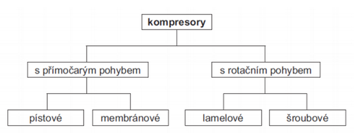

## Kompresory s přímočarým pohybem pístu

### Pístové kompresory

- Při pohybu pístu do dolní úvratě se otevírá sací ventil, vzduch je nasáván do kompresního prostoru.
- Při pohybu pístu do horní úvratě se vzduch stlačuje, sací ventil je uzavřen a při dosažení tlaku se otevře výtlačný ventil.

  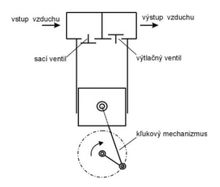

### Membránové kompresory

- Píst je od vzduchu oddělen membránou, takže nedochází k znečišťování vzduchu olejem.
- Používají se hlavně v potravinářství, farmaceutickém a chemickém průmyslu.

  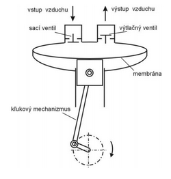

## Kompresory s rotačním pohybem

Při rotačním pohybu jednoho nebo dvou rotorů, dochází ke zmenšování pracovního prostoru a tím ke stlačování vzduchu

### Lamelové (křídlové) kompresory

- Ve válcovém tělese s otvory pro sání a výtlak se otáčí excentricky uložený rotor. V zářezech rotoru jsou posuvně uloženy lamely, které se opírají a kloužou po vnitřním povrchu tělesa statoru a tím vytvářejí komory.
- Při otáčení rotoru se komory, ze vzduchem zmenšují a tím dochází ke stlačování vzduchu.
- Výhodou je malý rozměr kompresoru, tichý chod a rovnoměrná, bezpulzní dodávka stlačeného vzduchu.

  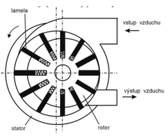

### Šroubové kompresory

- Vzduch je nasáván a vytlačován dvěma šroubovitými vřeteny s velkým stoupáním (konkávními a konvexními zuby), které stlačují axiálním směrem vytlačovaný vzduch.
- Používají se ke stlačování plynů vodíku, etanu, …, jejich směsí, kde je nutný nástřik chladicí kapaliny.

  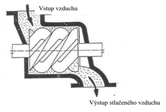

## Úprava stlačeného vzduchu

Odstraňují se mechanické částečky, vodní pára, popř. se dodává olej do vzduchu

### Dvě fáze:

- Hrubé čistění a odstranění vlhkosti za kompresorem
- Jemné čištění a odstranění vlhkosti na místě spotřeby stlačeného vzduchu, při pneumatickém zařízení

### K odstraňování vlhkosti vzduchu se používá

- Absorpční vysoušení – chemický postup
- Adsorpční vysoušení – využití fyzikálního jevu adsorpce
- Vysoušení ochlazováním (nejpoužívanější) – snížení teploty vzduchu -> pod teplotu rosného bodu vody
- Molekulární vysoušení – využití dutých vláken, pronikne jen voda, vzduch už ne

### K odstranění nečistot

- základními filtry – zachytí nečistoty do 5 µm
- mikrofiltry – zachytí nečistoty do 0,3 µm
- submikrofiltry – do 0,01 µm (odfiltrují i zápach)

  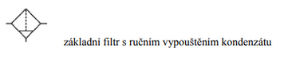

### Přimazávání stlačeného vzduchu

- Moderní pneumatické prvky nevyžadují přimazávaní
- 2 – 5 kapek na 1000 ln/min vzduchu

  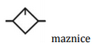

## Rozvod stlačeného vzduchu

### Trubky

- používají se ocelové bezešvé závitové trubky – Js (jmenovitá světlost) do 50 mm
- trubky o Js 65 a více se svařují z ocelových bezešvých trubek a tvarovek
- měděné trubky – Ø až 40 mm (Ø nad 28 mm velmi drahé)

### Hadice

- nylonové, polyuretanové, z PVC – vnitřní Ø 2; 2,5; 3; …5; 6; …9; 12; 13 mm

### Spojovací prvky – šroubení (fitiny)

- Šroubení s těsnícím prstencem a převlečnou maticí – používá se pro tlaky nad 1 Mpa
- Nástrčné spojky – do 1 Mpa
- Nástrčné spojky se zpětným ventilem – po zasunutí se zpětný ventil otevře, před vytažením hadice je nutno odvzdušnit rozvod. Po vyjmutí hadice se ventil uzavře.

## c) Prvky pneumatického obvodu a jejich schématické značky

### Schématické značky základní pojmy

  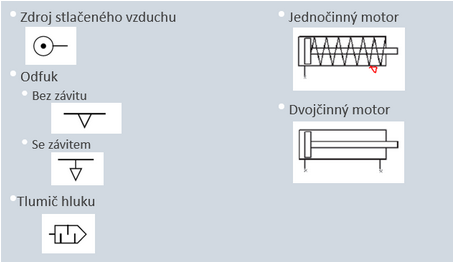

### Ventily

  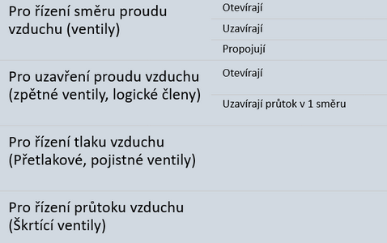

### Ovládání ventilů

  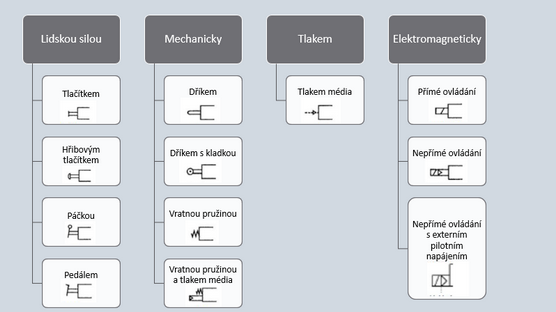

### Značení ventilů

  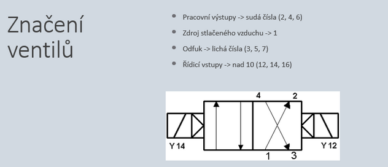

## d) Základní pneumatická schémata zapojení, pneumatické logické členy

### Automatický návrat 2činného PM válce

- Po zapnutí aretačního tlačítka se píst začne automaticky vysouvat a zasouvat opakovaně, dokud se tlačítko nevypne
- Pokud je sepnuté tlačítko a píst v poloze 4 (zasunut) dojde k přestavění ventilu 3 -> vysunutí pístu
- Když píst dosáhne polohy 2 (vysunut), zmáčkne se kladka a dojde k přestavění ventilu 2 -> ten pak nepřímě přestaví ventil 3 a dojde k zasunutí pístu

  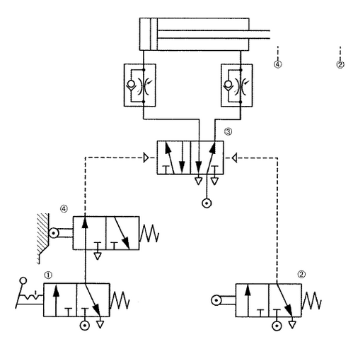

### Logický člen OR (3)

- Řízení PM ze dvou míst (1 nebo 2)

  

### Logický člen AND (blokování)

- Musí být stisknutá obě tlačítka pro vysunutí pístu

  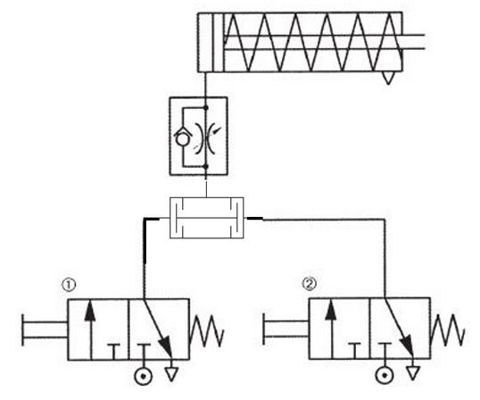

### AND – sériové zapojení

- Sériově zapojené ventily fungují jako logický člen AND
- Musí být zmáčknuté tlačítko 1 a zároveň sepnuta kladka 2 pro vysunutí 1činného PM

  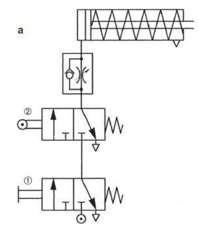

## e) Přímé a nepřímé řízení pneumatických motorů

### Přímé řízení 1činného PM válce

- 1činný PM je řízen přímo ventilem 3/2 s tlačítkem
- Obvod je méně složitý, za to je třeba vyvinout větší sílu na tlačítko než u nepřímého zapojení

  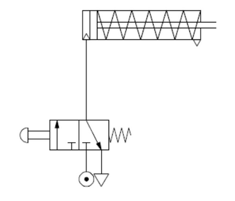

### Nepřímé řízení 1činného PM válce

- Oproti přímému zapojení, zde přibyl monostabilní ventil 3/2 ovládaný stlačeným vzduchem z tlačítka, tento ventil slouží jako prostředník mezi tlačítkem a PM
- Složitější obvod než u přímého zapojení, ale není třeba takovou silou zmáčknout tlačítko

  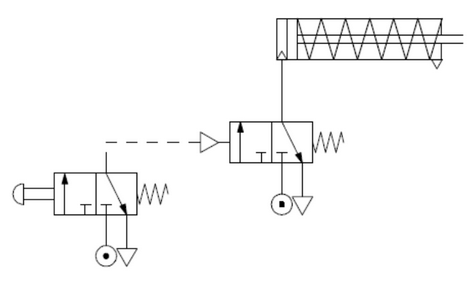

### Přímé řízení 2činného PM válce

- Řízení monostabilním ventilem 5/2
- Není využit žádný ventil jako prostředník, tlačítko je přímo zapojené ke škrticím ventilům
- Tento druh zapojení vyžaduje větší sílu na stisknutí tlačítka

  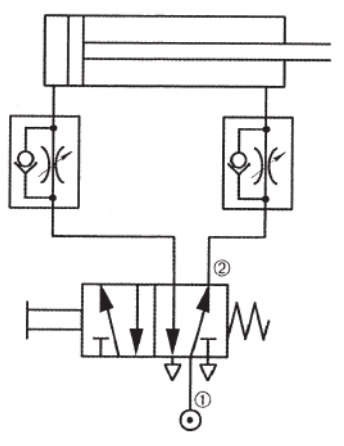

