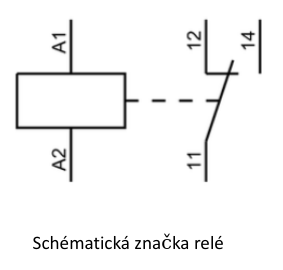
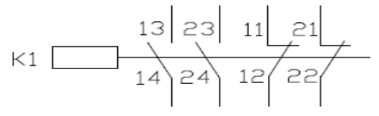
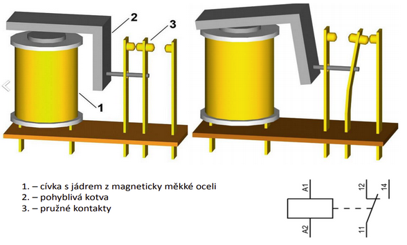
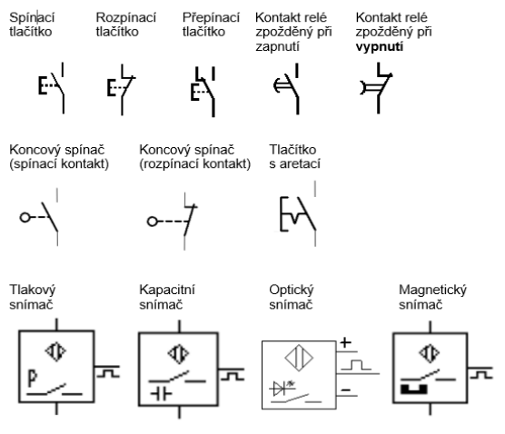
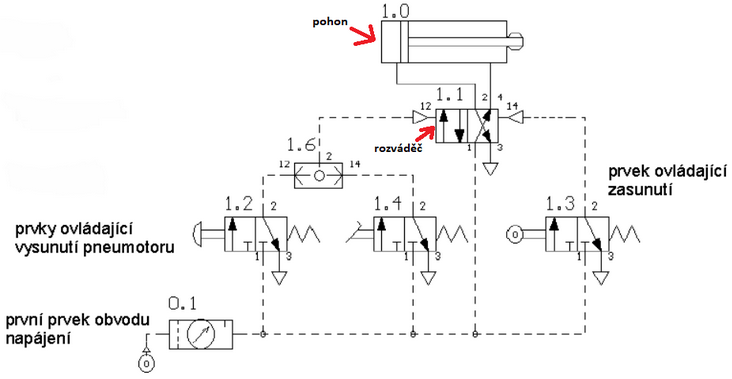
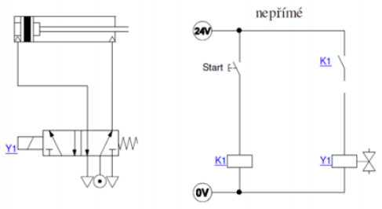

# Elektropneumatika

- pneumatický obvod, který je ovládán elektrickým obvodem

## a) relé – popis, schématická značka, značení kontaktů

### Popis činnosti

- je elektrotechnická součástka, která obsahuje elektromagneticky ovládané kontakty
- Relé se v základním provedení skládá z cívky (elektromagnetu) navinuté na jádru z měkkého feromagnetického materiálu.
- Magnetický obvod je uzavřen pohyblivou kotvou.
- Kotva je pružinou uváděna do klidové polohy a současně se opírá o pohyblivý kontakt.
- Po připojení cívky na elektrický zdroj, vyvolá proud cívkou v magnetickém obvodu magnetický tok. Magnetický tok vyvolá přitažlivou sílu na kotvu, která přemůže sílu v pružině a překlopí kontakt.
- Po odpojení el. proudu se kotva a kontakt vrátí do předchozího, klidového stavu

  

### Značení kontaktů:

- každé relé je označeno K1, K2, …
- svorky cívek se označují A1, A2, ...
- označení svorek kontaktů se skládá až ze tří číslic:
  1.  číslice – označení skupiny (pólu, polohy, patra apod.) kontaktů (není povinné označení)
  2.  číslice – označení pořadí kontaktů
  3.  číslice – označení funkce kontaktů

  

### Funkce kontaktů:

- vypínací (rozpojovací) kontakt ........ 1–2
- zapínací (spojovací) kontakt .......... 3–4
- přepínací kontakt ..................... (4)

### Funkce relé:

  

## b) Schematické značky pro zobrazení elektropneu. Obvodů

  

  

## c) Přímé a nepřímé řízení 1činného PM

### Zásady kreslení

1. Pneumatický obvod

  

2. Elektropneumatický obvod

řádkové kreslení

  

sloupcové kreslení

  

### Zobrazování vedení

- Vedení je nutno kreslit, **pokud možno přímými čarami a bez křížení**. Pracovní vedení jsou zobrazována plnými čarami, ovládací čárkovaně.

### Značení

- pracovní (výstupy): 2, 4, ...
- napájení, připojení tlaku:1
- odfuk (odvětrání): 3, 5, ...
- ovládací vstupy: 12, 14, ...
- Signál, který maže výstup: 10

### Přímé řízení 1činného PM

Po stisknutí tlačítka START se přivede signál na elektromagnetický ventil Y1, který přestaví monostabilní ventil 3/2 tak, že se pístnice vysune. Návrat pístnice je zajištěn po uvolnění tlačítka.

  

### Nepřímé řízení 1činného PM

Po stisknutí tlačítka START se přivede signál na cívku relé K1. Sepne se spínací kontakt K1, který přivede signál na elektromagnetický ventil Y1, monostabilní ventil 3/2 se přestaví. Návrat pístnice je zajištěn po uvolnění tlačítka.

  

## d) Přímé a nepřímé řízení 2činného PM

### Přímé řízení

pohyb pneumatického motoru je ovládán přímo (tlačítkem), tlačítko je nutné držet po celou dobu vysouvání pístu

### Nepřímé řízení

cívky relé jsou ovládány pomocí spínacích, rozpínacích, přepínacích kontaktů/tlačítek

### ad. a.

Stejný princip jako u 1činného PM.

### ad. b.

wtf ???

## nepřímé řízení 2činného PM pomocí monostabilního ventilu

- Po stisknutí tlačítka START se přivede signál na cívku relé K1. Sepne se spínací kontakt K1, který přivede signál na elektromagnetický ventil Y1.
- Monostabilní ventil 5/2 2činného PM se přestaví, pístnice se vysune. Návrat pístnice je zajištěn po uvolnění tlačítka.

### Způsoby zajištění vysunuté polohy

- výměnou tlačítka za tlačítko s aretací
- výměnou spínacího kontaktu za rozpínací

  

## ovládání ze dvou míst - OR / Logický součet

- Stisknutím tlačítka S1 nebo S2 se přivede signál na cívku relé K1. Sepne se spínací kontakt K1, který přivede signál na elektromagnetický ventil Y1.
-

Monostabilní ventil 5/2 2činného PM se přestaví, pístnice se vysune. Návrat pístnice je zajištěn po uvolnění jednoho z tlačítek.

  

## blokování - AND / Logický součin

- Stisknutím tlačítka S1 a S2 se přivede signál na cívku relé K1. Sepne se spínací kontakt K1, který přivede signál na elektromagnetický ventil Y1.
- Monostabilní ventil 5/2 2činného PM se přestaví, pístnice se vysune. Návrat pístnice je zajištěn po uvolnění jednoho z tlačítek

  

## zpoždění při zasunutí pístnice

- Po stisknutí tlačítka S1 se přivede signál na cívku relé K1. Sepne se spínací kontakt K1, který přivede signál na elektromagnetický ventil Y1. Bistabilní ventil 5/2 2činného PM se přestaví, pístnice se vysune.
- Při dosažení koncové polohy, pístnice sepne snímač A1, který přivede signál na časové relé se zpožděným zapnutím. Pístnice setrvá v koncové poloze podle nastaveného času na časovém relé.
- Po uplynutí nastavené doby signál sepne kontakt relé při zpožděném zapnutí, který přivede signál na elektromagnetický ventil Y2. Ventil se přestaví a pístnice se zasune.

## automatický návrat pístnice

- Po stisknutí tlačítka S1 se přivede signál na relé K1. Sepne se spínací kontakt K1, který přivede signál na elektromagnetický ventil Y1. Bistabilní ventil 5/2 2činného PM se přestaví, pístnice se vysune.
- Při dosažení koncové polohy, pístnice sepne snímač A1, který přivede signál na relé K2. Sepne se spínací kontakt K2, který přivede signál elektromagnetický ventil Y2, ventil se přestaví a pístnice se automaticky zasune.

  

## e) dimenzování pneumatických válců a využití vakua (přísavky)

- chybí :((
