# Senzory

1. definice - blokové schéma
2. Druhy signálů a převod analogových veličin na digitální signál
3. dělení senzorů
4. principy činnosti – odporový, kapacitní, piezoelektrický a využití při měření
5. bezkontaktní senzory

## 1. Definice - blokové schéma

Senzory převádějí neelektrické veličiny na veličiny elektrické.

  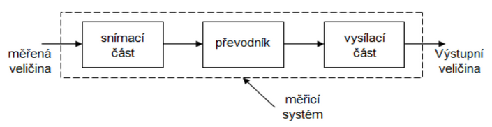

## 2. Druhy signálů a převod analogových veličin na digitální signál

### Analogové

- Veličinou je stejnosměrné napětí a proud, jejichž velikost je úměrná okamžité hodnotě měřené veličiny (parametrem je amplituda)
- Může nabývat jakékoliv hodnoty v daném rozsahu a je spojitý v čase
- Generují jej čidla, převodníky pro měření spojitých fyz. veličin např. tlaku, teploty, hladiny, průtoku apod.

  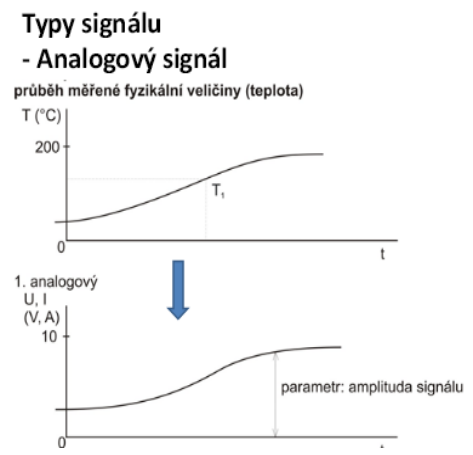

### Binární

- Nabývá pouze dvou úrovní (log. Nula a log. Jednička) např. u napětí 0V a 5V
- Parametr: Amplituda
- Zdrojem jsou: kontakty relé, spínače, přepínače, tlačítka, logické obvody
- Jedná se zejména o stavy např. motorů (čerpadel, kompresorů) – zapnuto, vypnuto – nebo stavy dvoupolohových ventilů – otevřeno, zavřeno

  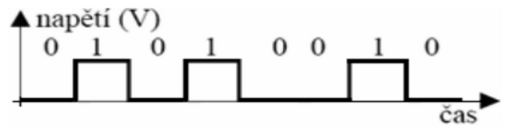

### Impulsní

- Generovány snímači s impulsním výstupem, hodnotu nese:
  - Frekvence impulsů
  - Šířka impulsů
  - Amplituda impulsů
- Parametr: Amplituda
- Zdrojem jsou: elektroměry, průtokoměry, tachodynama pro měření rychlosti

  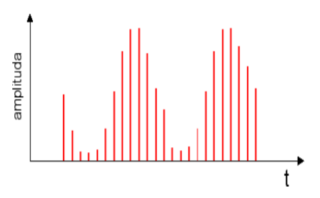

### Číslicové

- Mění svou hodnotu skokově, vždy o stejnou hodnotu
- Mají větší počet stavů
- Mění se stupňovitě
- Zdrojem jsou: číslicové voltmetry, dávkovací váhy, ultrazvukové hladinoměry

  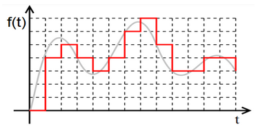

### Převod analogového signálu na digitální

Jde o převod spojitého (analogového) signálu na digitální, pomocí:

- **Vzorkování** - rozdělení vodorovné osy signálu na rovnoměrné úseky, z kterých se vyberou vzorky
- **Kvantování** - prostor kolem jednotlivých hodnot je rozdělen na toleranční pásy, a podle toho, do kterého pásu vzorek zapadne, je mu následně přiřazena daná hodnota.

## 3. Rozdělení senzorů

### Dle měřené veličiny:

- Senzory teploty
- Senzory tlaku
- Senzory průtoku
- Senzory mechanických veličin (posunutí, polohy, rychlosti, zrychlení, síly, mechanického napětí aj.)
- Senzory radiačních veličin ve viditelném, infračerveném a jiném spektru
- Senzory pro analýzy látek, kapalin a plynů
- Senzory elektrických a magnetických veličin

### Dle styku senzoru s měřeným prostředím:

- bezdotykové
- dotykové

### Dle tvaru výstupního signálu:

- analogové (spojité)
- digitální (číslicové, diskrétní)
- impulzní

### Dle transformace signálu:

- **Aktivní** - jsou zdrojem el. napětí (termočlánky, piezoelektrické)
- **Pasivní** - Potřebují cizí zdroj el. Napětí (tlak, teplota)

## 4. Principy činnosti – odporové, kapacitní, piezoelektrické a využití při měření

### Odporové

#### Typy:

- Platinové
- Niklové
- Měděné
- Speciální slitiny

#### Dilatační jev

Dva pásky z různých kovů jsou svařeny k sobě, při zahřívání se pásek ohýbá, protože každý pásek má jinou délkovou roztažnost

#### Odporové polovodičové senzory

- Velmi citlivé, velký výstupní signál
- Horší stabilita, šum, malý teplotní rozsah, nelinearita

**Termistor - negistor (NTC)**

- Typický měřící rozsah: -50 °C do +150 °C
- Senzor teploty prostorů ve větracích/klimatizačních zařízeních
- Venkovní senzory teploty

**Termistor - pozistor (PTC)**

- Měřící rozsah: +60 °C do +180 °C
- Vykazují prudký nárůst teploty, dvoustavové senzory

#### Termoelektrické senzory – termočlánky:

- Měřící rozsah: -200 °C až 3500 °C
- Lineární charakteristiky, velký teplotní rozsah, malé rozměry sond
- Malá citlivost = malé výstupní napětí
- Pro velké změny teplot
- spalovací kotle

#### Tenzometry – kovové (konstantanový drátek)

- Změna délky (průřezu) vodiče ovlivňuje el. Odpor vodiče
- Měření: tahu, tlaku, krouticí moment
- Velmi přesné
- Použití: Váhy, siloměry, tlakoměry

#### Tenzometry – polovodičové

- **Piezoelektrický jev** - působením mechanických sil dochází u některých krystalů ke vzniku náboje. Dochází k přesunu nábojů, tj. vzniká napětí (Nejčastěji se používá - SiO2 , BaTiO3 titaničitan barnatý, křemen).
- Velmi citlivé (až 60krát víc než kovové tenzometry)
- Použití: měření rychle se měnících tlaků ve spalovacích motorech nebo turbínách (dynamické tlaky), mechanického napětí, tlakové síly.

#### Magnetorezistor:

- V magnetickém poli dochází k ovlivňování toku nosičů el. Proudu a prodlužování jejich dráhy, což se projeví zvětšením odporu magnetorezistoru

#### Fotorezistor:

- Jeho odpor klesá s intenzitou dopadajícího světla, řádově z mega ohmu na stovky ohmů.
- Z polovodičového materiálu je na keramické destičce vytvořena meandrová cestička na kterou dopadá světlo.
- Energie světla uvolňuje elektrony – proud roste a hodnot a odporu klesá

### Kapacitní

Jsou založeny na existenci kapacity mezi dvěma kovovými částmi. Změnou těchto kovových částí se mění kapacita a tím se převádí měřená fyzikální veličina na el. Signál.

- Použití: měření tlaku, kmitočtů, poloha, úrovně hladin, dotyk. Telefony
- εr … poměrná permitivita
- εo … permitivita vakua má hodnotu 8,845 \* 10-12 [F/m]
- S … plocha elektrody (obě shodných rozměrů)
- d … vzdálenost elektrod.

#### Výhody

- velká přesnost
- celkem snadno konstrukčně dosažitelná

  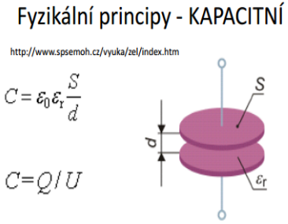

  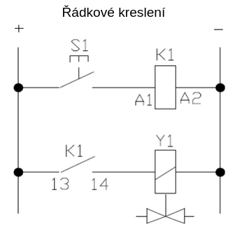

## 5. Bezkontaktní senzory a snímače

### Výhody a nevýhody bezkontaktních snímačů

#### Výhody:

- Rychlé měření, bezpečné (až do 3000 °C)
- Zanedbatelný vliv měřící techniky na měřený objekt

#### Nevýhody:

- Lze měřit jen povrchové veličiny (teplotu)
- Vliv nečistot

### Přibližovací snímače

- Bezkontaktní snímače
- Princip činnosti je založen na oscilačním obvodu, který vyzařuje elektrostatické nebo elektromagnetické pole vystupující z čelní plochy. Přiblíží-li se elektricky vodivý předmět/změní-li se dielektrikum, poklesne rezonance a obvod se vypne.

#### Kapacitní

- i nekovové
- Reagují na změny kapacity v důsledku přiblížení kovových i nekovových předmětů
- Kondenzátor je součástí RC oscilátoru
- Pokud měřený předmět není v elektrickém poli, je amplituda kmitů malá
- Přiblížením předmětu kapacita vzroste a zvýší se i amplituda kmitů a dojde k přepnutí klopného obvodu a výstupu
- **Použití:** Snímání úrovně hladiny, lze snímat kapaliny (olej, voda, alkohol), sypké materiály (prášky, cukr, obilí, počítání prvků

Základní části:

- RC Oscilátor
- Vyhodnocovací obvody
- Koncový (výkonový) stupeň

#### Indukční

Základní části:

- RC Oscilátor
- Vyhodnocovací obvody
- Koncový (výkonový) stupeň

  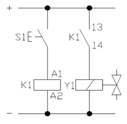

### Optické snímače, použití

#### Dělení:

- Snímače pro SPOJÍTÉ měření polohy
  - Inkrementální (přírůstkové)
  - Absolutní
- Snímače pro NESPOJITÉ měření (indikaci) polohy

#### Spojité

Inkrementální

- **Princip:** spočívá v clonění světelného toku mezi zdrojem a detektorem (pravítkem nebo kotoučem) pravidelně rozděleným na průhledné a reflexní úseky. Právitko se překrývá maskou (clonou) se stejnou roztečí rysek, takže intenzita světelného signálu přijímaného fotodiodami se periodicky mění. Signály na fotodiodách jsou sinusové, fázově posunuté o 180°.

  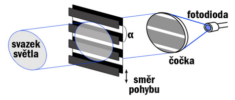

Absolutní

- poskytují pro každou polohu určitou číselnou hodnotu
- Čísla jsou zakódována na kódových pravítkách a kotoučích v binárním kódu pomocí průhledných a neprůhledných plošek
- Např. Binární, Grayův kód

#### Nespojité snímače pro indikaci

Využívají:

- ultrafialové světlo **UV** (λ = 400 – 10 nm, f = 10 15 – 1017 Hz)
- infračervené světlo **IR** (λ = 760 nm – 1 mm, f = 300 GHz – 400 THz)
- Zdroje světla:
  - laserová dioda LD
  - DBF laserová dioda
  - LED dioda (dnes se nepoužívá)

Principy optickych snímačů:

- světelná závora
- reflexní snímač
- difúzní snímač

#### Světelná závora

Systém sestává ze dvou oddělených komponent: z vysílače a přijímače. Vysílač vysílá taktované světlo v infračerveném nebo červeném rozsahu vlnových délek. Přijímač rozpozná dopadající světelný paprsek a jeho přerušení, způsobené objektem nacházejícím se v detekční oblasti, převede ihned na spínací signál.

#### Reflexní optický snímač

U reflexních světelných závor se nachází vysílač i přijímač v jednom pouzdře. Pomocí zrcadla je vysílačem vyslaný světelný paprsek přiveden zpět k přijímači. Objekt, který se dostane do cesty světelného paprsku, přeruší světelný paprsek a tím spustí spínací proces.

  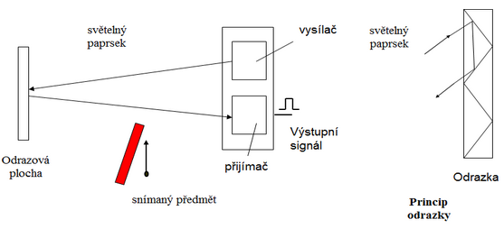

#### Difůzní optický snímač

Slouží k přímé detekci objektů. Stejně jako u reflexního senzoru nachází se zde vysílač i přijímač v jednom pouzdře. Senzor vyzařuje světlo, které se od objektu, který má být detekován odrazí a odražené světlo je přijato přijímačem.

Vyhodnoceno není u tohoto systému přerušení světelného paprsku, ale příjem odraženého světla od objektu.

  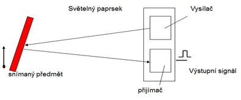

#### Optoelektrické snímače

- Výhodou optoelektronických snímačů je necitlivost vůči rušení elektromagnetickým polem a velký rozsah vzdáleností, ve kterých jsou schopny detekovat objekty. Jsou citlivější na vlhkost, vnější světlo a infračervené záření.
- K typickým aplikacím patří hlídání rozměrů, kontrola obsahu, hlídání hladin, odměřování polohy.
- Ultrazvuk je mechanické vlnění s frekvencí **větší než 20 kHz** (neslyšitelné pro člověka, některé zvířata jej slyší – psi, delfíni)
- **Využití:** Lékařství, defektoskopier, sonar

  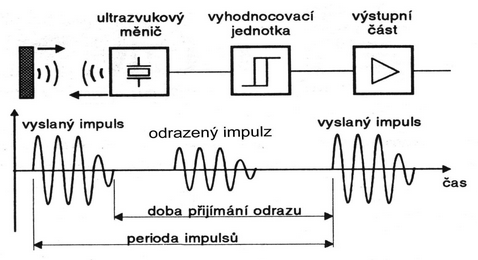

Zdroje ultrazvuku:

- **mechanickými generátory** (speciálními píšťalami a sirénami).
- **Magnetostrikční generátory** vytvářejí ultrazvukové kmity do 60 kHz. V prostředí kolem feromagnetické tyčinky, která je umístěna v magnetickém poli elektromagnetu napájeného střídavým proudem. Využití mají pouze v zubním lékařství při odstraňování zubního kamene a kazu.
- **Piezoelektrické generátory** je destička křemene připojena k elektrodám se střídavým napětím a tak kmitá se stejnou frekvencí jako napětí a mění energii elektrickou na mechanickou. Ta rozkmitá okolní prostředí. Frekvence bývají v rozsahu 1 – 20 kHz. Jsou využívány pro diagnostické i terapeutické účely.

#### Difůzní ultrazvukový snímač

Piezoelektrický ultrazvukový měnič pracuje střídavě jako reproduktor a mikrofon tak, že po vyslání signálu měří dobu odezvy po odrazu od překážky. Při příjmu se vzorek porovnává s vyslaným signálem.

Výhody

- detekce transparentních a lesklých předmětů
- měření hladiny kapaliny a pastovitých látek
- nevadí prašné prostředí

### Magnetické snímače, použití

  

