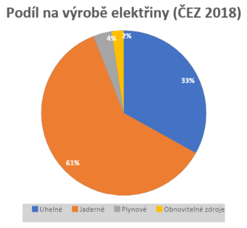
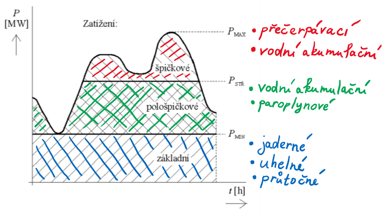
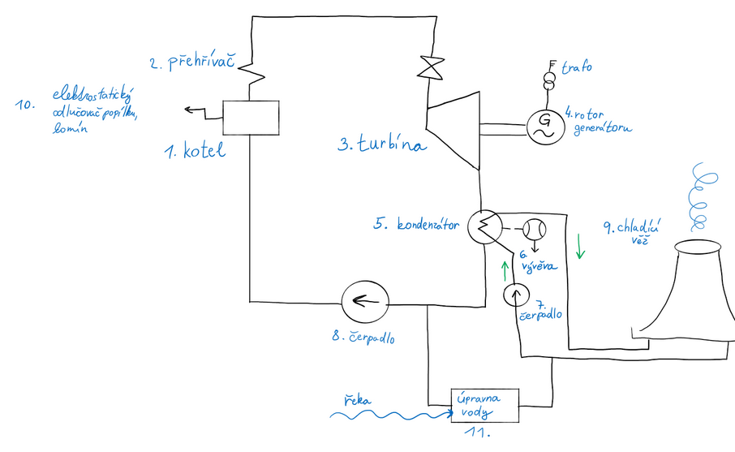

# Výroba elektrické energie, generátory

## a) Rozdělení zdrojů elektrické energie

### Neobnovitelné zdroje

Zdroje se neobnoví v historicky krátké době. Těžba většinou nebývá šetrná k přírodě, stejně tak jejich spalování.

**Uhlí**

Výhody:

- Vysoký čistý energetický výnos
- Velká dostupnost (takřka po celém světě zásoby na 200–900 let)
- Nízké náklady

Nevýhody:

- Znečišťuje ovzduší CO2 (oxid uhličitý) => přispívá ke globálnímu oteplování
- Těžba poškozuje krajinu (viz Karvinsko, Mostecko)
- Zásoby se časem vyčerpají
- Radioaktivní (uhelné elektrárny vypouštějí do okolí více radioaktivity než jaderné elektrárny)

**Uran (používá se izotop U238)**

Výhody

- Cena uranu tvoří jen nepatrnou část v nákladech na výrobu elektřiny
- K výrobě elektřiny potřeba mnohem méně uranu, než uhlí

Nevýhody

- Radioaktivita
- Skladování radioaktivního odpadu (viz Likvidace)
- Drahá výstavba elektrárny

**Ropa**

**Zemní plyn**

### Obnovitelné zdroje

Vyskytují se v přírodě, v krátké době se znovu obnovují a je možné je využívat opakovaně; problémem je jejich občasná nedostupnost (někdy nesvítí slunce apod.)

- Voda
- Vítr
- Slunce

### Rozdělení elektráren

**Tepelné-parní (uhelné, jaderné, plynové)**

- Kondenzační elektrárna (dodává jen elektrickou energii)
- Teplárna (dodává elektrickou energii i teplo)
- Výtopna (dodává pouze užitkové teplo)

**Vodní**

- Akumulační / průtočné (Vltavská kaskáda)
- Malé vodní elektrárny (do 10 MW)
- Vodní elektrárny (nad 10 MW)
- Přečerpávací (Dlouhé Stráně)
- Spádové (u nás nejsou; Norsko, Švédsko)
- Slapové (využívají příliv a odliv)

**Sluneční**

- Přímé (fotovoltaické)
- Nepřímé (sluneční tepelné elektrárny)

**Větrné elektrárny**

**Bioplynové elektrárny**

### Podíl elektráren na výrobě energie

  

## b) Diagram zatížení

- Graf vyjadřující závislost výkonu sítě na čase (P = f (t)).
- Má význam pro řízení provozu elektrizační soustavy.
- Elektrickou energii nelze skladovat, proto se musí dodávat do soustavy stejné množství energie, jako se právě spotřebovává (jinak by docházelo k výpadkům dodávky elektřiny a poškození strojů). Právě k tomu je potřeba diagram zatížení.
- Může být zpracován z pohledu zdroje (elektrárna) nebo z pohledu spotřeby (město, závod).
- Rozdělujeme na: denní, týdenní, měsíční (nesleduje se kvůli rozdílu zima–léto), roční

  

Legenda: PMIN – minimální zatížení, PSTŘ – střední zatížení, PMAX – maximální zatížení

Dle toho, jak se zdroje používají k pokrytí spotřeby elektřiny, je dělíme na pásma:

Základní

- Kryjí:
  - Jaderné elektrárny
  - Tepelné elektrárny (uhelné, …)
  - Průtočné vodní elektrárny
- Kryjí elektrárny v provozu 24/7; provoz levný, ale jejich výkon se těžce reguluje

Pološpičkové

- Kryjí:
  - Vodní akumulační elektrárny
  - Paroplynové elektrárny (využívají zemní plyn)
- Kryjí elektrárny s lepší možností regulace, ale dražším provozem

Špičkové

- Kryjí:
  - Přečerpávací elektrárny (např. Dlouhé Stráně)
  - Vodní akumulační elektrárny
- Kryjí provozně drahé elektrárny s rychlou možností regulace

**Výroba el. energie z neobnovitelných zdrojů**

Střídavou elektrickou energii vyrábí synchronní generátor (viz alternátor). U elektráren z neobnovitelných zdrojů se jedná o turboalternátor (rotorem otáčí parní turbína)

## c) popis výroby elektrické energie v uhelných a jaderných elektrárnách, likvidace odpadů

### Výroba v uhelné elektrárně

**Uhelná elektrárna** (tepelná elektrárna) vyrábí elektrickou energii přeměnou z chemické energie vázané v palivu prostřednictvím tepelné energie. Není tak ekologická jako jaderná, ale její nahrazení by stálo hodně peněz.

### Proces

1. Kusové uhlí se rozemele na prášek
2. Ventilátor dopraví prášek se vzduchem k hořákům v kotli (1)
3. V kotli prášek shoří -> uvolněné teplo ohřívá vodu v trubkách výparníku
   1. -> vzniká sytá pára
   2. -> sytá pára se přehřívá na ostrou páru (550 °C; vysoký tlak)
4. Sytá pára roztáčí turbínu (3)
   1. Na společné hřídeli s turbínou je generátor (4)
   2. -> v generátoru vzniká elektrický proud
5. Pára v turbíně odevzdá svou energii
   1. -> pára přechází do kondenzátoru (5)
   2. -> tam se chladí studenou vodou a kondenzuje (zkapalňuje)
   3. chladící voda se chladí vzduchem v chladících věžích (9)
6. Voda (zkapalněná pára z kroku 5b) se z kondenzátoru vrací přes úpravnu vody (10) do kotle
   1. a cyklus se neustále opakuje

### Turbína

Má 3 stupně, kam se vede ostrá pára:

- Vysokotlaký
- Středotlaký
- Nízkotlak

### Odpady uhelných elektráren:

**a) Pevné odpady:**

popel / struska

- shromažďuje se ve výsypkách, rozdrtí se a využívá se k:
- revitalizaci krajiny
- stavbě silnic

spaliny (kouř)

- popílek = pevné částice ve spalinách
- spaliny se ženou přes odlučovače popílku
- Čistí se (likvidují):

  - **Elektrostatickým odlučovačem**

    - Účinnost 99 %
    - Popílek je pomocí elektrod nabit napětím a přitahován k desce (elektrodě)

  - **Cyklónovým odlučovačem**

    - Využívá odstředivých sil ve válci
    - Těžší částečky (popílek) padají ve víru cyklónu na okraj, plyn odchází vzhůru

    - **Textilní odlučovače**

    - Princip vysavače
    - Nevýhoda => vyšší spotřeba el. energie pro ventilátory

**b) Plynné odpady**

SO2 – oxid síry

- Odstraňuje se v odsiřovacích zařízeních mokrou cestou
- Spaliny síry procházejí sprchou vápencové suspenze
- Oxid siřičitý oxiduje na energosádrovec -> nahradí přírodní sádrovec při výrobě sádry a stavebních hmot

NOX ve spalinách

- (NO = oxid dusnatý (90 %); NO2 = oxid dusičitý (5 %); N2O = oxid dusný (při spalování pod 900 °C))
- Do spalin se vstřikuje amoniak (čpavek)
- spaliny se vedou přes katalyzátory (vzniká dusík a voda)

Likvidace plynných odpadů

- Fluidní spalování
- Při teplotě 700–900 °C se spaluje uhlí (zrnitost 20 mm) s mletým vápencem
- Palivo vyhořívá z více než 90 % (oprosti normálním cca 45 %, takže se nevypouští tolik škodlivin)
- => vznikají spaliny s nízkým obsahem oxidu síry i oxidu dusíku

**c) využité odpadů**

Suchý popílek k výrobě:

- Stabilizátu
  - = popílek + struska + energosádrovec
  - Pro sanaci důlních výsypek a revitalizaci krajiny
- Naplň filtrů pro čištění odpadních vod
  - Ničí patogenní bakterie, těžké kovy a PCB (PCB způsobuje rakovinu jater a slinivky břišní nebo neplodnost; dříve se používaly k nátěrům sil nebo kravínů, proto je konzumujeme v mléce nebo mase)
- Betonu, umělého kameniva

### Výroba v jaderné elektrárně

- Elektřina se vyrábí přeměnou vody v páru, která roztáčí turbínu, podobně jako v uhelných elektrárnách, v jaderných se avšak používá místo uhlí štěpná reakce (nejčastěji U235).
- Nejběžnější typ – tlakovodní reaktor
- Dělení tlakovodního reaktoru:
  - Primární okruh
  - Sekundární okruh
- Primární okruh se nachází v tzv. Kontejnmentu a je to část jaderného reaktoru, kde se tvoří teplo. Čerpadla zajišťují průchod vody a jeho cirkulaci mezi reaktorem a parogenerátorem, který ohřívá vodu v parogenerátoru, která se mění na páru.
- **Sekundární okruh** tvoří parogenerátor, který je zdrojem páry pro několikastupňovou turbínu, která pohání alternátor, který tvoří elektrickou energii. Pára následně cirkuluje do kondenzátoru, kde se pomocí chladící věže pracující na komínovém efektu ochlazuje. Pumpa nakonec znovuzrozenou vodu cirkuluje opět do parogenerátoru.
- **Terciální** (chladící) okruh zajišťuje chlazení v kondenzátoru přes chladící věž, často čerpá vodu z okolní řeky.

  

### Likvidace odpadů z jaderné elektrárny

Vyhořelé jaderné palivo je silně radioaktivní a je málo způsobů, jak se ho doopravdy zbavit. Jaderný odpad ale nevzniká pouze z jaderných elektráren, ale z mnoha činností člověka. Celkově v ČR připadá 45 g nízkoaktivního a středněaktivního radioaktivního odpadu na obyvatele. Vyhořelé jaderné palivo (vysokoaktivní) “pouze” 10 g na obyvatele. O jaderný odpad zodpovídá SÚRAO a kontroly provádí SÚJB.

**Možnosti nakládání s jaderným odpadem:**

- Vitrifikace – převádění jaderného odpadu na sklo. Z jaderného odpadu se odstraní voda a přidají se sklotvorné přísady. Sklo je následně daleko pevnější, tepelně vodivější a uvolňuje daleko míň radioaktivních částeček do prostředí.
- Uskladňování v dlouhodobých skladech
- Uskladňování do vrtů do země – vrty dlouhé několik km, jaderný materiál uložený do materiálu s vyšším bodem tavení – síra. Jaderný odpad nahřívá síru, která způsobí tepelnou roztažitost síry, která poté zatlačí jaderný odpad ještě hlouběji do země.

## d) popis výroby elektrické energie z obnovitelných zdrojů (vodních elektrárnách, větrné, sluneční)

### Výroba el. energie z vodních zdrojů

**Vodní elektrárna** přeměňuje kinetickou energii přírodních i nepřírodních vodních toků na energii elektrickou.

**Druhy vodních elektráren:**

- akumulační/ průtočné - Slapy, Orlík, Lipno
- přečerpávací elektrárny – 2 vodní nádrže (Dlouhé Stráně, Dalešice,…)
- spádové
- malé vodní elektrárny

### Akumulační elektrárna

**Dle MW**

- Malé (do 10MW)
- Střední (do 100MW)
- Velké

**Dle výšky spádu**

- Nízkotlaké – spád do 20 m, Kaplanova turbína

**Kaplanova turbína** – využívá se od 0,6m spádu a používá se tam, kde není zajištěn stálý průtok vody. Má vyšší účinnost než Franciscova turbína, ale je dražší a komplexnější na operaci.

- Středotlaké – používají Franciscovu turbínu – od 20 do 100 m spádu.

**Franciscova turbína** - 2 varianty dle položení hřídele – horizontální / vertikální. Je to přetlaková turbína – během svého průchodu mění svůj tlak. Patří mezi nejpoužívanější. Lze použít jako čerpadlo.

- Vysokotlaké – spád nad 100 m

**Peltonova turbína** – rovnotlaká turbína, účinnost při malém provedení okolo 85 % a při větším 95 %. Nejefektivnější pro velké přírodní spády.

**Bankiho turbína** – pro malé vodní elektrárny do 10 MW

### Přečerpávací elektrárna

- Mají dolní a horní vodní nádrž propojenou potrubím, v němž jsou zařazeny vodní turbíny /čerpadla. Při přebytku el. energie v síti čerpají čerpadla vodu z dolní nádrže do vysoko položené horní nádrže.
- Používá se zde Francisova turbína

### Slapové elektrárny

- Energii mořských vln se převádí:
- Vertikálně orientované bójky nebo ležící tubusy buď přímo pohybují magnety proti cívkám, čímž se indukuje elektrický proud,

### Výroba el. energie ve větrných elektrárnách

- Vítr je proudění vzduchu, které vzniká tlakovým rozdílem v atmosféře
- Vítr charakterizují dvě veličiny: směr a rychlost větru
- Přeměňují kinetickou energii větru na elektrickou
- Více druhů mezi základní řadíme vertikální a horizontální

**Konstrukce:**

- Hlavní motor – mechanismus, brzda rotoru, list rotoru, hnací hřídel
- Gondola – převodovka, hřídel, generátor, řídicí jednotka
- Tubus – vyvedení vodičů
- **Výhody:** nevznikají emise, zelená energie, nové prac. Místa, zisk pro majitele
- **Nevýhody:** hluk, rušení signálu, málo vhodných míst pro umístění, konstrukční vady

### Výroba el. Energie ve slunečních elektrárnách

- sluneční e. přeměňuje sluneční energii na elektrickou
- Energie se vyrábí přímo nebo nepřímo

##### Přímo:

- fotovoltaické články
- termočlánky

#### Nepřímo:

- Tepelné sluneční elektrárny

#### Fotovoltaická elektrárna

- Využívá se fotovoltaických článků, které se se spojují do větších celků = fotovoltaické panely
- Sluneční světlo doléhá na panely, kde dochází k uvolnění elektronů z obalu atomu a vzniká tak elektrická energie

#### Sluneční tepelná elektrárna

- Potřebné teplo se získává přímo ze slunečního záření.
- Kotel (absorbér) je umístěn na věži v ohnisku velkého fokusačního (ohniskového) sběrače.
- Sluneční záření se na něj soustřeďuje pomocí otáčivých zrcadel – heliostatů. V kotli se ohřívá olej - ve výměníku se získává horká pára, která pohání turbínu.

## e) Generátor střídavé elektrické energie (alternátor)

### Popis generátoru

Generátor střídávého proudu, také známý jako alternátor, je elektromechanický stroj přeměňujícího točivou mechanickou energii na elektrickou energii v podobě střídového (často trojfázového proudu).

Skládá se z:

- Statoru – nehybné části, na které je umístěné vinutí, ve kterém se indukuje střídavý proud na základě otáček rotoru
- Rotoru – pohyblivá část na hřídeli společně s hnacím strojem umístěná do statoru. Má v sobě permanentní magnety, které působí na vinutí statoru.

Pokud jsou chlazeny vzduchem, na hřídeli může být také i větrák

### Princip činnosti generátoru

Fungují na principu měnění magnetického pole okolo vinutí statoru, které způsobuje indukci elektrického proudu ve vinutí. Hnací mechanizmus (např. Parní turbína) otáčí rotorem, který tuto změnu magnetického pole vyvolává. Ve statoru se většinou nachází 3 vinutí a tímto vytváří 3fázový střídavý proud.

Rotor může být osazen permanentními magnety, nebo vinutím rotoru napájenými sběrnými kroužky.

Zapojení statoru může být buď do hvězdy či do trojúhelníku.

Při zapojení do hvězdy se nám zvýší napětí \* odmocninu 3, ale také se sníží proud na třetinu.

### Konstrukce generátoru

Alternátory bývají synchronní, což znamená že rychlost otáček je stejná jako rychlost otáčení magnetického pole.

Jsou hlavní 2 typy:

1. **S hladkým rotorem** – bývají menší (do 1 m), obvykle mají 2 či 4 póly, při 50 Hz a 2 pólech (1 polový tvar) potřebují otáčky 3000/min. Toto se počítá dle následujícího vztahu: n = 60f / p.

   - Při větších konstrukcích by mohly odstředivou silou vytrhnout vinutí z drážek.

   - Používají se v jaderných a tepelných elektrárnách, jsou poháněny parní turbínou. Chladí se vodou či kombinací voda-vodík. Největší turboalternátory mohou dosahovat více než 1500 MVA výkonu. Bývají vybaveny budičem, který je spojen s rotorem.

2. **S vyniklými póly** – jsou pro pomalejší implementace (vodní turbíny). Pólové nástavce jsou umístěny do po obvodu rotoru a mají daleko více pólů. Např 30. Platí na ně stejný vztah. Staví se až 20 m verze.

   - Používají se v automobilech a jako hydroalternátory. Chlazeny vzduchem.
