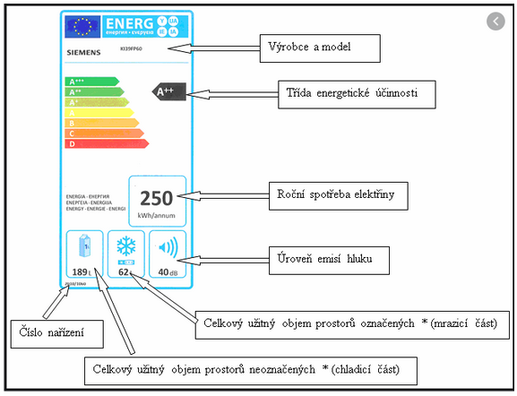
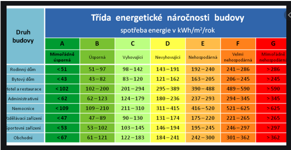
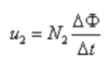
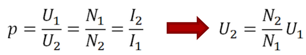
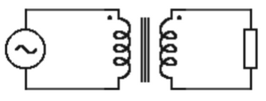
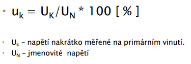

# PŘENOS ELEKTRICKÉ ENERGIE, TRANSFORMÁTORY

## a) Popis energetické soustavy, úrovně napětí soustav

Elektrický rozvod - slouží k přenosu el. Energie z místa jeho výroby k místu jeho spotřeby a tvoří ho **rozvodné sítě**.

### Rozvodná síť zajišťuje:

- Přenos el. Energie (přenosovou soustavou)
- Distribuci el. Energie spotřebitelům (distribuční soustavou)

Spojovacími prvky mezi přenosovou a distribuční soustavou jsou **elektrické stanice**.

### Přenosová soustava:

- Dálkový přenos velmi vysokého napětí
- Linky propojují jednotlivé zdroje a transformační stanice
- Možnost řídit přenos energie v závislosti na okamžité spotřebě elektřiny v různých oblastech i v případě poruchy v určitém sektoru
- 110/220/400/750/1150 a vice kV

### Distribuční soustava:

- V transformátoru se velmi vysoké napětí transformuje na vysoké napětí 110 kV
- Část energie jde do podniků a železničních tratí
- Zbytek k menším podnikům, města, obce, kde se transformuje na 22 kV
- V samotných městech, čtvrtích se transformuje na nízké napětí 230V a 400 V a je dovedena k spotřebitelům
- 110; (35); 22; 0,4 kV

### Úrovně napětí:

- Ultra vysoké napětí uvn - více než 800 kV
- zvlášť vysoké napětí ZVN – 300kV-800kV dálkové a mezinárodní přenosy
- velmi vysoké napětí VVN – 52kV-300kV energie do továren
- vysoké napětí VN – 1000V-52kV energie do transformátorů
- nízké napětí nn - místní rozvody 50-1000 V
- malé napětí mn - 0-50V

## b) ztráty při přenosu energie

### Ztráty při přenosu:

- Korona – sršivý výboj při přenosu u VN, VVN

### Ztráty v magnetickém poli:

#### Hysterezní

- Vzniká při přemagnetizaci
- Energie potřebná na tyto změny se mění na teplo – jádro se zahřívá
- magneticky tvrdé materiály - k přemagnetizaci je potřeba velká energie
- magneticky měkké materiály – malá energie

  

#### Vířivé proudy

- Vznikají v masivních kovových materiálech, působením střídavého mag. Pole, nebo pohybem kovových předmětů v mag. Poli.
- Jádra se z důvodu ochrany skládají z tenkých izolovaných plechů (lak, oxidace)
- Využití: Pec, Brzdy, Indukční ohřev

#### Ztráty v železe:

- Pokud je transformátor připojen k napájení a je bez zátěže

**Ztráty obecně**: PFe = PV + PH (Vířivé + Hyterézní)

## c) Technické prostředky pro přenos elektrické energie

### Vedení

- Vnější
- Kabelové
- Vnitřní

### Vedení rozlišujeme na jednoduché a dvojité

- venkovní – bronz (S = 25 mm2), AlFe.
- Nad 400 kV použití svazkových vodičů (každá fáze 2 – 4 vodiče)
- kabelové vedení – v obytných aglomeracích, v závodech
- 1-4 žilové, vodivé žíly Cu (řídicí obvody), Al (silové VN, nn)
- supravodivý koaxiální kabel

### Stožáry

- Podpěrná konstrukce el. Vedení (jedle, soudek, delta, kočka, dona) – beton, ocel

### Izolátory

- Podle způsobu namáhání rozlišujeme podpěrné, závěsné a kotevní izolátory. (Porcelán, sklo)
- koronu (čím větší korona tím větší ztráty) Korona – sršivý výboj u VN. a VVN.

### Stanice

- Transformovny – změna napětí při zachování frekvence
- Spínacích stanice - rozvádí elektrickou energii při stejném napětí bez transformace
- Měnírny – mění střídavý proud na stejnosměrný, pro potřeby el. Trakce (tramvaje)
- Součástí stanic jsou taky rozvodny, u menších el. stanic jsou to rozvaděče, u odběratelů jsou to rozvodnice.

  

## d) měření spotřeby elektrické energie a její výpočet, energetické štítky

### Cena:

- Část regulovaná (distribuce)
- Neregulované (dodávka, paušál za připojení)
- Daně

### Měření spotřeby:

Elektroměrem v MWh; kWh; GWh

### Výpočet:

W = P \* t [Wh; W, h]

### Energetické štítky:

- rozřaďují přístroje podle spotřeby do kategorie A (A+++) až D, přičemž A+++ je z hlediska spotřeby nejúspornější.
- Nejčastěji se označují domácí spotřebiče

  

### Budovy:

- Štítek udává kolik daná budova při svém provozu spotřebuje energie (vytápění apod.)
- Skupiny A – G
- Můžeme zjistit, jestli je daná budova hospodárná

  

## e) transformátory – popis, princip činnosti, druhy

### Konstrukce:

- Magnetický obvod (jádro) – transformátorové plechy 0,5 ; 0,35 mm – navzájem od sebe izolované nevodivou oxidační vrstvou
- Slouží k přeměně parametru střídavého napětí při zachování frekvence
- Magnetický obvod s 1 vinutím = Tlumivka
- Magnetický obvod s 2 vinutími = Trafo
- Elektrický obvod – vinutí
- Systém chlazení – vzduchem, olejem

### Princip činnosti:

- Připojením střídavého napětí U1 na primární cívku jí začne protékat proud I1 , který vytvoří střídavý magnetický tok, který je železným jádrem mnohonásobně zesilován.
- Časovou změnou magnetického pole se v závitech primární i sekundární cívky indukují napětí podle počtu závitů N1 , N2 .
- Pokud připojíme k sekundární cívce zátěž, začne protékat sekundárním vinutím proud I2 – pak do zátěže Z2 dodává transformátor výkon P2 = U2 . I2 . cos ϕ2

### Indukované napětí

  

[V; Wb; sh]

### Převod transformátoru:

  

### Rozdělení tranformátorů:

### Podle počtu fází

- Jednofázový
- Trojfázový
- Speciální (dvě nebo více fází, měniče počtu fází)

#### Podle konstrukce magnetického obvodu

- Plášťový
- Jádrový
- Toroidní

#### Podle použití:

- Energetické (na vedení vvn),
- Distribuční (z vedení vvn/vn ke spotřebiteli)
- Napájecí (pro transformaci nízkého napětí na malé napětí)
- Bezpečnostní (jako napájecí, ale zajištěná izolační pevnost - pro napájení obvodů ve zdravotnictví, v hračkách a v spotřebičích ve třídě III)
- Rozptylový (s magnetickým bočníkem, pro svařování, napájení výbojek a speciální aplikace)
- Regulační (autotransformátory,,...)
- Měřicí (napěťové, proudové, kombinované)

### Autotransformátor

- Odbočka sekundárního vinutí může být realizována pomocí pohyblivého jezdce. Poloha jezdce udává velikost sekundárního napětí.
- Výhoda: proti transformátoru je, že při stejném výkonu má MENŠÍ hmotnost železného jádra a MENŠÍ hmotnost vinutí (mědi).
- Nevýhoda: nezajišťuje galvanické oddělení primárního a sekundárního obvodu (obě vinutí jsou spojena).

### Provozní stavy:

- naprázdno – svorky sekundárního vinutí jsou rozpojeny (měří se ztráty v železe)

  

- při zatížení – na sekundární vinutí je připojena zátěž

  

- nakrátko – sekundární svorky zkratovány, určuje se relativní napětí nakrátko uk [ % ]

  

Dle hodnoty uk se posuzuje tvrdost zdroje.
