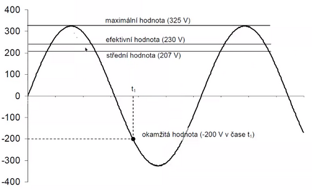
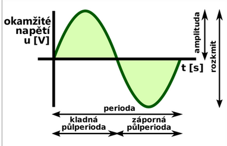
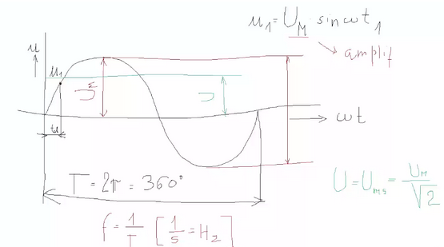
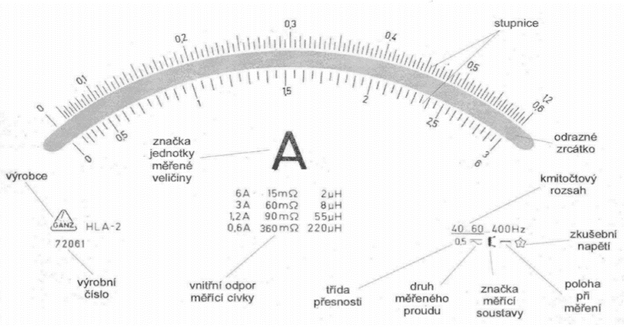
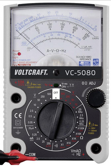

# Měřící technika

## a) Pojmy

### Měření

- soubor úkonů vedoucích ke zjištění hodnoty fyzikální veličiny
- pomocí měřicích přístrojů

### Měřící přístroj

- zařízení sloužící k převodu měřené veličiny na údaj poskytující informaci o velikosti měřené veličiny
- kalibrování – zjišťování odchylky, nastavování přesnosti
- justování(vyrovnávání) – nastavování do výchozí hodnoty, aby bylo měření přesné
- cejchování – úřední ověření měřícího přístroje pro jeho správnou funkci

### Metody měření

**Přímé**

- hodnota měřené veličiny se získá přímo bez potřeby dodatečného výpočtu,
- **např:** přiložíme měřící přístroj ampérmetr a naměříme hodnotu proudu

**Nepřímé**

- hodnota měřené veličiny se získá z měření provedených přímými měřícími metodami jiných veličin vázaných s měřenou veličinou na základě známého vztahu
- **např:** měřením el. proudu a napětí určíme el. odpor

**Absolutní**

- poskytuje hodnotu měřené veličiny přímo v příslušné jednotce
- **např:** čas v s, hmotnost v kg, elektrický proud v A

**Relativní (srovnávací)**

- měření spočívá v porovnání měřené veličiny s danou známou hodnotou veličiny téhož druhu etalonem nebo normálem.
- **Etalon** - hodnoty etalonů bývají udány s největší možnou přesností
- **Normál** - hodnoty normálů bývají udány s přesností požadovanou podle účelu použití

### Další metody měření

**Statické**

- hodnotu měřené veličiny určujeme z klidového stavu měřidla
- **např:** měření délky

**Dynamické**

- založeny na pohybových změnách měřícího zařízení
- **např:** určení tuhosti pružiny – na siloměr zavěsíme závaží známé hmotnosti, to rozkmitáme, změříme dobu kmitu a tuhost poté dopočítáme dle příslušného vztahu

**Substituční (AKA submisivní)**

- měřený objekt postupně nahrazujeme normály až dosáhneme na použitém měřidle stejného účinku jako u měřeného objektu
- **např:** měření odporu rezistoru – rezistor neznámého odporu postupně nahrazujeme rezistory známých odporů, až obvodem prochází stejný elektrický proud jako při zapojení rezistoru o neznámém odporu

**Kompenzační**

- účinek měřeného objektu vyrovnáváme (kompenzujeme) stejně velkým účinkem normálu, ale opačného znaménka
- **např:** vážení na rovnoramenných vahách

### Sinusový průběh napětí

  

  

  

## b) Analogové měřící přístroje

### Ručičkový měřící přístroj

- zobrazovaný údaj je spojitá veličina
- **např:** využívají fyzikálních účinků elektrického proudu ke stanovení některé elektrické veličiny

### Analogový údaj

- získaný odečtením výchylky ukazovacího zařízení (ručky) na stupnici analogového měřicího přístroje
- výchylku převádí pozorovatel na číselnou hodnotu
- při spojité změně měřené veličiny se údaj mění spojitě (plynule)

### Tlumení otočného ústrojí

- zabraňuje rozkmitání ručky

### Aretace

- znehybnění otočné části měřícího ústrojí

### Popis číselníku

  

### Konstanta

- hodnota měřené veličiny připadající na 1dílek stupnice
- k = (nastavený měřicí rozsah) / (rozsah stupnice)
- jednotka: V/dílek, A/dílek…

### Citlivka

- převrácená hodnota konstanty
- počet dílků stupnice na jednotku měřené veličiny

### Výchylka

  

### Chyby měřícího přístroje

- ???

### Měření ručkovým přístrojem

**Rozsah stupnice**

- maximální výchylka ručky
- udává se v dílcích

**Měřicí rozsah přístroje M**

- v jednotkách měřené veličiny (V, A, …)
- volíme vždy nejbližší vyšší rozsah, než je hodnota měřené veličiny
- výchylka by měla být v poslední třetině stupnice (kvůli přesnosti měření)

  

## c) Digitální měřící přístroj

### S displejem

- Zobrazovaný údaj je nespojitá veličina
- Obsahují elektronický obvod, který převede hodnotu měřené veličiny na číselnou

### Součásti digitálního měřícího přístroje

- Analogově digitální převodník
- Převádí měrnou analogovou veličinu na digitální
- Zesilovač
- Usměrňovač
  - Usměrňuje střídavé veličiny
- Displej
  - Počet míst (3 = 000–999, 3,5 = 000–1999)

### Číslicový (digitální údaj)

- získaný odečtením číselné hodnoty z displeje

### Měřená veličina

- udávaná číselným násobkem určitých základních skoků (kvant) i při spojité změně měřené veličiny se údaj mění nespojitě (skokově)

### Přesnost a chyba měření

- přesnost měření se udává nepřímo velikostí chyby
- výsledek každého měření (naměřená hodnota) se poněkud liší od skutečné hodnoty
- absolutní chyba F rozdíl mezi naměřenou hodnotou N a skutečnou hodnotou S.
  - F = N - S
- skutečnou hodnotu nezjistíme můžeme ji vyjádřit z měřené hodnoty a absolutní chyby
  - S = N ± |F|

**Absolutní chyba** (není příliš vypovídající)

- Rozdíl mezi ukazovanou hodnotou a porovnávací hodnotou, definuje se intervalem
- **Např:** Příklad: Naměříme-li na displeji ohmmetru 1.00Ω. Vypočítaná chyba měření je ±(0,02 + 0,05)

**Relativní chyba**

- podíl absolutní chyby a naměřené || skutečné hodnoty udává se v procentech

**Třída přesnosti**

- maximální relativní chyba měřicího přístroje zaručená výrobcem
- řada třídy přesnosti: 0,05 0,1 0,2 0,5 1 1,5 2,5 5
- největší možná absolutní chyba měření přístrojem s danou třídou přesnosti |F|=M/100∙TP
- M je měřicí rozsah přístroje
- TP je třída přesnosti
- největší možná relativní chyba měření |f|=|F|/N∙100

### Chyby měření – podle výskytu

**1. soustavná chyba**

- vyskytuje se pravidelně, zkresluje výsledek vždy stejně
- řešení: opravná hodnota

**2. nahodilá chyba**

- vždy jiná
- řešení: více měření, aritmetický průměr

**3. omyl**

## d) LabView a RC2000

**LabView**

Systémové a vývojové prostředí pro grafické programování od firmy National Instruments. Slouží k získávání dat, analýze signálů a hardwarovému řízení

**RC2000**

- určen pro výuku elektroniky, elektrotechniky a příbuzných oborů na středních a vysokých školách
- skládá se z jednotlivých vzájemně plně
- kompatibilních modulů
- kvalitní, přesné a vysoce stabilní součástky
- spolehlivost a odolnost proti poškození
- při práci žáků prověřená stovkami škol
- jediné společné napájecí napětí +5 V

## e) Měření proudu a napětí

- Napětí – měří se paralelně
- Proud – měří se sériově
- Odpor – vypočtu pomocí proudu a napětí (`U = I * R`)
