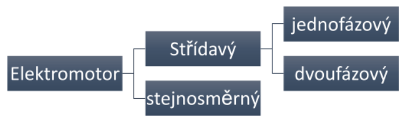
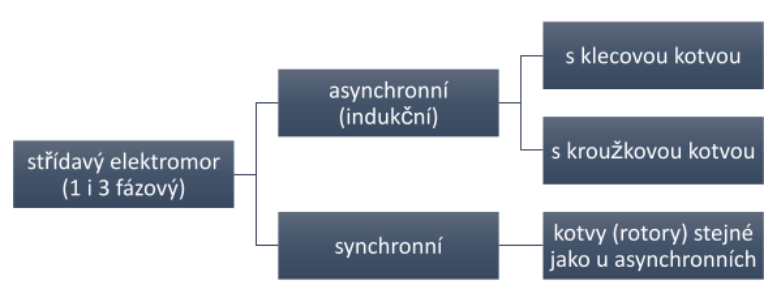
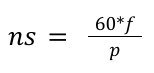
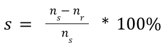
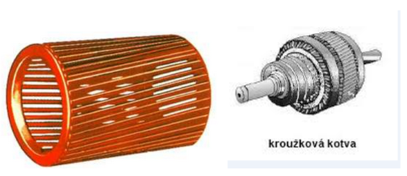
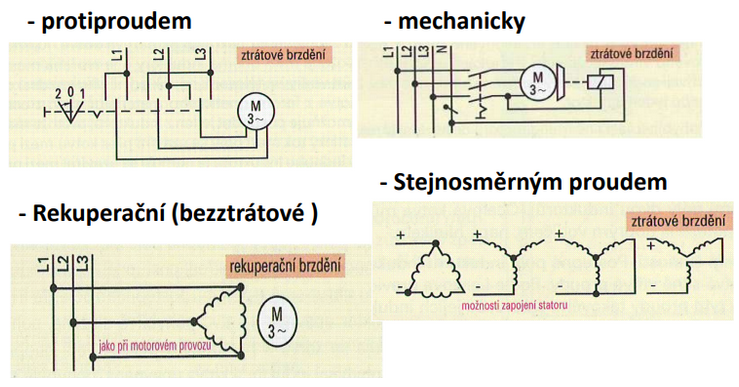
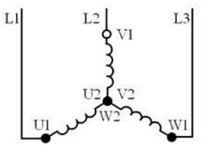
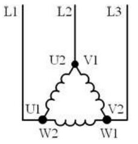
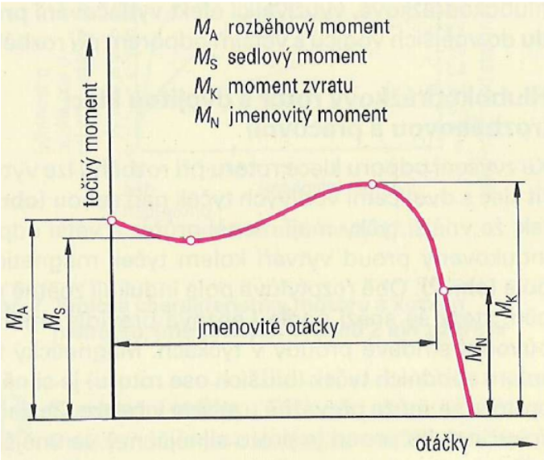
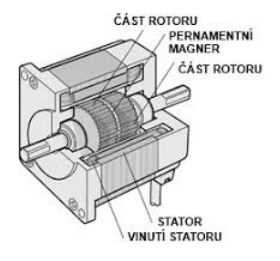

# Elektrické akční členy

## Fyzikální principy

### Teče elektrický proud -> vzniká magnetické pole

#### Stejnosměrný proud

- Když někam teče stejnosměrný proud vzniká stejnosměrné magnetické pole
- Proud má stále stejnou velikost 🡪 pole má stále stejnou velikost
- Sever je na jednom místě, jih je na jednom místě

#### Střídavý proud

- Když někam teče střídavý proud, vzniká střídavé magnetické pole
- Nemění směr, pouze velikost a orientaci
- Sever je na jedné straně, jich na druhé, po polovině periody se to vystřídá
- Při použití 3fázového proudu s vhodně orientovanými cívkami vzniká točivé magnetické pole

### Elektromagnetická indukce

- aby vznikala, musí se něco měnit
- vodič se pohybuje nebo se mění/pohybuje magnetické pole (mění se v čase)

### Silové působení

- Vodič, kterým **musí protékat elektrický proud** 🡪 působí na něj v magnetickém poli síla
- Platí pravidlo pravé ruky

## Generátor

- Dodáváme **mechanickou energii, odebíráme elektrickou energii**

## Alternátor

- Generátor **střídavého napětí**
- Konstrukce:
  - **Stator** – obsahuje vinutí (vodiče)
  - **Rotor** – elektromagnet
- **Napájíme stator**
- **Roztáčíme rotor a ze statoru odebíráme napětí**
- Rotor je **roztáčen vnější silou** např. turbína, dieselový motor, řemen, spalovací motor atd.
- **Magnet se točí 🡪 pole se mění pohybem 🡪 vzniká indukované napětí na vodičích**
- Jedna perioda – jak dlouho trvá, než se mi vrátí na zpět na N cívku
- Pokud chceme, aby frekvence byla 50 Hz, musí se magnet otočit 50x za sekundu
- **Vodní turbíny** potřebují **tři magnety**, protože **se nedokážou tak rychle točit** 🡪 rotor s vyniklými póly
- **Parní turbíny** potřebují **jenom jeden** 🡪 rotor s hladkými póly
- Např. 3fázový alternátor – cívky jsou připojeny k fázím, dodávají 3fázový proud, konce jsou spojeny – uvnitř musí být magnet, který se otáčí

## Dynamo

- Generátor stejnosměrného napětí
- Funguje to naopak než v alternátoru
- Konstrukce
  - **Stator** – magnet/elektromagnet
  - **Rotor** – obsahuje vinutí/vodiče
- **Napájíme rotor** – roztáčíme ho vnější silou a napětí odebíráme z něj napětí
- Vinutí je navinuto na nějakém feromagnetickém jádře
- **Stejnosměrné napětí se získává z komutátoru**
- **Komutátor** – mechanický usměrňovač napětí, dráty jsou nehybné, ale polokroužky se mění se smyčkou
- Princip:
  - **Magnetické pole je nehybné, ale mění se vodič v magnetickém poli 🡪 vzniká elektromagnetická indukce 🡪 vzniká střídavé napětí**
  - Kvůli přeměně střídavého na stejnosměrné jsou **uvnitř polokroužky, každá polovina polokroužku je připojena ke konci vedení** (nejsou připájené, ale točí se, vedení je nehybné)

## rozdělení pohonů podle vstupní energie, rozdělení elektrických akčních členů

### Podle vstupní energie

  

### Podle elektrických akčních členů

  

### Rozdělení střídavých motorů

  

## indukční elektromotory (konstrukce, otáčky, rozběh, brzdění, řízení otáček, reverzace)

Konstrukce:

- **Stator** – nepohyblivá část
- **Rotor** (kotva) – pohyblivá část, otáčí se, spojena s hřídelí

### Asynchronní třífázový motor

**Využití:** stroje s větším výkonem (cirkulárka, míchačka…)

#### Konstrukce

Stator

- **Elektrotechnické plechy** naskládané do dutého válce – **po obvodu jsou drážky**
- **V drážkách** je **3fázové vinutí posunuté o 120 stupňů** – začátky a konce vinutí jsou vyvedeny na svorkovnici
- Vzniknout může zapojení do hvězdy nebo zapojení do trojúhelníku
- elektromagnetické **plechy zesilují magnetické pole**
- **kvůli zamezení vířivých proudů (ztráta) jsou vzájemně izolované**
- **napájen vnějším napětím**
- vlivem rozmístění cívek a fázovému posunu fází ve statoru **vzniká točivé magnetické pole**
- výpočet otáček statoru:

  

Rotor

- **Elektrotechnické plechy připevněné na hřídeli – po obvodu jsou drážky**, ve kterých jsou **navzájem spojené vodiče**
- Vodiče – hliníkové neb měděné tyče
- Může být:
  - **Klecová kotva** – tyče na obou koncích spojeny zkratovacími kroužky
  - **Kroužková kotva** – v drážkách měděné vinutí vyvedeno na kroužky, není napájené
- Díky elektromagnetické indukci se **ve vodičích indukuje napětí 🡪 vodiče jsou uzavřené smyčky a tím v nich teče proud**
- **Otáčky rotoru** musí být \*\*vyšší než statorové pole (kdyby se točili stejně rychle, nic by se neindukovalo) 🡪 nr < ns
- **Skluz:**

  

  

#### Princip činnosti

- Po zapnutí elektromotoru se **ve statoru vytvoří točivé magnetické pole**
- **Magnetické pole začne** ve vodičích rotoru vlivem elektromagnetické indukce **indukovat napětí**
- **Rotorem začne procházet střídavý proud 🡪 vznik magnetického pole 🡪 silové účinky vyvolají točivý moment**
- 🡪 rotor se začne otáčet

#### Rozběh motoru

- Vznikají proudové špičky
- Omezení počátečního proudu:
  - Přepínač hvězda/trojúhelník
  - Statorový spouštěč
  - Spouštění s odpory
  - Spouštěcí transformátor
  - Elektronický spouštěč

#### Řízení otáček

- **Frekvenční měnič** – změna frekvence, otáčky vyšší i nižší než otáčky statoru, malé ztráty
- **Skluzem** – u kroužkových motorů, dochází k velkým tepelným ztrátám, otáčky jen nižší než otáčky statoru, zařazením odporu do obvodu kotvy
- **Počtem pólů** – neumožňuje plynulou změnu

#### Reverzace

- **Změna směru otáčení rotoru**
- Záměna 2 přívodů
- U motorů s měniči frekvence 🡪 **řídícím signálem se změní točivé magnetické pole statoru**

#### Brždění

Ztrátové

- **Mechanické** – diskové, lamelové brzy
- **Elektrické**
  - Protiproudem (přehození dvou přívodů)
  - DC proudem do statoru

Rekuperační

- Z motoru se stane generátor a vrací elektrickou energii zpět do sítě
- Např. u jeřábů

  

#### Zapojení vinutí statoru

Do hvězdy

- Každá cívka je zapojena **mezi fází a střední vodič**
- Napětí na cívce je **230 V** (fázové napětí)

  

Do trojúhelníka

- Každá cívka je **zapojena mezi 2 fáze**
- Napětí na cívce je 400 V (sdružené napětí)

  

#### Momentová charakteristika

  

#### Příklady

1. Dvoupólový asynchronní elektromotor třífázový připojený k 50 Hz elektrické síti má 2850 otáček za minutu. Určete počet otáček točivého magnetického pole statoru. Určete skluz rotoru.
2. Čtyřpólový asynchronní elektromotor 3fázový je připojený k 50 Hz elektrické síti 1450 otáček za minutu. Určete počet otáček točivého magnetického pole statoru. Určete skluz rotoru.
3. Šestipólový asynchronní elektromotor 3fázový připojený k 50 Hz elektrické síti má skluz rotoru 5 %. Určete počet otáček rotoru.

### Jednofázový asynchronní elektromotor

- Funguje na **stejném principu jako asynchronní elektromotor třífázový**
- **Rozdílná konstrukce statoru** – vytváří **točivé magnetické pole pouze pomocí jedné fáze**
- Nemůže vzniknout točivé magnetické pole, pouze střídavé!
- Do výkonu 250 W
- **Využití:** spotřebiče s menším výkonem (mixér, lednička, vrtačka, ruční sekačka…)

#### Konstrukce

Stator

- **Elektromagnetické plechy** naskládané na sebe do tvaru dutého válce
- Uvnitř v drážkách jsou uložena **dvě vinutí – hlavní a pomocné**
- Vinutí jsou **posunuta o 90 stupňů**
- K pomocnému je **zapojen do série kondenzátor**

Rotor

- **Svazek** elektromagnetických plechů **připevněný na hřídel** – po obvodu jsou drážky
- **V drážkách navzájem spojené vodiče**
- Používá se klecové vinutí

#### Princip činnosti

- Statorem **začne protékat proud a vzniká magnetické pole**
- **Fázovým posunem mezi střídavým proudem v hlavním a pomocném vinutí, které jsou vzájemně posunuta o 90 stupňů vzniká točivé magnetické pole**
- **Fázového posunu je dosaženo pomocí kondenzátoru**
- Točivé magnetické pole vlivem elektromagnetické indukce **začne indukovat napětí**
- Rotorem začne **procházet střídavý elektrický proud 🡪 vyvolá magnetické pole 🡪 silové účinky vyvolají točivý moment**
- Rotor se uveden do otáčivého pohybu

## Třífázový synchronní elektromotor

### Konstrukce

#### Stator

- **Stejný jako u asynchronního**
- Elektromagnetické plechy naskládány do dutého válce
- Uvnitř jsou **drážky, ve kterých jsou 3 fáze vzájemně posunuty o 120 stupňů**
- **Vzniká točivé magnetické pole**

#### Rotor

- Uvnitř je **buď permanentní magnet nebo elektromagnet** buzený stejnosměrným proudem
- **Magnet** je připevněn **na hřídeli**
- **Elektromagnet se skládá z elektrotechnických plechů a vinutí, které je přes sběrné kroužky napájeno stejnosměrným proudem**

### Princip činnosti

- Po zapnutí motoru **ve statoru vznikne točivé magnetické pole**
- **Póly rotoru jsou střídavě přitahovány protipóly a odpuzovány souhlasnými póly statoru**
- **Rotor je třeba roztočit vnější silou** (rozběhové vinutí, pomocný motor) 🡪 uvádí rotor do otáčivého pohybu
- **Rotor se začne pohybovat synchronně s magnetickým polem statoru**

## Stejnosměrné elektromotory (konstrukce, druhy DC motorů)

### Konstrukce

#### Stator

- **Permanentní magnet nebo elektromagnet**
- Elektromagnet se skládá ze svazku **elektrotechnických plechů** naskládaných do dutého válce s **vinutím napájeným stejnosměrným proudem**

#### Rotor

- **Svazek elektrotechnických plechů s drážkami, ve kterých je vinutí**
- Začátky a konce vinutí jsou izolovány a **připojeny k lamelám komutátoru, který je na hřídeli**
- **komutátor**
  - dva oddělené půlkroužky spojené s kontakty napájení
  - každý půlkroužek na jeden vývod cívky (vinutí)
  - když se pootočí o půl otáčky, dostane se na každý půlkroužek opačná polarita než předtím, otočí se směr proudu

### Princip činnosti

- **Silové účinky magnetického pole rotoru a statoru vyvolají točivý moment**
- Rotor je uveden do otáčivého **pohybu**
- **Aby vznikal točivý moment, který by působil na rotor jen v jednom směru a uváděl ho do točivého pohybu, je zapotřebí měnit směr průtoku proudu ve vinutí rotoru 🡪 zařizuje komutátor**
- **Směr** otáčení se mění **přepólováním napájení rotoru**
- **Rychlost** otáčení se mění **změnou elektrického napětí**

### Rozdělení stejnosměrných motorů

- **Permanentní magnet ve statoru**
- **S elektromagnetem ve statoru** (tzv. buzení)
  - **S cizím buzením** – cívky statoru i rotoru má nezávislý zdroj napájení
  - **S vlastním buzením** – cívky statoru i rotoru jsou napájeny ze stejného zdroje
    - **Sériový motor** – rotor a stator zapojeni do série (dopravní stroje – vlaky, tramvaje, metro, elektromobily)
    - **Derivační motor** – rotor a stator zapojeni paralelně
    - **Kompaudní motor** – rotor a stator zapojeni do série i paralelně (např. výtahy, bagry a trolejbusy)

## Lineární, krokové, univerzální elektromotory

### Lineární motor

- Střídavý, třífázový
- **Induktor (neboli stator)** – hřebenovitý tvar, v drážkách je 3fázové vinutí 🡪 postupně vytváří magnetické pole
- **Kotva (rotor)** – vodivá deska mezi 2 induktory, vlivem vířivých proudů vykonává posuvný pohyb

### Krokový motor

- **Řízený stejnosměrnými impulzy** – každý impuls **způsobí pootočení hřídele rotoru o určitý úhel**
- **Stator** – napájený **stejnosměrným proudem**, postupným přepólováním pólových párů 🡪 vzniká točivé magnetické pole
- Způsob provedení statoru:
  - **Unipolární princip** – 2 cívky v každém pólovém páru – přepnutím mezi nimi se mění směr proudu a tím i směr magnetického pole
  - **Bipolární princip** – 1 cívka v každém pólovém páru – změnou polarity napětí se mění směr proudu a tím i směr magnetického pole
- **Rotor** – elektromagnet
- **Využití** – dosažení přesné polohy (přesné otočení, posun)

  

### Servomotor

- **Stejnosměrný komutátorový motor s kotoučovým vinutím**
- Požadujeme **přesné pootočení hřídele o daný úhel** – proto se **musí rychle rozběhnout a zastavit**
- Rotor **musí mít setrvačnost** – musí být lehký
- **Stator – permanentní magnet**, zmagnetovaný při montáži s pomocí magnetizačního vinutí
- **Rotor** – bez železného jádra, na plastovém kotouči nalepeno **vinutí z nastříhané fólie**
- **Napájení rotoru přes komutátor** (funkci komutátoru plní fólie)
- Využití – dosažení přesné polohy

### Univerzální motor

- Konstrukce **jako komutátorový sériový stejnosměrný motor** (stator = elektromagnet, rotor = vinutí), **ale je napájený střídavým napětí**
- Proud v sériově propojených **cívkách statoru i rotoru mění směr vždy současně** – mění se magnetické pole ve statoru a rotoru najednou
- **Síla magnetického pole na rotor má stále stejný směr** – směr otáčení se nemění
- **Je možné napájet i stejnosměrně**
- **Pohon malých domácích spotřebičů** a malého elektrického nářadí

### EC motor (BLDC motor)

- EC = elektronicky komutovaný
- BLDC = bezkartáčový stejnosměrný
- **Není napájen přes kartáčky, proto má vyšší životnost**
- **Stator** – soustava **přepínaných cívek**, do kterých se **postupně přivádí stejnosměrný proud – podle polohy rotoru**, což se zjišťuje Hallovou sondou – detekuje magnetické pole 🡪 vytváří se točivé magnetické pole
- **Rotor – permanentní magnet**
- **Malé rozměry, velká rychlost, tichý plynulý chod, nutná elektronika**
- **Použití:** ventilátory, diskové paměti, elektromobily
