# Kombinační logické obvody

## a) Automatizace, důvody automatizace, rozdělení automatických zařízení

### **Stupně náhrady lidské práce**
  - Mechanizace = náhrada fyzické práce člověka činností strojů
  - **Automatizace** = proces náhrady fyzické a duševní práce člověka činností strojů
  - Komplexní automatizace = odstranění činnosti člověka z celého procesu

### **Kybernetika** = věda zabývající se obecnými principy řízení a přenosu informací
  - ve strojích
  - v živých organizmech
  - ve společenstvích

### **Důvody zavedení automatizace**
  - Vyloučení zdravotní ohrožení člověka
  - Vyloučení chyb člověka
  - Zvýšení přesnosti procesu
  - Zvýšení rychlosti procesu
  - Snížení výrobních nákladů
  - Zvýšení produktivity práce
  - Zvýšení pohodlí člověka

### **Rozdělení automatických zařízení**
  - Ovládané - bez zpětné vazby
  - Regulační - se zpětnou vazbou
  - Kybernetická - vyšší formy řízení

## b) Logické proměnné, příklady, technická realizace

### *Logická proměnná* nabývá pouze dvou hodnot:

  - 0 - nepravda, false, low, off,
  - 1 - pravda, true, high, on

### Příklady:
  - není - je napětí  
  - neteče - teče proud
  - nesvítí - svítí

### Technická realizace logické proměnné
  - Kontakt
  - LED
  - Ventil

## c) Logické funkce –přehled, značky, popis, pravdivostní tabulka, technická realizace

| Zkratka | Název                        |                            Značka                            | Matematický výraz |                     Pravdivostní tabulka                     |
| ------- | ---------------------------- | :----------------------------------------------------------: | :---------------: | :----------------------------------------------------------: |
| NOT     | Negace                       | 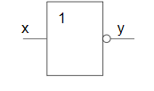 |      y = !x       | 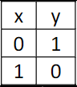 |
| AND     | Logický součin (A současně)  | 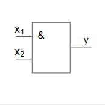 |    y = x1 * x2    | 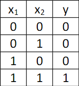 |
| OR      | Logický součet (A nebo)      | 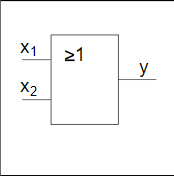 |    y = x1 +x2     | 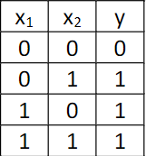 |
| NAND    | Negace logického součinu     | 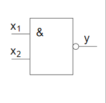 |  y = !(x1 * x2)   | 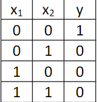 |
| NOR     | Negace logického součtu      | 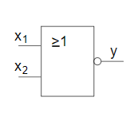 |  y = !(x1 + x2)   | 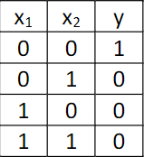 |
| XOR     | Nonekvivalence (Buď na nebo) | 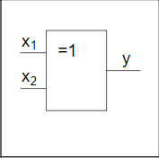 |    y = x1 ⨁ x2    | 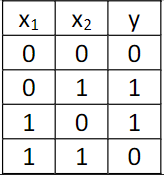 |

### Technická realizace logických funkcí

- Kontakt
- Relé
- Tranzistory
- Logické integrované obvody
- Pneumatické logické členy

## d) Sestavení a minimalizace logického výrazu - Karnaughova mapa, Booleova algebra

### Postup návrhu logické funkce

1. Slovní popis
2. Vyjádření vstupů a výstupů - kolik, jaké, co je 0 a co 1
3.  Tabulka
4. Karnaughova mapa
5. Minimalizace Karnaughovy mapy => algebraický zápis
6. Nakreslení schématu zapojení

### Karnaughova mapa

- Další způsob vyjádření logické funkce
- Počet polí mapy = počet řádků pravdivostní tabulky
- Vstupní proměnné  - pruhy kolem mapy (kde je pruh, tam má proměnná hodnotu 1)
- V polích mapy jsou výstupy

**Příklady Karnaughových map** 

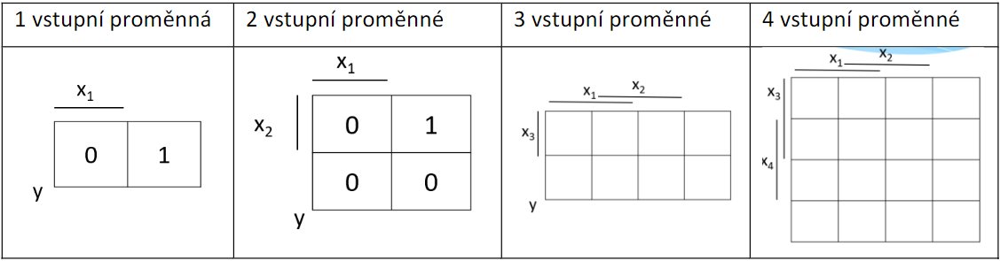

**Minimalizace logické funkce z Karnaughovy mapy**

- Vyznačíme v Karnaughově mapě skupiny sousedních jedniček:
  - dvojice
  - čtveřice
  - počet musí být 2 na n
- Jednička může být součástí více skupin
- Každou skupinu vyjádříme jako logický součin pouze těch proměnných, které mají pro celou skupinu stejnou hodnotu:
  - 1 - bez negace
  - 0 - s negací 
- Výsledná funkce je logický součet všech skupin

### Booleova algebra

- Pracuje jen s dvouhodnotovými veličinami

**Zákony Booleovy algebry**

- Zákon agresivnosti
- Zákon neutrálnosti
- Zákon komutativní
- Zákon asociativní
- Zákon distributivní
- Zákon absorbce
- Zákon dvojité negace
- Zákon o vyloučení třetího

## e) Aplikace kombinačních logických funkcí - kódér/dekódér, multiplexer/demultiplexer

### Rozdělení logických obvodů

- Kombinační logické obvody
  - Výstup závisí pouze na vstupech
- Sekvenční logické obvody
  - Výstup závisí na vstupech i na předchozím stavu výstupu (mají paměť)

## Příklady kombinačních logických obvodů

-  Základní funkce 
  - NOT, AND , OR, NAND, NOR, XOR
- Kódér
  - Převádí číslo aktivního vstupu na kód výstupu
    - Binární kód > dvojková soustava
- Dekódér
  - Převádí kód na vstupu na jeden výstup, který je aktivní
- Multiplexer
  - Elektronický přepínáč
  - Převádí hodnotu jednoho z datových vstupů na výstup
  - Adresní vstupy určují , který datový vstup jde na výstup
- Demultiplexer
  - Elektronický přepínač
  - Převádí hodnotu datového vstupu na jeden z výstupů
  - Adresní vstupy určují, na který výstup jde datový vstup
- Dvojková sčítačka
  - Sčítá čísla ve dvojkové soustavě
  - Rozdělení
    - Poloviční - nemá přenos nižšího řádu
    - Úplná - má přenos z nižšího řádu
