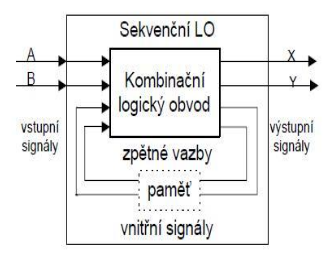
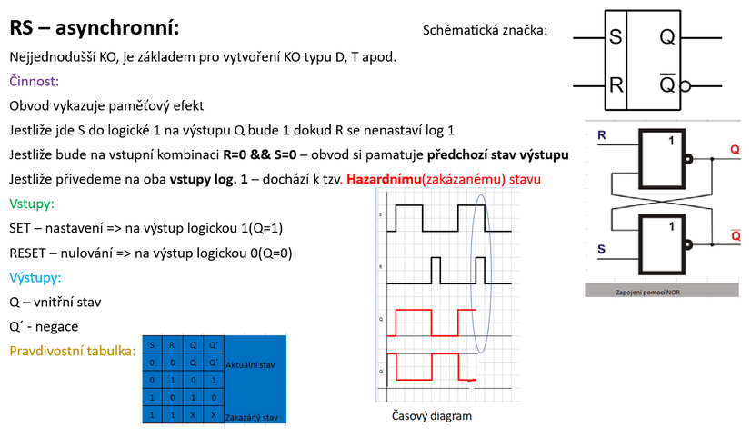
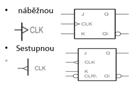
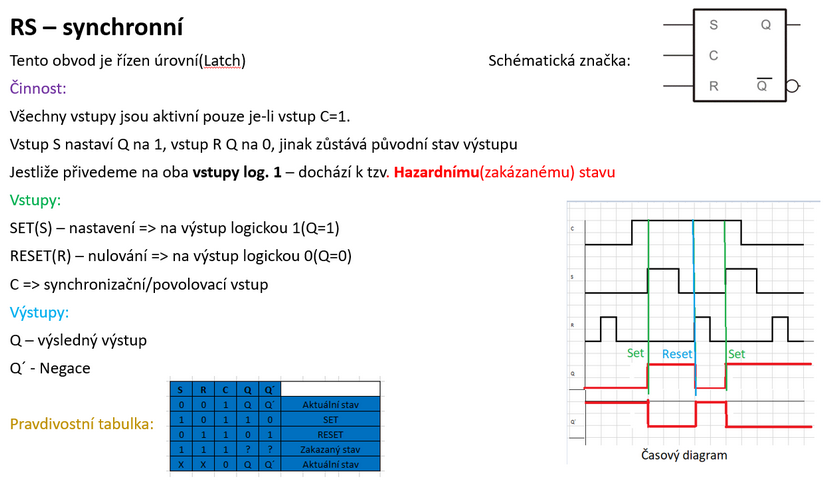
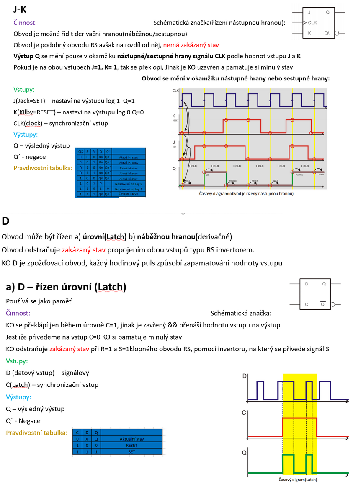
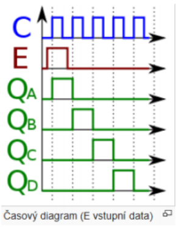
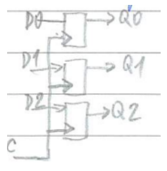
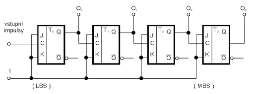

# Sekvenční logické obvody

## definice a rozdělení, typy

Hodnoty **výstupních** signálů závisí na okamžitých **hodnotách vstupních proměnných**, a navíc ještě na **hodnotách předchozích**.

Sekvenční obvody se od kombinačních liší => **Pamětí a zpětnými vazbami**(smyčky)

Sekvenční obvod má **vstupní, výstupní a vnitřní proměnné**, ty dávají informace o **předchozích stavech**

  

### Rozdělení Sekvenčních logický obvodů:

1. Bistabilní klopné obvody
2. Monostabilní klopné obvody
3. Astabilní klopné obvody

## Bistabilní klopné obvody a popis hodinového signálu

Úkol: **Zaznamenat přechodné informace a uchovat jejich stav**, i po zmizení informací ze vstupu

Klopné obvody neboli **flip-flop** - mají **dva stabilní** stavy (0, 1); jeden stabilní stav přechází skokem v druhý.

Nejmenší paměť s kapacitou **1 bit**.

#### Využití:

- paměť
- tvoří základ složitých sekvenčních obvodů:
  - registry
  - čítače
  - časovače apod.

#### Typy Bistabilních obvodů:

- Asynchronní KO - RS
- Synchronní KO - RS(Latch), JK(derivační), D, T

### Asynchronní Klopné obvody

KO nemusí být řízen dalším vstupem (náběžnou/sestupnou hranou nebo hodinovým signálem Latch)

Nejsou řízené taktovacími impulsy

  

#### Hazardní stav

Přivedeme-li na oba vstupy signál 1 (zakázaný stav) => nastaví se oba výstupy nejprve do stavu 0 =>
konečný stav bude záležet na zpoždění použitých členů, nebo na tom, který ze signálů R a S dříve skončí.

### Synchronní klopné obvody

- Tyto obvody potřebují k řízení další pomocný vstup.
- Jsou řízené taktovacími impulsy

#### Druhy řízení + popis hodinového signálu

- řízené úrovní hodinového signálu => Hladinové/úrovňové/Latch
- řízené hranou – derivační

  

- Master-slave ► dvoufázové – 2 seriově zapojené KO řízené hranou. Vstupní = master, výstupní = slave

  

  

  

## Monostabilní klopné obvody

- Vyznačuje se jedním ustáleným stavem
- S příchodem vstupního impulsu je výstup po určitou dobu v opačném, než ustáleném stavu.
- Délka impulsu prakticky nezávisí na vstupním impulsu, ale na časové konstantě RC obvodu.
- Po skončení impulsu se vrací do ustálenéhoo stavu.

### Využití:

V číslicových obvodech se monostabilní klopné obvody využívají především ke generování impulsů s nastavitelnou šířkou, dále např. k vytvoření požadovaného zpoždění impulsů apod.

## Astabilní klopné obvody

Vyznačují se dvěma kvazistabilními stavy, do kterých se tyto obvody periodicky překlápějí v závislosti na časovacích členech, nemá ustálený stav. Samovolně přepíná mezi 1 a 0.

### Využití:

generátory pravoúhlých kmitů, multivibrátory, popř. generátory periodicky se opakujících impulsů

## Aplikace sekvenčních obvodů

### Posuvné registry

- Uchovávají a posouvají informaci, realizace z obvodů JK a D, je sestaven z řady klopných obvodu spojených tak, že každý obvod přenáší informaci ze svého výstupu na vstup dalšího.
- **Využití:** svítící pohyblivé reklamní tabule (skládají se s 10K diod, které se postupně rozsvěcují), buzení žárovek zajišťují výkonové obvody řízené počítačem.
- **Realizace KO typ D** - posouvání se uskutečňuje s náběžnou hranou hodinových impulzů. V okamžiku náběžné hry se vždy posune o jednu hodnotu

  

### Statické registry

- Slouží k uchování n-bitové informace, realizace Z obvodů JK a D, jsou řízené časovým signálem
- **Využití:** převodníky, násobičky a děličky mocniny
- V okamžiku náběžné hrany se D0-D2 posune do Q0-Q2

  

### Čítače

- Používají se tam, kde je třeba zaznamenat velké množství dějů, které následují rychle za sebou. Počítá se kolikrát proběhla nějaká událost
- Děje se převádějí na impulsy – s každým impulsem se přičítá nebo odečte 1
- **Využití:** bankomat, počítadlo peněz, automat na kávu

  

### Časovače

- Druh čítače, který nastaví hodnotu a ta se pak odečítá (např. každou sekundu se odečte 1)
- Jakmile dosáhne 0, je vyvoláno přerušení.
- **Využití:** budík, časovač v mikrovlnce, v počítači
