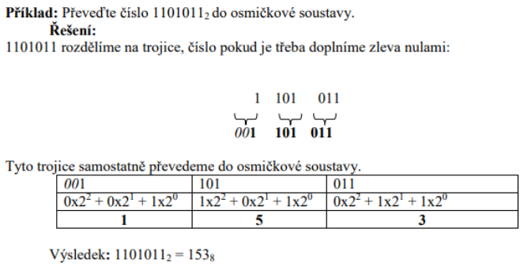
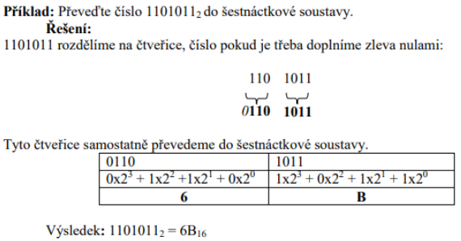
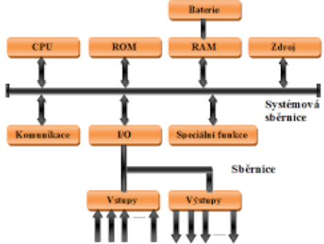
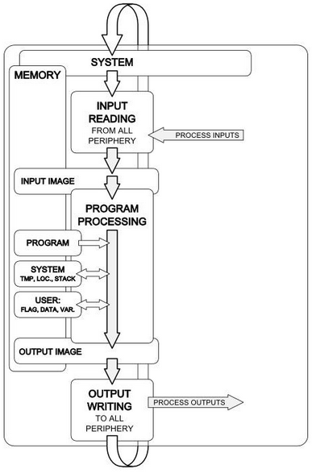
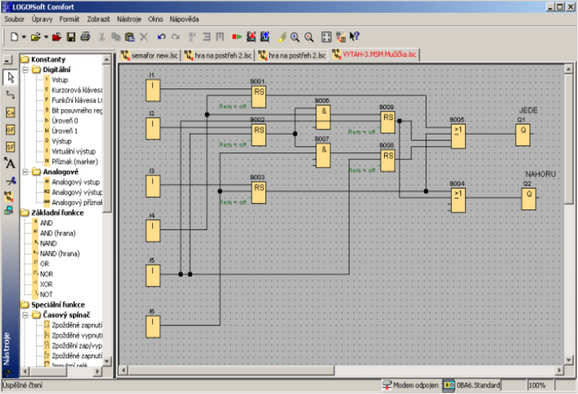
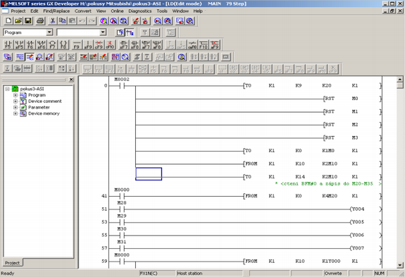
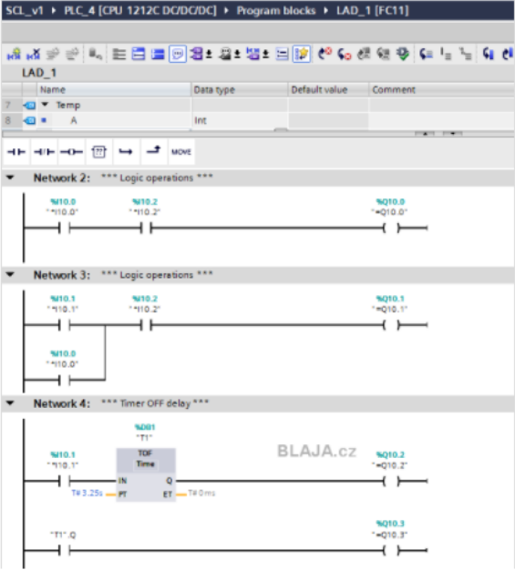
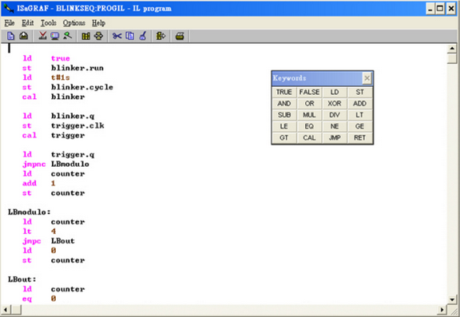
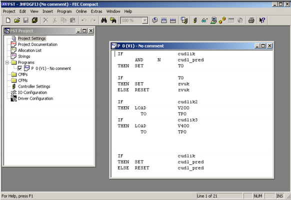

# Programovatelné automaty (PLC)

## Číselné soustavy

### Dvojková soustava

- Skládá se z 0 a 1
- Používá se především ve výpočetní technice (jednodušší rozpoznávat dva stavy než 10, žárovka = SVÍTÍ/NESVÍTÍ

### Šestnáctková soustava (Hexadecimální)

- Chybějící číslice jsou nahrazují písmena abecedy (0,1,2,3,4,5,6,7,8,9, A, B, C, D, E, F)
- Použití:
  - Grafika (definování barev)
  - Programování
  - Sítě (MAC)

## Převody číselných soustav

### Převod z desítkové (Metoda postupného dělení)

Číslo z desítkové soustavy dělíme číslem základu nové soustavy. Získaný (neúplný) podíl opět dělíme základem nové soustavy. Toto aplikujeme tak dlouho, dokud není neúplný podíl roven nule. Koeficienty ai vycházejí jako zbytky celočíselného dělení v pořadí a0, a1, a2,..., an. Poziční zápis čísla v nové soustavě získáme tak, že napíšeme všechny zbytky v pořadí od konce do začátku anan-1 ... a1a0 Příklad: Převeďte číslo 7910 do dvojkové soustavy.

#### 1. Převeďte číslo 7910 do dvojkové soustavy.

| **Podíl**   | **Zbytek** | **Koeficienty**   |
| ----------- | ---------- | ----------------- |
| 79 / 2 = 39 | 1          | a0 = 1 |
| 39 / 2 = 19 | 1          | a1 = 1 |
| 19 / 2 = 9  | 1          | a2 = 1 |
| 9 / 2 = 4   | 1          | a3 = 1 |
| 4 / 2 = 2   | 0          | a4 = 0 |
| 2 / 2 = 1   | 0          | a5 = 0 |
| 1 / 2 = 0   | 1          | a6 = 1 |

Výsledek: 7910 = 10011112

#### 2. Převeďte číslo 8210 do osmičkové soustavy.

| **Podíl**   | **Zbytek** | **Koeficienty**   |
| ----------- | ---------- | ----------------- |
| 82 / 8 = 10 | 2          | a0 = 2 |
| 10 / 8 = 1  | 2          | a1 = 2 |
| 1 / 8 = 0   | 1          | a2 = 1 |

Výsledek: 8210 = 1228

#### 3. Převeďte číslo 200710 do šestnáctkové soustavy.

| **Podíl**       | **Zbytek** | **Koeficienty**    |
| --------------- | ---------- | ------------------ |
| 2007 / 16 = 125 | 7          | a0 = 7  |
| 125 / 16 = 7    | 13         | a1 = 13 |
| 7 / 16 = 0      | 7          | a2 = 7  |

Výsledek: 200710 = 7D716 (v šestnáctkové soustavě číslu 13 odpovídá písmeno D)

### Převod do desítkové (Váhová metoda)

Číslo rozepíšeme na součet mocnin a po jejich sečtení dostaneme výsledek v desítkové soustavě.

#### 1. Převeďte číslo 1010112 do desítkové soustavy.

1010112 = (1 \* 25) + (0 \* 24) + (1 \* 23) + (0 \* 22) + (1 \* 21) + (1 \* 20) = 4310

#### 2. Převeďte číslo 10758 do desítkové soustavy.

10758 = (1 \* 82) + (0 \* 81) + (7\* 80) = 57310

#### 3. Převeďte číslo A3C16 do desítkové soustavy.

A3C16 = (10 \* 162) + (3 \* 161) + (12 \* 160) = 262010

### Převod, když ani jedna není desítková

#### Převod z dvojkové soustavy do osmičkové

číslo z dvojkové soustavy rozdělíme do trojic (zprava) a tyto trojice převedeme metodou váhových kódů do osmičkové soustavy.

  

#### Převod z dvojkové soustavy do šestnáctkové

číslo z dvojkové soustavy rozdělíme do čtveřic (zprava) a tyto čtveřice převedeme metodou váhových kódů do šestnáctkové soustavy.

  

## Označení, funkce, požadavky, použití, výrobci

### Funkce

- zpracování informace
- přečtení a vystavení hodnot pomocí vstupně/výstupních (I/O) portů
- využívání paměti pro zápis obrazů vstupů a výstupů

### Požadavky

- konstrukce pro práci v průmyslovém prostředí
- odolné proti rušení jak přes vstupy a výstupy, tak také přes napájení
- odolné proti vibracím
- mohou pracovat v širokém rozsahu teplot (běžné 0 až 55°C, speciální -25 až 60°C)
- vysoké krytí, u periferních jednotek až IP65 (vlhkost, prach), dodávají se i v provedení pro práci prostředí s nebezpečím výbuchu
- změny programu beze změn v zapojení
- modulární řešení (řada různých modulů pro řešení konkrétní technologické úlohy)
- programování je přizpůsobeno provozním požadavkům
- možnost zápisu a čtení programu v grafické formě (kontaktní nebo funkční schémata)
- konstrukce automatů a vykonání programu je optimalizováno na rychlé řešení logických funkcí
- výkonné diagnostické nástroje pro detekci a nápovědu k odstranění závady c) druhy programovatelných automatů

### Použití

- Používá se k automatizování procesů
- Řízení strojů, výrobní linky
- Používají se tam, kde je potřeba hodně logický operací

### Výrobci

- Siemens
- Moeller
- Mitsubishi
- Festo

## Druhy programovatelných automatů

### Podle provedení

#### 1. Kompaktní

- CPU
- digitální i analogové vstupy, výstupy, základní podporu komunikace,
- popř. zdroj.
- „Mikro PLC“

#### 2. Modulární

- Komponenty jsou rozděleny do modulů, které lze vzájemně propojovat a systém rozšiřovat.

#### 3. Se zásuvnými kartami

- CPU
- Vstupy, výstupy jsou rozdělené do modulů => jsou propojeny pomocí sběrnice
- Lepší pro větší programy

### Podle velikosti

#### 1. Malá PLC

- počet I/O do 20 (INPUT, OUTPUT)
- bez možnosti komunikace
- malá paměť
- **Výrobci:** Siemens, Moeller, Mitsubishi

#### 2. Střední

- 128 až 512 I/O
- Siemens: SIMATIC S7-300, Festo FPC 404

#### 3. Velká

- až tisíce I/O
- vždy modulární provedení zásuvnými kartami

## Hardware

#### 1. Zdroj

- 24 V DC / 230 V AC (nejčastěji)
- Může být integrován v CPU

#### 2. Central Procesor Unit (CPU)

- Řídící jednotka
- Obsluhuje vstupy a výstupy

#### 3. DI / DO

- Digitální vstupy a výstupy

#### 4. AI / AO

- Analogové vstupy a výstupy

#### 5. SPEC

- Funkční prvky
  - Čítače
  - Časovače
  - ...

#### 6. COM

- Komunikační modul

#### 7. Další

- Speciální moduly
  - Regulátory
  - ...

### Blokové schéma

  

### Human Machine Interface (HMI ; rozhraní člověk – stroj)

#### 1. Jsou určeny pro tvorbu vizualizací technologických projektů

#### 2. Slouží k ovládání a monitorování programu

- Aktivace a deaktivace funkcí
- Poskytují okamžité info o stavu strojů a procesorů
- Zobrazují varovné hlášení a protokoly o chybách

#### 3. Druhy displejů

- Aktivní
  - Vyžaduje informace od řídícího systému (komunikuje)
- Pasivní
  - Pouze zobrazuje data z řídícího systému

#### 4. Rozdělení displejů

- Podle velikosti úhlopříčky
  - 4‘‘, 6‘‘, 10‘‘, ...
- Podle zobrazení
  - Grafické
  - textové
- Podle barvy displeje
  - Monochromatický
  - Barevný

#### 5. Konektivita

- Profinet
- USB
- RS232
- WiFi

#### 6. Druhy panelů

- Se zabudovanou klávesnicí
- S dotykovou obrazovkou

## SW - Cyklus PLC

Cyklus je základním znakem průmyslového řídícího systému, kdy PLC stále opakovaně provádí svoji činnost.

  

## SW - Programovací jazyky PLC

- Stanoví je norma IEC 61131-3

### Grafické jazyky

#### 1. FBD (Function Block Diagram)

- jazyk funkčních bloků
- bloky (obdélníčky) reprezentující jednotlivé funkce

  

#### 2. LD (Ladder Diagram)

- jazyk liniových schémat, kontaktní schéma, žebříček...
- podobné elektrickému zapojení

  

#### 3. SCL (Structured Control Language)

- vysokoúrovňoví programovací jazyk založený na pascalu a umožňuje strukturované programování
- jsou dostupné před sestavené bloky jako systémové funkce nebo systémové funkční bloky v operačním systému CPU

  

## Textové jazyky

#### 1. IL (Instruction List)

- seznam instrukcí
- nižší programovací jazyk, bližší procesoru, složitější pro uživatele

  

#### 2. ST (Structured Text)

- strukturovaný text
- vyšší programovací jazyk, mnoho funkcí, snazší pro uživatele

  

