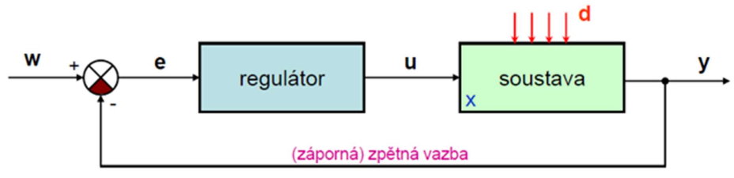
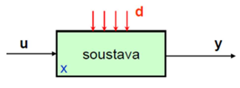
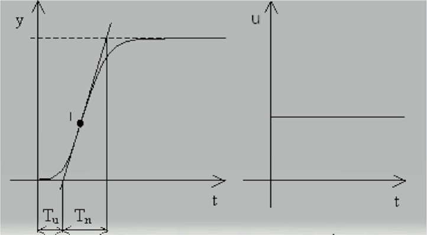
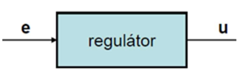
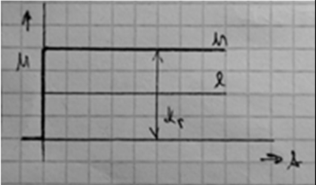
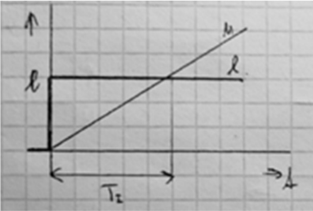
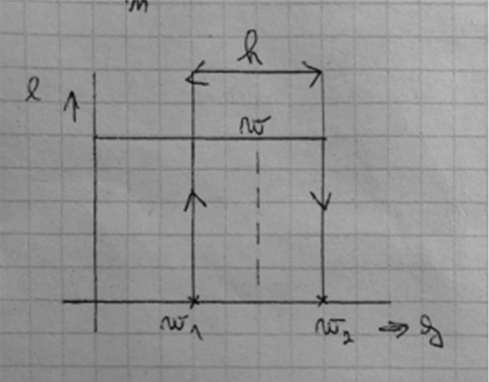
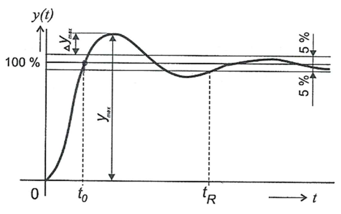
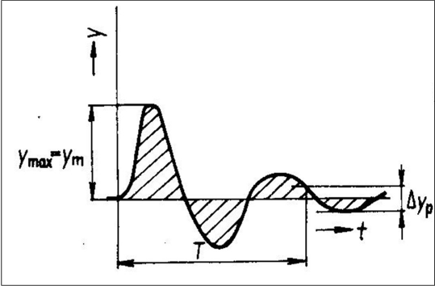
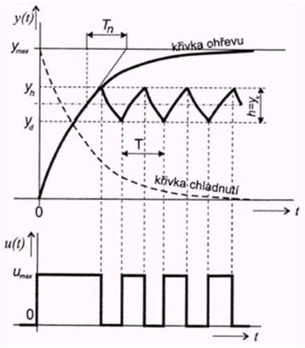

# Řízení s uzavřenou smyškou - regulace

- **regulace** - umožňuje udržování určitých fyzikálních veličin na stanovených hodnotách, řízení na zpětnou vazbu

## Druhy řízení, druhy regulace

### Vlastnosti členů regulačního obvodu

- statické
  - statická charakteristika = závislost vstupní hodnoty na výstupu
  - odezva na jednotkový skok, závislá na čase
- dynamické
  - přechodová charakteristika
    - měří se v okamžiku přivedení impulsu
  - frekvenční charakteristika

### Druhy řízení

- ovládání - bez zpětné vazby
- regulace - se zpětnou vazbou
- kybernetická zařízení - samočinné řízení

### Druhy regulace

- spojitá
- nespojitá
- na konstantní hodnotu
- programová
- vlečná

## Blokové schéma regulačního obvodu

- lednička, žehlička, vytápění, klimatizace, ...

  

- `w` ► požadovaná hodnota = nastavení požadované hodnoty
- `y` ► regulovaná veličina (např.: teplota, tlak, napětí, ...)
- `e` ► regulační odchylka = rozdíl skutečné a žádané hodnoty
- `u` ► akční veličina (např.: impuls pro sepnutí kompresoru, tepelné spirály, …)
- `d` ► poruchová veliči (např.: otevření dveří lednice)

**Výpočet regulační odchylky:** `e = w - y`

## Regulované soustavy

### Regulovaná soustava (RS)

  

### Rozdělení RS

Regulovaná veličina - rychlost, otáčky, tlak, síla, teplota, výška hladiny, intenzita světla,
chemické složení, ...

#### Zda se regulovaná veličina/y ustálí:

- statické - `y` se ustálí (př.: nenucený odtok/přítok)
- astatické - `y` kolísá (stoupá nebo klesá) (př.: nenucený odtok/přítok)

#### Dle počtu kapacit:

- **jednokapacitní**
  - př. kompresor o jedné nádobě na stlačený vzduch (regulace výšky hladině v nádrži / tlaku v tlakové nádobě)
- **dvoukapacitní** - nejčastější
  - př.: dvě nádrže v sérii (za sebou) při regulaci tlaku
- **vícekapacitní**
- **bezkapacitní**
  - př.: krátký úsek potrubí
- **s dopravním zpožděním**
  - př.: dlouhý úsek potrubí
  - pzn.: kapacita = množství energie, které je vedení schopno pojmout

### Přechodová char. 2 kapacitní statické RS (soustava 2. řádu)

  

- `I` ► inflexní bod (= místo, kde se zakřivení křivky mění)
- Tu ► doba průtahu
- Tn ► doba náběhu

#### Vzorce

- Tp = Tu + Tn
- r = Tu / Tn

&nbsp;

- Tp ► doba přechodu
- r ► regulovatelnost

## Regulátory

  

### Rozdělení regulátorů

#### 1. spojité - udržují regulovanou veličinu na požadované hodnotě

- **a. Proporcionální**
  - **nezávislý** na čase
  - parametry nastavujeme hodnotou odporu
  - **Výhody:** regulační pochod stabilizuje a zesiluje
  - **Nevýhody:** pracuje s trvalou regulační odchylkou
- **b. Integrační**
  - je závislý na čase
  - odstraňuje problém s trvalou regulační odchylkou
- **c. Derivační**
  - urychluje a stabilizuje celý regulační proces
  - reaguje pouze na změnu regulační odchylky

#### 2. nespojité - regulační veličina stále kmitá

- 2 polohové, 3+ polohové
- levné, konstrukčně jednoduché
- **Využití:** kompresor, lednice, žehlička

#### 3. sdružené

- PI, PD, PID

### Spojité regulátory - přechodová charakteristika

<table>
  <tbody>
    <tr>
      <th>Regulátor</th>
      <th align="center">Přechodová charakteristika</th>
      <th>&nbsp;</th>
    </tr>
    <tr>
      <td>
        <b>P regulátor</b> 
        Vzorce:
        <pre><code>Kr = R2 / R1</code></pre>
        <pre><code>u = -Kr * e</code>
      </td>
      <td align="center"></td>
      <td>Kr ► součinitel přenosu (zesílení regulátoru), nastavuje se pomocí odporu</td>
    </tr>
    <tr>
      <td>
        <b>I regulátor</b> 
        Vzorce:
        <pre><code>Ti = Ci / Ri</code></pre>
        <pre><code>u = -Kr / Ti ∫ e dt</code></pre>
      </td>
      <td align="center"></td>
      <td>Ti ► integrační časová konstanta</td>
    </tr>
    <tr>
      <td>
        <b>D regulátor</b> 
        Vzorce:
        <pre><code>u = Td * Kr * e'</code></pre>
      </td>
      <td align="center"></td>
      <td>Td ► derivační časová konstanta e' ► rychlost změny vstupní veličiny</td>
    </tr>
  </tbody>
</table>

### Nespojitý regulátor - statická charakteristika

  

- h ► hystereze (nastavuje se tuhostí pružiny, sílou magnetu)
- w ► požadovaná hodnota
- w1 ► dolní hranice
- w2 ► horní hranice

## Regulační pochod

- Regulační pochod ► průběh regulované veličiny (y)

### Druhy regulačních pochodů se spojitými regulátory

#### 1. změna řídící / požadované veličiny (w)

  

- ∆Ym ► maximální překmit
- Ym ► maximální hodnota
- t0 ► doba odezvy
- tR ► doba regulace

#### 2. změna poruchové veličiny (d)

  

### Druhy regulačních pochodů s nespojitými regulátory

<i>viz nespojitý regulátor</i>

  

### Kvalitu regulačního pochodu posuzujeme pomocí:

- maximálního překmitů
- doby odezvy
- doby regulace
- počtu překmitů
- regulační plochou
